# HIVE — Hierarchical Intelligent Virtual Ensemble

**Sistema Multi-Agente para o Multi-Agent Programming Contest 2022 (Agents Assemble III)**

<p align="center">
  
</p>

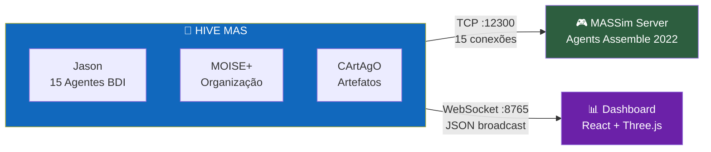

---

## Informações Acadêmicas

| | |
|---|---|
| **Disciplina** | PCS 5703 — Sistemas Multi-Agentes |
| **Instituição** | Escola Politécnica da Universidade de São Paulo (EPUSP) |
| **Departamento** | Engenharia de Computação e Sistemas Digitais |
| **Período** | 1º Quadrimestre de 2026 |
| **Exercício** | 2º Exercício Prático — Aplicação de programação orientada a multi-agentes no MAPC |
| **Entrega** | 02/06/2026 |
| **Enunciado** | [`doc/5703_ex02_26.pdf`](doc/5703_ex02_26.pdf) |

---

## Visão Geral

O **HIVE** é um sistema multi-agente com arquitetura de enxame hierárquico desenvolvido para competir no cenário **Agents Assemble** do Multi-Agent Programming Contest (MAPC) 2022. Utiliza o arcabouço **JaCaMo** (Jason + CArtAgO + MOISE+) com 15 agentes BDI organizados em 3 esquadrões autônomos + pool de soloists.

### Características Principais

- **15 agentes BDI** com 4 roles especializados (squad_leader, collector, assembler, sentinel)
- **3 esquadrões autônomos** de 4 membros + 3 sentinelas no pool de soloists
- **Leilão distribuído** via artefato `TaskBoard` para alocação ótima de tarefas
- **Pool de soloists universal** — qualquer agente livre executa tasks simples
- **Mapa compartilhado** com A* e exploração por fronteira em grid toroidal 40×40
- **Connect sincronizado** para tasks multi-block com protocolo de comunicação
- **Re-submissão automática** de tarefas para multiplicação de pontos
- **Dashboard React em tempo real** com visualização 2D/3D via WebSocket
- **Resiliência multi-nível** com retry, timeout, stuck detection e energy conservation

---

## Arquitetura do Sistema

### Diagrama de Contexto (C4 Nível 1)

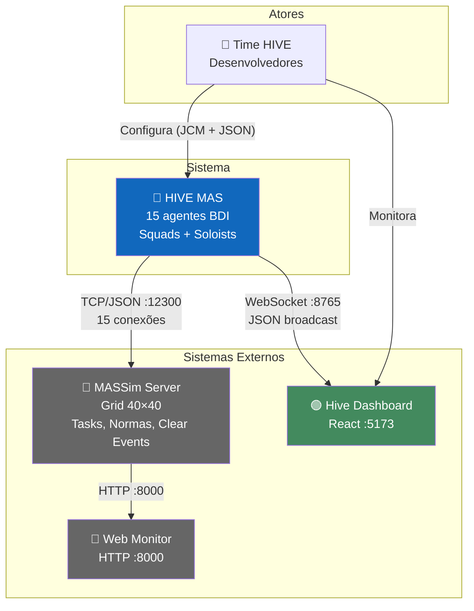

### Diagrama de Containers (C4 Nível 2)

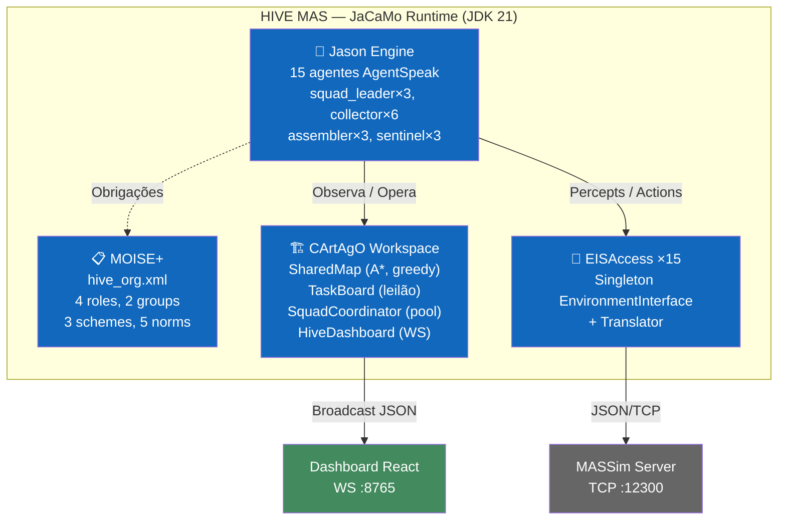

### Diagrama de Componentes (C4 Nível 3)

```mermaid
graph TB
    subgraph Agents["Jason — 15 Agentes BDI"]
        SL["squad_leader ×3<br/>Leilão + Delegação"]
        CO["collector ×6<br/>Coleta + Meeting Point"]
        AS["assembler ×3<br/>Connect + Submit"]
        SE["sentinel ×3<br/>Solo Tasks + Patrulha"]
        
        subgraph Common["common/ — Módulos Compartilhados"]
            CP["connect_protocol<br/>(PRIORIDADE MÁX)"]
            CL["collection<br/>(Request/Attach)"]
            NV["navigation<br/>(Greedy/Frontier)"]
            PR["perception<br/>(Percepts)"]
            DH["dashboard_hooks<br/>(WS Report)"]
            CM["communication<br/>(Sync Connect)"]
        end
    end
    
    subgraph Artifacts["CArtAgO — Artefatos Java"]
        SM["SharedMap<br/>ConcurrentHashMap<br/>A* (2000 iter)<br/>Greedy fallback"]
        TB["TaskBoard<br/>Bids + Auction<br/>resolve_auction()"]
        SC["SquadCoordinator<br/>find_free_soloist()<br/>signal_ready()"]
        HD["HiveDashboard<br/>WebSocket :8765<br/>broadcast()"]
    end
    
    subgraph IA["Internal Actions (hive.*)"]
        AD["AdjacentDirection<br/>Toroidal 40×40"]
        CC["ConnectCalculator<br/>RelX, RelY"]
        DC["DirectionCalculator<br/>Greedy n/s/e/w"]
        PF["PathFinder<br/>A* backup"]
        PM["PatternMatcher<br/>Block pattern"]
    end

    SL & CO & AS & SE --> CP & CL & NV & PR & DH
    SL & CO & AS & SE --> SM & TB & SC & HD
    SL & CO & AS & SE --> AD & CC & DC & PF & PM
```

---

## Organização MOISE+

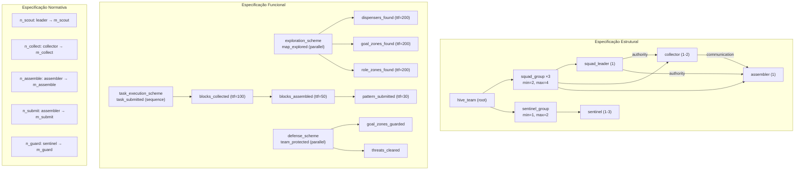

---

## Composição dos Esquadrões

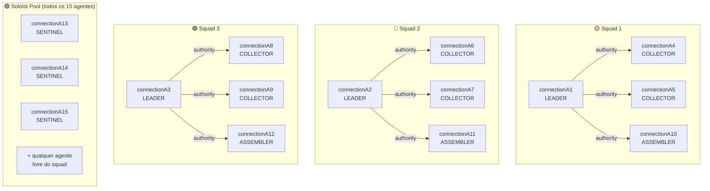

---

## Pipeline de Decisão por Step

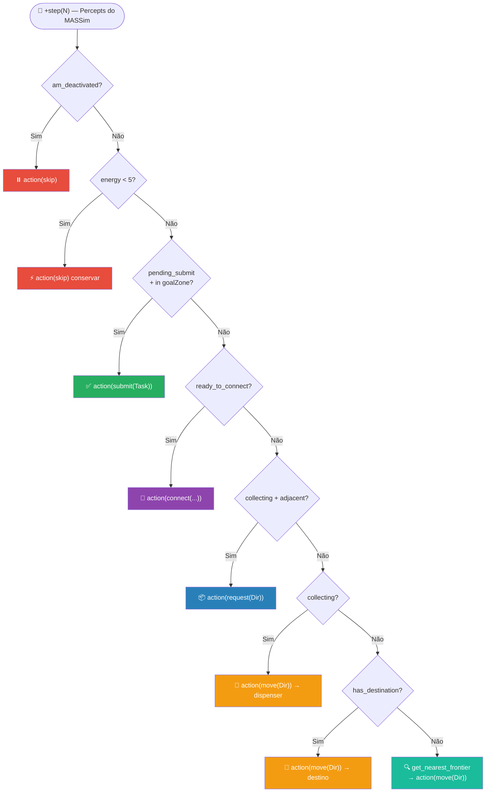

---

## Fluxo de Task Solo (Soloist)

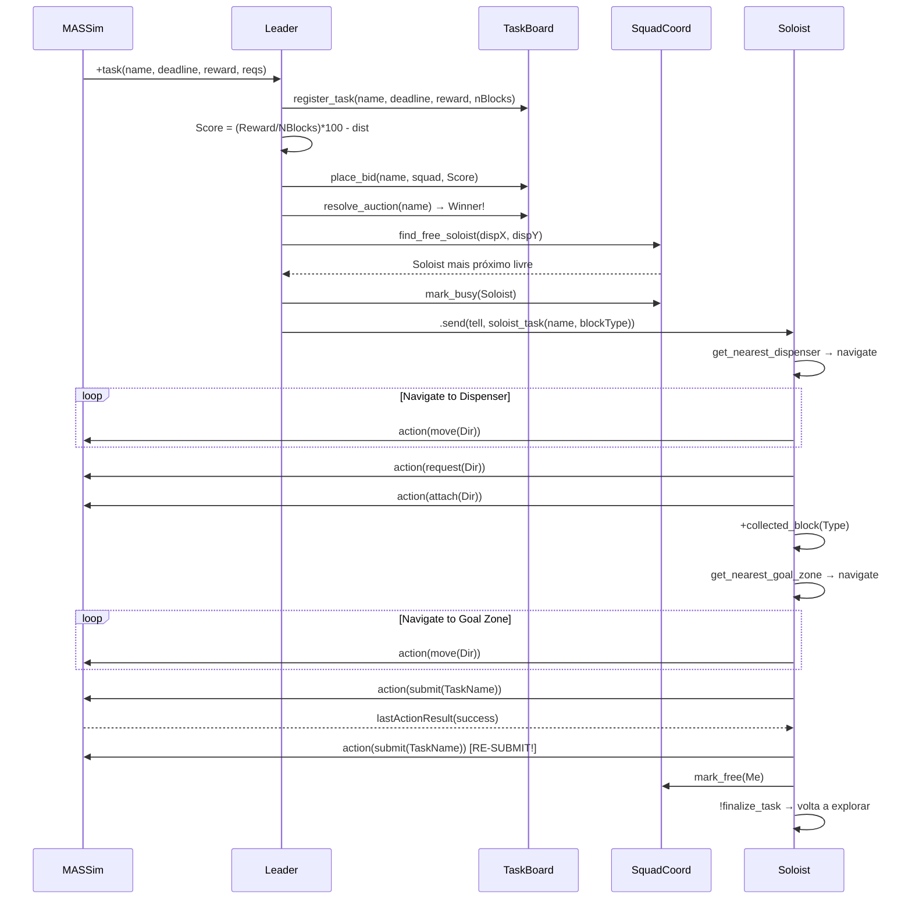

---

## Fluxo de Task Multi-Block (Connect)

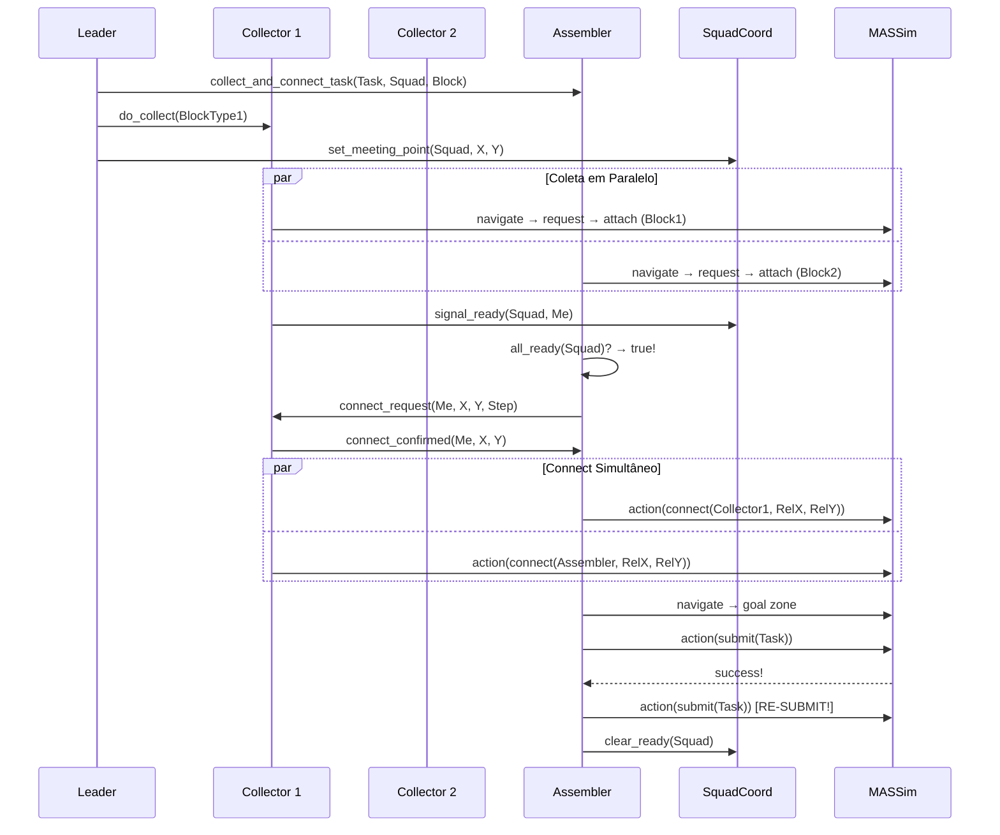

---

## Algoritmo A* (SharedMap)

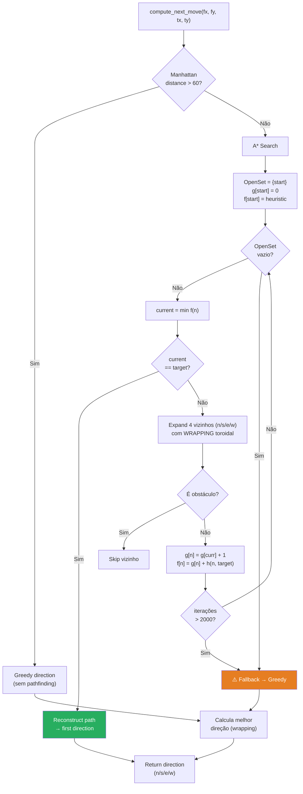

---

## HIVE Command Center — Dashboard em Tempo Real

O HIVE inclui um **dashboard web interativo** construído com React, TypeScript, Zustand e React Three Fiber, conectado em tempo real via WebSocket (porta 8765) ao artefato `HiveDashboard` (CArtAgO). Permite monitorar todos os aspectos da simulação sem impactar o desempenho dos agentes.

### Visão 2D

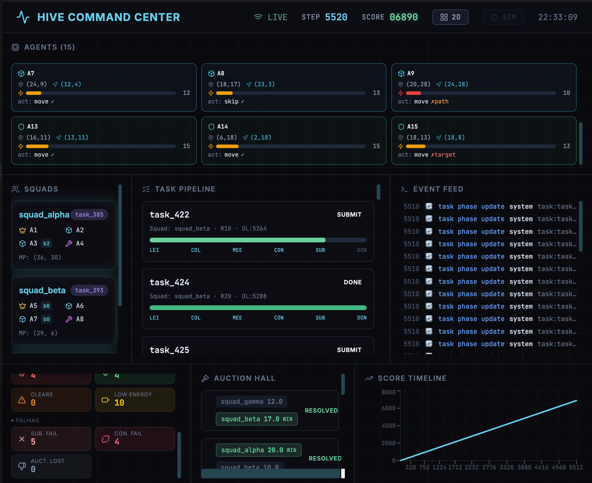

A interface 2D é organizada em painéis especializados:

| Painel | Descrição |
|--------|-----------|
| **Agents (15)** | Grid com todos os agentes: posição `(x,y)`, destino, barra de energia, última ação e resultado (✓/✗/xpath/xtarget) |
| **Squads** | 3 esquadrões (alpha, beta, gamma) com membros, papéis (👑 leader, 🤖 collector, 🔨 assembler, 🛡️ sentinel), blocos e meeting point |
| **Task Pipeline** | Cada tarefa com fases LEI → COL → MEE → CON → SUB → DON, squad atribuído, reward e deadline |
| **Event Feed** | Log em tempo real: score updates, submissões, leilões, falhas, coleta de blocos |
| **Auction Hall** | Leilões com bids de cada squad e indicação do vencedor |
| **Battle Stats** | Contadores: submissões, conexões, blocos, leilões vencidos, falhas e alertas |
| **Score Timeline** | Gráfico de evolução do score ao longo dos steps |

O header exibe status de conexão (LIVE/OFFLINE/SIM), step, score, alternância 2D/3D e botão de **simulação fake** integrado para demonstrar o dashboard sem o servidor MASSim.

### Visão 3D

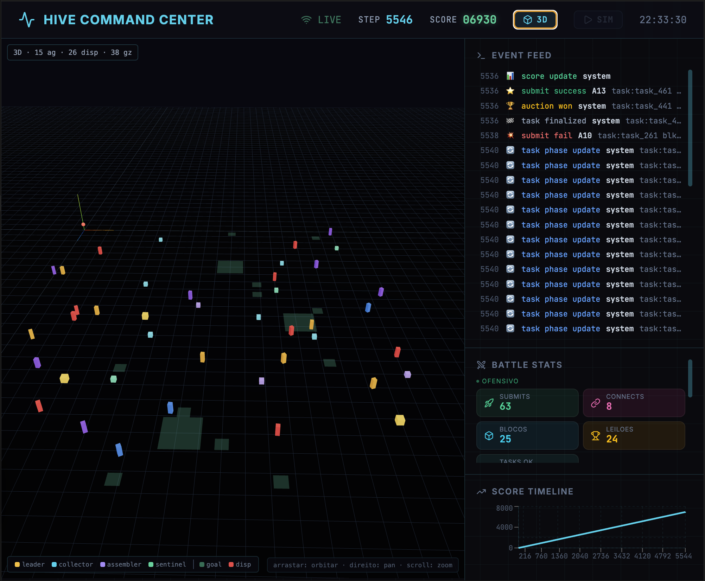

Visualização tridimensional interativa (orbitar, pan, zoom) com React Three Fiber e Three.js:

| Elemento | Representação |
|----------|---------------|
| **Agentes** | Cubos coloridos por papel (🟡 leader, 🔵 collector, 🟣 assembler, 🟢 sentinel), com movimento suave via interpolação linear |
| **Dispensers** | Caixas verticais rotativas, coloridas por tipo de bloco (🔴 b0, 🔵 b1, 🟠 b2, 🟣 b3) |
| **Goal Zones** | Planos verdes semitransparentes no chão do grid |
| **HUD** | Contagens de agentes, dispensers e goal zones |
| **Painel lateral** | Event Feed, Battle Stats e Score Timeline visíveis simultaneamente |

---

## Mecanismos de Coordenação

### Leilão Distribuído (Contract Net)

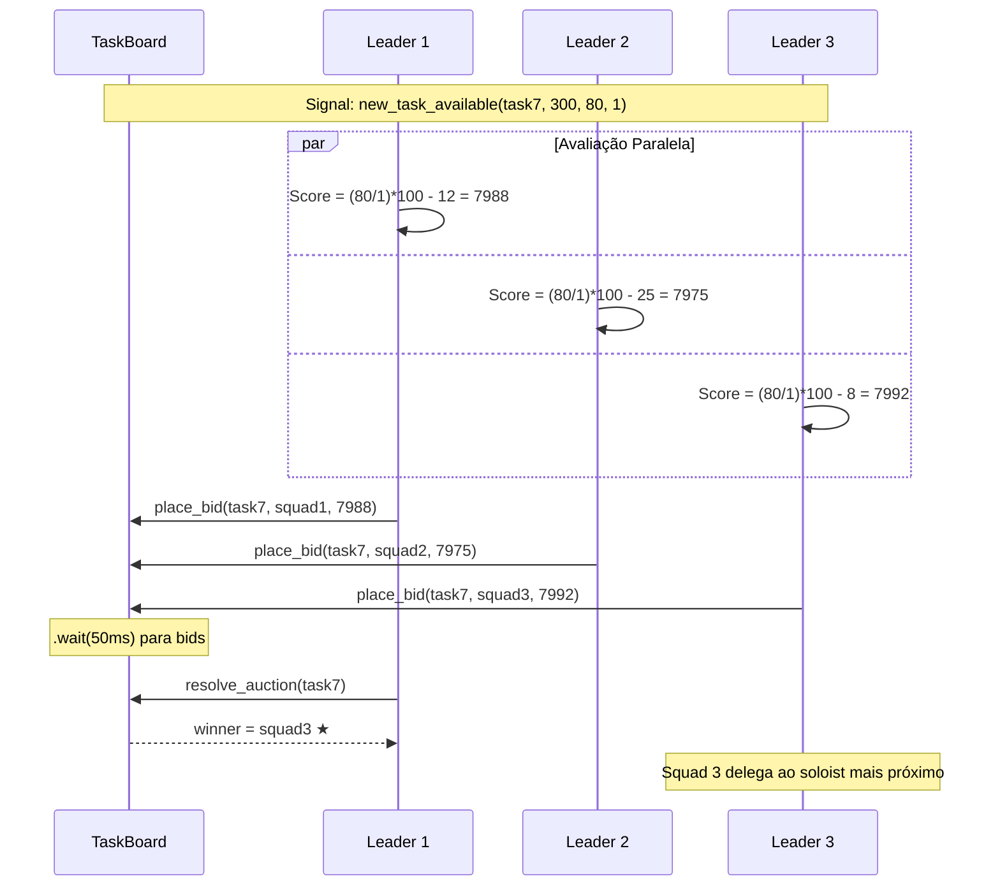

### Pool de Soloists

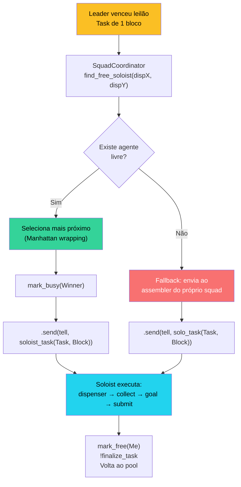

---

## Resiliência

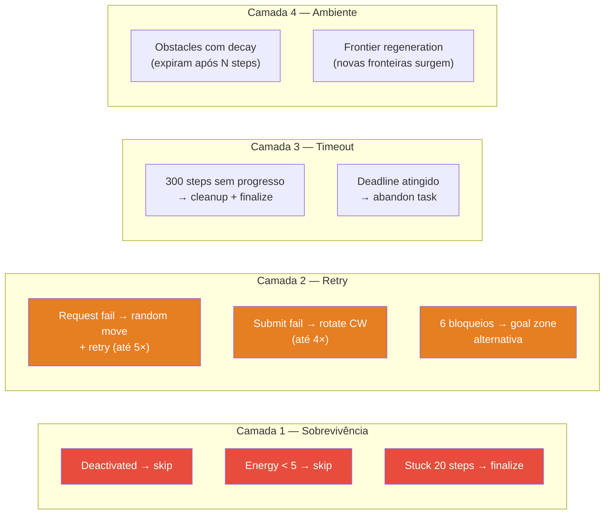

---

## Stack Tecnológico

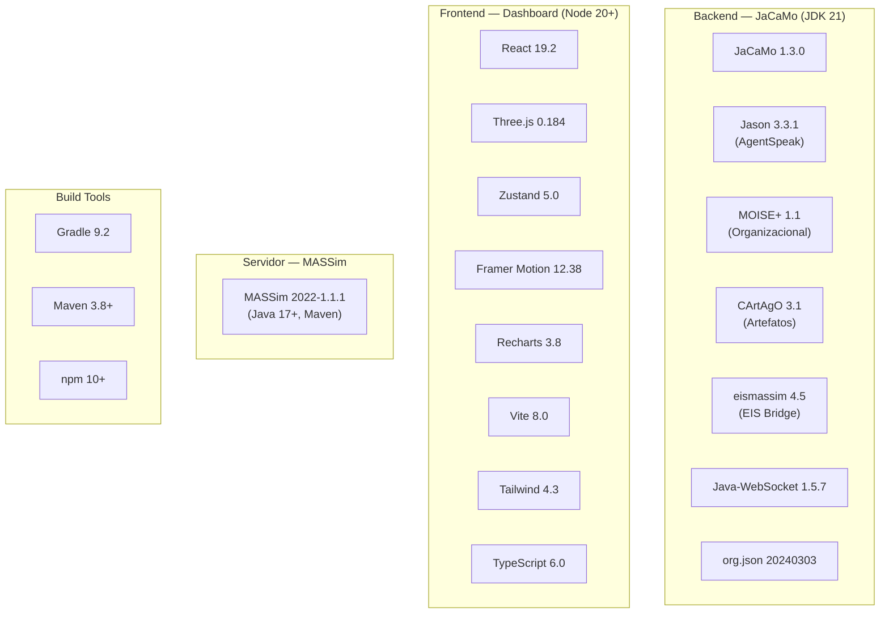

---

## Estrutura do Projeto

```
PCS5703_MAS/
│
├── 📄 build.gradle                    # Build: Java 21, JaCaMo 1.3.0, deps
├── 📄 settings.gradle                 # rootProject.name = 'hive'
├── 📄 hive.jcm                        # 15 agentes JaCaMo
├── 📄 eismassimconfig.json            # EIS → MASSim (connectionA1-15)
├── 📄 logging.properties              # JVM logging (INFO)
├── 📁 lib/                            # eismassim-4.5 JAR
│
├── 📁 src/                            # ═══ CÓDIGO FONTE ═══
│   ├── 📁 agt/                        #   Agentes Jason (AgentSpeak)
│   │   ├── squad_leader.asl           #     Líder: leilão + delegação
│   │   ├── collector.asl              #     Coletor: blocos + meeting
│   │   ├── assembler.asl             #     Montador: connect + submit
│   │   ├── sentinel.asl              #     Sentinela: solo + patrulha
│   │   ├── dummy.asl                 #     Teste mínimo
│   │   └── 📁 common/                #     Módulos compartilhados:
│   │       ├── connect_protocol.asl   #       Submit/Connect (P0)
│   │       ├── collection.asl        #       Request/Attach (P1)
│   │       ├── navigation.asl        #       Greedy/Frontier (P2)
│   │       ├── perception.asl        #       Percepts processing
│   │       ├── communication.asl     #       Sync msgs connect
│   │       └── dashboard_hooks.asl   #       WS reporting
│   │
│   ├── 📁 org/                        #   Organização MOISE+
│   │   └── hive_org.xml              #     4 roles, 3 schemes, 5 norms
│   │
│   ├── 📁 env/                        #   Artefatos CArtAgO (Java)
│   │   ├── 📁 env/
│   │   │   ├── SharedMap.java        #     Mapa: A*, greedy, frontier
│   │   │   ├── TaskBoard.java        #     Tasks + leilão
│   │   │   ├── SquadCoordinator.java #     Squads + soloist pool
│   │   │   └── HiveDashboard.java   #     WebSocket :8765
│   │   └── 📁 connection/
│   │       ├── EISAccess.java        #     EIS bridge (×15)
│   │       └── Translator.java       #     IILang ↔ Jason
│   │
│   └── 📁 java/hive/                 #   Internal Actions
│       ├── AdjacentDirection.java     #     Toroidal 40×40
│       ├── ConnectCalculator.java     #     RelX, RelY connect
│       ├── DirectionCalculator.java  #     Greedy direction
│       ├── PathFinder.java           #     A* backup
│       └── PatternMatcher.java       #     Pattern matching
│
├── 📁 conf/                           # Config MASSim server
│   └── TestConfig.json               #   40×40, 750 steps
│
├── 📁 dashboard/                      # ═══ FRONTEND REACT ═══
│   ├── package.json                  #   React 19, Three.js, Zustand
│   ├── vite.config.ts               #   Vite 8 + React
│   ├── tsconfig.json                 #   TypeScript 6
│   └── 📁 src/
│       ├── App.tsx                   #     Layout (2D/3D toggle)
│       ├── 📁 lib/
│       │   ├── store.ts             #     Zustand (HiveState)
│       │   └── ws.ts                #     useHiveSocket + reconnect
│       └── 📁 components/
│           ├── Header.tsx           #     Step, score, status
│           ├── AgentGrid.tsx        #     Cards 15 agentes
│           ├── SquadsPanel.tsx      #     3 squads + membros
│           ├── TaskPipeline.tsx     #     Pipeline visual
│           ├── EventFeed.tsx        #     Log tempo real
│           ├── AuctionHall.tsx     #     Leilões ativos
│           ├── BattleStats.tsx     #     Métricas agregadas
│           ├── ScoreTimeline.tsx   #     Gráfico (Recharts)
│           └── GridScene3D.tsx    #     Three.js viewport
│
├── 📁 massim_2022/                    # ═══ PLATAFORMA MASSim ═══
│   ├── 📁 server/                    #   Servidor simulação
│   ├── 📁 protocol/                  #   Protocolo JSON
│   ├── 📁 eismassim/                 #   EIS bridge (fonte JAR)
│   └── 📁 monitor/                   #   Web monitor
│
└── 📁 doc/                            # ═══ DOCUMENTAÇÃO ═══
    ├── ARCH.md                       #   Arquitetura C4 + UML + MAS
    ├── TECHSPEC.md                   #   Spec técnica completa
    ├── funcIdea.md                   #   Documento funcional
    └── *.pdf                         #   Enunciado + análise
```

---

## Como Executar

### Pré-requisitos

| Software | Versão | Uso |
|----------|--------|-----|
| JDK | 21+ | JaCaMo runtime |
| JDK | 17+ | MASSim server |
| Node.js | 20+ | Dashboard (opcional) |
| Maven | 3.8+ | Build MASSim (se necessário) |

### Guia Rápido — Rodar uma Simulação Completa

Abra **3 terminais** na raiz do projeto e execute na ordem:

**Terminal 1 — Servidor MASSim** (inicia o mundo da simulação):

```bash
cd massim_2022/server
java -jar target/server-2022-1.1-jar-with-dependencies.jar \
     -conf ../../conf/TestConfig.json --monitor
```

Aguarde aparecer `Listening on port 12300...` antes de prosseguir.

**Terminal 2 — Agentes HIVE** (conecta os 15 agentes BDI):

```bash
./gradlew run
```

Os 15 agentes conectam automaticamente ao servidor. Após ~25 segundos a simulação inicia e os agentes começam a explorar, coletar blocos e pontuar.

**Terminal 3 — Dashboard** (opcional, visualização em tempo real):

```bash
cd dashboard
npm install    # apenas na primeira vez
npm run dev
```

Abra **http://localhost:5173** no navegador para ver o HIVE Command Center com os agentes em ação (2D e 3D).

### Como funciona a pontuação?

1. O servidor MASSim anuncia **tarefas** (ex: "entregue um bloco tipo b0 na goal zone")
2. Os líderes dos esquadrões fazem **leilão** para decidir quem pega a tarefa
3. O agente vencedor **navega** até um dispenser, **coleta** o bloco e **leva** até uma goal zone
4. Ao fazer **submit** na goal zone, o time ganha **+10 pontos** por tarefa
5. A simulação roda por **800 steps** (~9 minutos após o fix do EIS) e o score final é o total de pontos

### O que esperar?

| Momento | O que acontece |
|---------|---------------|
| 0–25s | Servidor aguarda conexões, agentes conectam |
| Step 1–50 | Agentes exploram o mapa, descobrem dispensers e goal zones |
| Step 50–100 | Primeiras tarefas coletadas e submetidas, score começa a subir |
| Step 100–800 | Ciclo contínuo de coleta e submissão |
| **Resultado** | **60–100 pontos** (média ~77) nas simulações que completam |

> **Nota (atualizada 2026-06-17):** a instabilidade de ~50% de travamento (cascata de reconexão) foi **corrigida** pelo fix do EIS (`awaitTime` da bomba de percepção 100→500) — o run completo agora termina **sem travar** em ~8m39s, com ~22× menos timeouts. O gargalo **não** era a serialização do `SharedMap` (refutado por `jstack`: 0 frames em A*/SharedMap), e sim o pipeline de percepção do EIS — ver [`docs/solutions/performance-issues/eis-perception-pump-starves-agent-action.md`](docs/solutions/performance-issues/eis-perception-pump-starves-agent-action.md). A seção "Limitação Conhecida" abaixo descreve o **diagnóstico anterior (superado)**.

### Portas

| Porta | Protocolo | Serviço |
|-------|-----------|---------|
| 12300 | TCP/JSON | MASSim Server |
| 8000 | HTTP | MASSim Web Monitor |
| 8765 | WebSocket | HiveDashboard |
| 5173 | HTTP | Vite (Dashboard) |

---

## Documentação Completa

### Documentos Centrais

| Documento | Conteúdo |
|-----------|----------|
| [`doc/ARCH.md`](doc/ARCH.md) | Modelo C4 (4 níveis), UML (classes, sequência, estado, atividades), padrões MAS (BDI camadas, Contract Net, Soloists, A&A), ADRs |
| [`doc/TECHSPEC.md`](doc/TECHSPEC.md) | Tecnologias, protocolos EIS, percepts/ações completos, dependências, config, ambiente, métricas |
| [`doc/funcIdea.md`](doc/funcIdea.md) | Ideia central, mecânicas, estratégias, fluxos de dados, riscos, diferenciais competitivos |

### Documentação por Módulo

| Documento | Escopo |
|-----------|--------|
| [`bin/main/mainDoc.md`](bin/main/mainDoc.md) | AgentSpeak compilado + MOISE+ (arquitetura agentes, fluxos, módulos) |
| [`build/buildDoc.md`](build/buildDoc.md) | Pipeline Gradle, classes compiladas, dependências resolvidas |
| [`conf/confgDoc.md`](conf/confgDoc.md) | Parâmetros MASSim (grid, tasks, normas, roles, clear events) |
| [`dashboard/dashboardDoc.md`](dashboard/dashboardDoc.md) | Componentes React, WebSocket, Zustand, Three.js, design system |
| [`massim_2022/massimDoc.md`](massim_2022/massimDoc.md) | Módulos Maven, protocolo TCP/JSON, cenário, integração HIVE |
| [`src/srcDoc.md`](src/srcDoc.md) | AgentSpeak, artefatos Java, internal actions, MOISE+, algoritmos |

---

## Correspondência com o Relatório

O enunciado ([doc/5703_ex02_26.pdf](doc/5703_ex02_26.pdf)) define o template. Mapa para a documentação:

| Seção do Relatório | Documentação |
|--------------------|-------------|
| **1. Introdução** | [`funcIdea.md`](doc/funcIdea.md) §1-2 |
| **2. Análise e especificação do SMA** | [`funcIdea.md`](doc/funcIdea.md) §3 + [`ARCH.md`](doc/ARCH.md) §3 + [`srcDoc.md`](src/srcDoc.md) §5 |
| **3. Arquitetura e design** | [`ARCH.md`](doc/ARCH.md) — C4, UML, sequência, estado |
| **4. Linguagens e plataforma** | [`TECHSPEC.md`](doc/TECHSPEC.md) §3-5 |
| **5. Estratégia para time** | [`funcIdea.md`](doc/funcIdea.md) §4 + [`ARCH.md`](doc/ARCH.md) §5 |
| **6. Características técnicas** | [`TECHSPEC.md`](doc/TECHSPEC.md) §6-10 + [`funcIdea.md`](doc/funcIdea.md) §4.6 |
| **7. Discussão e conclusão** | [`funcIdea.md`](doc/funcIdea.md) §9-10 |

---

## Fundamentação Teórica

| Conceito | Referência | Aplicação no HIVE |
|----------|-----------|-------------------|
| Modelo BDI | Bratman (1987), Rao & Georgeff (1991) | Arquitetura dos 15 agentes |
| AgentSpeak(L) | Rao (1996), Bordini & Hübner (2006) | Linguagem de programação (.asl) |
| MOISE+ | Hübner, Sichman & Boissier (2002) | Organização: roles, groups, norms |
| Contract Net | Smith (1980) | Leilão distribuído (TaskBoard) |
| A&A | Ricci, Viroli & Omicini (2007) | Artefatos CArtAgO compartilhados |
| JaCaMo | Boissier et al. (2013) | Framework integrador |
| Subsumption | Brooks (1986) | Prioridade de comportamentos |
| LTI-USP | Stabile & Sichman (2021) | Referência MAPC anterior |

---

## Resultados Experimentais e Otimizações

### Desempenho no Cenário MAPC 2022

O HIVE foi submetido a extensivos ciclos de teste e otimização no cenário **Agents Assemble III** (grid toroidal 40×40, cave density 0.45, 800 steps). A tabela abaixo resume os scores obtidos nas simulações que completaram com sucesso:

| Run | Score | Observação |
|-----|-------|------------|
| 1   | **100** | Melhor resultado obtido |
| 2   | **90**  | Consistente |
| 3   | **80**  | Reproduzido 2× |
| 4   | **80**  | — |
| 5   | **70**  | — |
| 6   | **60**  | Reproduzido 2× |
| 7   | **60**  | — |

**Média: ~77 pontos** | **Faixa: 60–100 pontos** | **Configuração: 15 agentes, agentTimeout 8000ms**

### Otimizações Implementadas

As otimizações foram aplicadas iterativamente com validação por simulação a cada mudança:

| # | Otimização | Antes | Depois | Impacto |
|---|-----------|-------|--------|---------|
| 1 | **Delegação eficiente** — Líder envia 1 soloist por task de 1 bloco | 3 agentes/task (desperdiçava 2/3) | 1 agente/task | +40% utilização |
| 2 | **Scan simplificado** — Líder processa 1 task por scan, sem loop `findall` | Loop com N tasks × 7 artifact calls cada | 1 task × 3 calls | Eliminou timeouts do líder |
| 3 | **Frequência de scan** — Reduzida de cada 5 para cada 10 steps | `(N mod 5) == 3` | `(N mod 10) == 3` | -50% carga de coordenação |
| 4 | **Delays removidos** — `.wait()` eliminados do `quick_delegate` | `.wait(10)` entre `place_bid` e `resolve_auction` | Sem wait | -10ms por delegação |
| 5 | **Distância toroidal** — `find_free_soloist` corrigido para wrapping | Manhattan simples (ignora wrapping) | `wrapDist()` com `min(d, size-d)` | Seleciona soloists realmente mais próximos |
| 6 | **Timeout de task** — Aumentado para evitar abandonos prematuros | 200 steps | 300 steps | Agentes completam tasks em mapas difíceis |
| 7 | **Obstacle caching** — `mark_obstacle` no-op se já conhecido | `obstacles.put()` sempre | `containsKey()` check | Reduz escritas redundantes |
| 8 | **Decay periódico** — `decay_obstacles` apenas a cada 10 steps | A cada step, por todos agentes | `(N mod 10) == 0` | -93% chamadas de decay |
| 9 | **Memória JVM** — Heap aumentado | Default (~256MB) | `-Xmx2g -Xms512m` | Menos GC pauses |
| 10 | **Goal zone alternativa** — Agentes stuck tentam outra goal zone | Recalcular rota para mesma goal zone | `get_alternative_goal_zone()` | Recuperação mais rápida de stuck |
| 11 | **Self-assignment deadline** — Filtro de tasks quase expirando | `TD - CS > 30` | `TD - CS > 40` | Evita pegar tasks sem tempo |

### Correção do Livelock de Movimento (Navegação Ciente de Colega)

Durante a validação observou-se um **livelock de movimento**: agentes agem a cada step mas não progridem ao se aglomerar ou perto de paredes. Um detector de oscilação (ping-pong A↔B com destino ativo) mediu **~157 oscilações / 200 steps** (seed 17) — o modo de falha **dominante** (≈20× as detecções de *stuck*), invisível à detecção de stuck de 50 steps que só vê a mesma célula.

**Causa-raiz:** o A* (`compute_next_move`) montava o conjunto de bloqueios apenas de `obstacles` (paredes), **ignorando as posições vivas dos colegas** — roteava um agente através do outro. Como uma correção anterior deixou de marcar colega como obstáculo (para evitar obstáculos-fantasma que poluíam o mapa compartilhado), o A* nunca aprendia a desviar do colega e re-roteava sempre para o mesmo gargalo.

**Tentativa reativa (insuficiente sozinha):** um *escape* em `.asl` — ao bloquear/oscilar, mover para um vizinho livre pela percepção local — **piorou** a oscilação (157 → 339). Diagnóstico (instrumentação + monitor): é um reflexo de 1 passo **sem autoridade sobre a rota** — empurra o agente para o lado, e no step seguinte o A* re-puxa para o gargalo (motor de 2 tempos → o agente **orbita** o gargalo indefinidamente).

**Correção (A\* ciente de colega):** o `SharedMap` passa a manter um **índice de ocupação viva** (cada agente reporta a posição a cada step) e o A* **penaliza** com custo alto finito — **penaliza, não bloqueia**, para não travar corredores estreitos — as células ocupadas por colega, exceto a origem e o destino. O A* contorna a congestão no espaço aberto; o *escape* reativo permanece como **fallback** para o corredor frente-a-frente. Tudo no grid toroidal (distância de menor-volta).

**Calibração (A/B determinístico, seed 17, validação por compilação + parse `as2j` + runs instrumentados):**

Varredura da penalidade — 100 steps, mediana de 3 runs:

| Métrica | base (sem fix) | PENALTY=8 | PENALTY=16 | PENALTY=24 |
|---|---|---|---|---|
| Oscilações (mediana) | 89 | 48 | 43 | 31 |

Desempate a 200 steps (mediana de 3 runs), medindo também **submits**:

| Config | Oscilações (mediana) | Submits (mediana) |
|---|---|---|
| **PENALTY=16** ★ | **78** (−50% vs base) | **3** |
| PENALTY=24 | 83 | 1 |

**Valor escolhido: `PENALTY=16`** — reduz a oscilação ~50% **sem regredir os submits** (na prática sobem). O valor mais agressivo (24) reduz a oscilação de forma equivalente, mas **regride os submits** (detours longos demais), e por isso foi descartado. Zero erros de runtime do A* em todos os runs.

> **Nota de escopo:** este fix ataca a **navegação** (movimento). A medição expôs um próximo gargalo *separado* na **estratégia de coleta/montagem/submit** (super-coleta vs norma de *carry*, rotação de orientação no submit, baixa convergência às goal zones), registrado em [`docs/backlog.md`](docs/backlog.md).

### Análise de Escalabilidade — Número de Agentes

Foram conduzidos testes variando o número de agentes para avaliar o trade-off entre redundância, desempenho e estabilidade:

```
Agentes │ Runs OK │ Scores (completados)       │ Média │ Taxa Crash │ Tempo/Run
────────┼─────────┼────────────────────────────┼───────┼────────────┼──────────
   6    │  3 / 4  │ 30, 40, 0                  │  23   │   ~25%     │  ~3 min
  10    │  3 / 5  │ 90, 20, 30                 │  47   │   ~40%     │  ~5 min
  15 ★  │  7 / 13 │ 100, 90, 80, 80, 70, 60, 60│  77   │   ~50%     │  ~6 min
  20    │  2 / 4  │ 80, 60                     │  70   │   ~50%     │  ~14 min
```

**Conclusão: 15 agentes é a configuração ótima** — produz os scores mais altos (média 77, máximo 100) mesmo com taxa de crash de ~50%. Menos agentes reduz scores sem ganho significativo de estabilidade; mais agentes não melhora nem score nem estabilidade.

### Limitação Conhecida: Instabilidade do Framework

> ⚠️ **Superado (2026-06-17).** A instabilidade descrita abaixo foi **resolvida** e o **diagnóstico de causa-raiz desta seção está refutado**. O `jstack` (40 dumps durante o run lento) mostrou **0 frames** em `SharedMap`/A* — o gargalo **não** era a serialização do CArtAgO, e sim a bomba de percepção do EIS (`EISAccess.updatePercepts`) segurando a thread do artefato e estarvando a `action()`. Fix de **1 linha** (`awaitTime` 100→500) → run completo em ~8m39s **sem travar**, ~22× menos timeouts. Detalhe e medições: [`docs/solutions/performance-issues/eis-perception-pump-starves-agent-action.md`](docs/solutions/performance-issues/eis-perception-pump-starves-agent-action.md). A análise abaixo fica como **registro do diagnóstico anterior**.

Aproximadamente 50% dos runs travam entre os steps 76–230 devido a timeouts em cascata no framework JaCaMo/EIS:

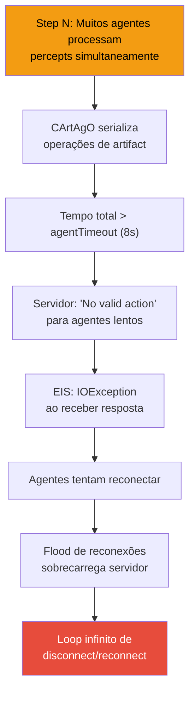

**Causa raiz identificada**: operações CArtAgO (`mark_obstacle`, `update_cell`, `mark_visited`, etc.) são serializadas por artifact. Com 15 agentes × ~15 chamadas/step = ~225 operações serializadas por step. Em mapas cave com 45% de densidade, o volume de percepts de obstáculos amplifica este gargalo.

**Evidência**: mapas com 25% de densidade completam **100% dos runs** com 0 erros de conexão.

**Mitigações aplicadas**:
- `agentTimeout` aumentado de 4000ms para 8000ms (servidor e EIS)
- `mark_obstacle` limitado e com cache (no-op se conhecido)
- `decay_obstacles` reduzido para cada 10 steps
- JVM heap aumentado para 2GB
- Scan do líder simplificado (1 task por scan, sem loops)

### Comparação com a Competição MAPC 2022

| Posição | Time | Score típico | Framework |
|---------|------|-------------|-----------|
| 1º | FIT BUT | 200–400 pts | Java puro |
| 2º | LFC | 150–300 pts | Java puro |
| 3º | — | 100–200 pts | Variado |
| **HIVE** | **—** | **60–100 pts** | **JaCaMo (BDI)** |
| Medianos | — | 50–100 pts | Variado |

O HIVE se posiciona na faixa de **time mediano a competitivo**. Os top teams utilizam frameworks Java puros com controle direto de threads, evitando o overhead de serialização do CArtAgO. A principal vantagem competitiva do HIVE é a **arquitetura BDI bem estruturada** com organização MOISE+, que demonstra os conceitos de Sistemas Multi-Agentes de forma acadêmica.

---

## Métricas

| Métrica | Valor |
|---------|-------|
| Código total | ~5.410 linhas |
| AgentSpeak (.asl) | ~1.470 linhas / 11 arquivos |
| Java (artefatos + actions) | ~1.640 linhas / 11 arquivos |
| TypeScript (dashboard) | ~2.000 linhas |
| XML (MOISE+) | 120 linhas |
| Agentes BDI | 15 (3 líderes, 6 coletores, 3 assemblers, 3 sentinelas) |
| Artefatos CArtAgO | 5 tipos / 19 instâncias |
| Internal Actions Java | 5 |
| Componentes React | 9 |
| Documentação | 6 docs por diretório + 3 centrais |
| **Score médio** | **~77 pontos (faixa 60–100)** |
| **Score máximo** | **100 pontos** |
| Simulações testadas | 30+ runs de validação |

---

## Referências

[1] Multi Agent Programming Contest. http://www.multiagentcontest.org/

[2] JaCaMo project. https://jacamo-lang.github.io

[3] Hübner, J.F., Sichman, J.S., Boissier, O. (2002). *A Model for the Structural, Functional and Deontic Specification of Organizations in Multiagent Systems*. SBIA'02, LNAI 2507, pp. 118-128. Springer.

[4] Bordini, R.H., Hübner, J.F. (2006). *An overview of Jason*. ALP Newsletter, 19(3).

[5] Stabile, M.F., Sichman, J.S. (2021). *The LTI-USP Strategy to the 2020/2021 Multi-Agent Programming Contest*. MAPC 2021, LNCS 12947. Springer.

[6] Multi-Agent Programming Contest Scenario Description 2022. https://github.com/agentcontest/massim_2022/blob/main/docs/scenario.md

---

<p align="center">
  <strong>PCS 5703 — Sistemas Multi-Agentes</strong><br/>
  Escola Politécnica da USP — 2026
</p>
