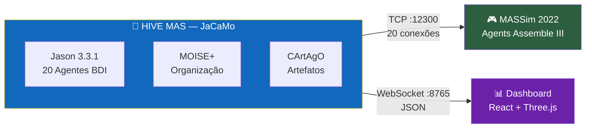
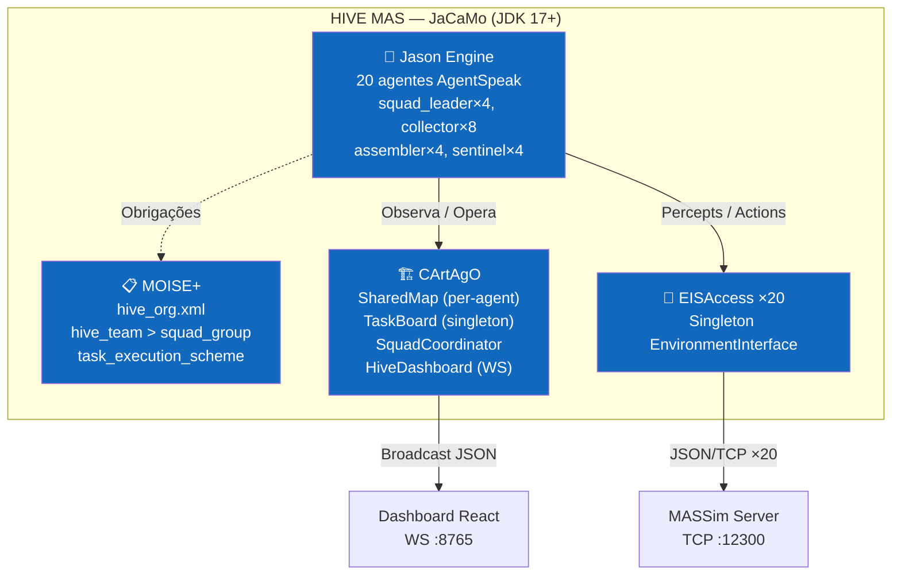
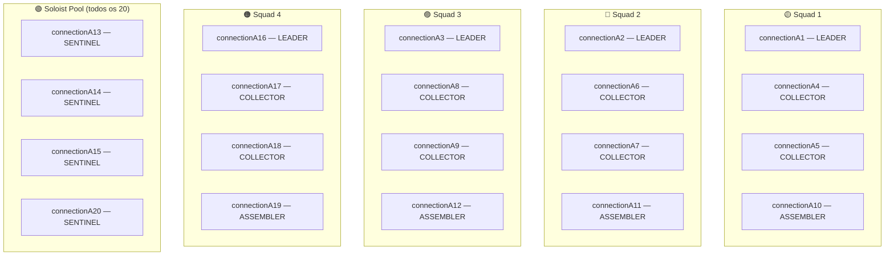
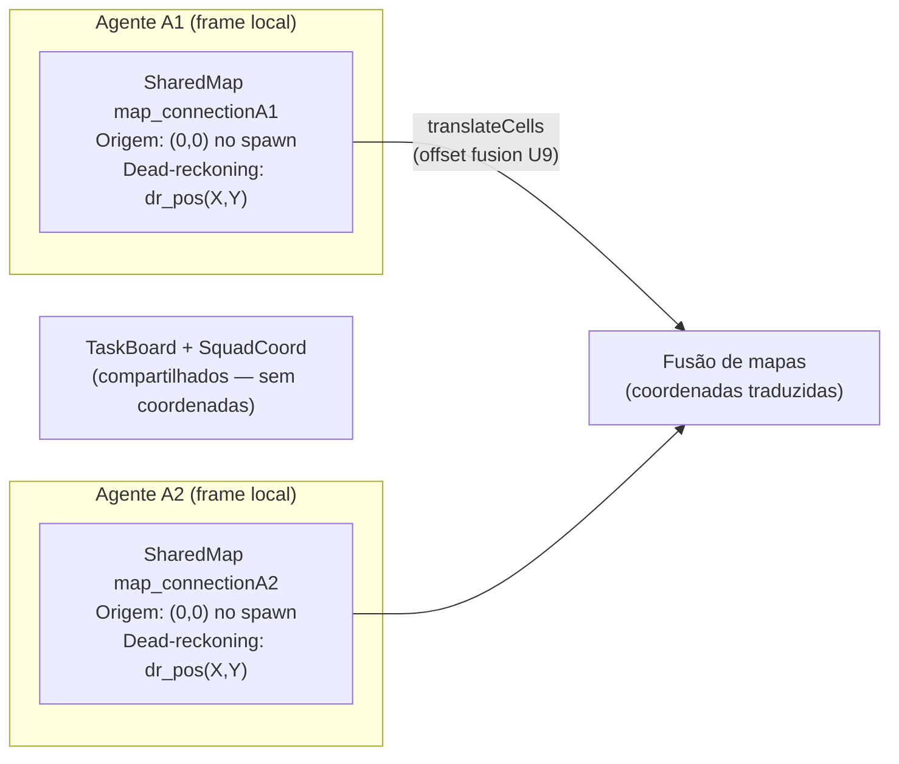
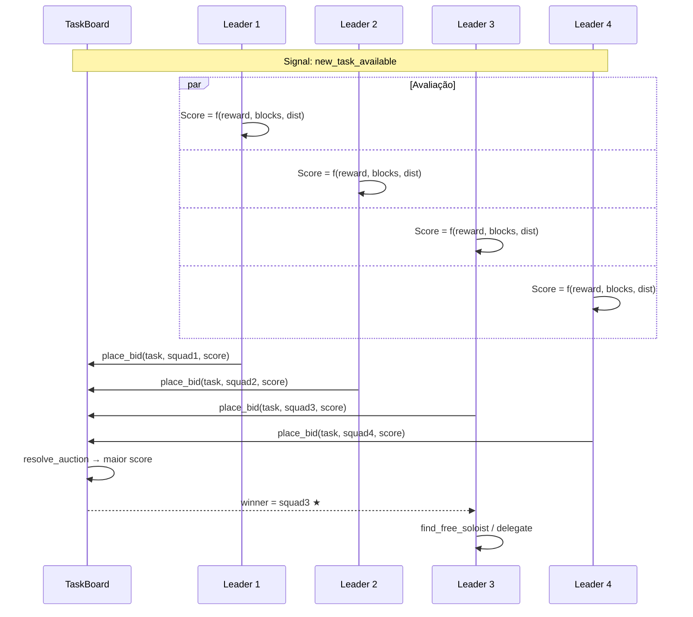
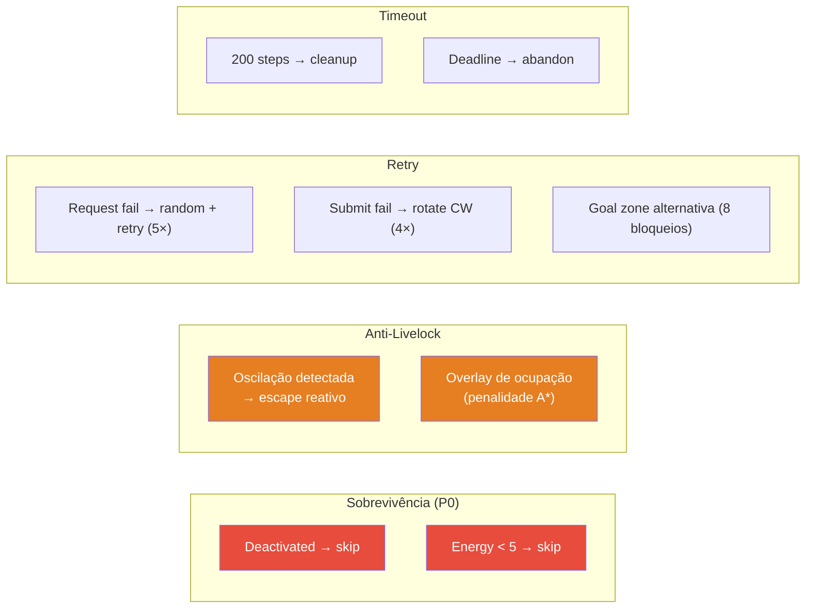

# HIVE — Hierarchical Intelligent Virtual Ensemble

**Sistema Multi-Agente BDI para o Multi-Agent Programming Contest 2022 (Agents Assemble III)**



---

## Informações Acadêmicas

| | |
|---|---|
| **Disciplina** | PCS 5703 — Sistemas Multi-Agentes |
| **Instituição** | Escola Politécnica da Universidade de São Paulo (EPUSP) |
| **Departamento** | Engenharia de Computação e Sistemas Digitais |
| **Período** | 1º Quadrimestre de 2026 |
| **Exercício** | 2º Exercício Prático — Aplicação no Multi-Agent Programming Contest |
| **Entrega** | 02/06/2026 |
| **Enunciado** | [`doc/5703_ex02_26.pdf`](doc/5703_ex02_26.pdf) |
| **Paper** | [`doc/paper/paperv0.md`](doc/paper/paperv0.md) |

---

## Resumo

O **HIVE** (*Hierarchical Intelligent Virtual Ensemble*) é um SMA desenvolvido na plataforma **JaCaMo** para o cenário *Agents Assemble* do MAPC 2022. Emprega **20 agentes BDI** programados em AgentSpeak(L)/Jason, organizados em **4 esquadrões autônomos** via MOISE+, com artefatos CArtAgO para mapa por-agente (frame relativo), quadro de tarefas com leilão distribuído e pool universal de soloists. Resultados experimentais demonstram scores de 60–100 pontos (média 77,1) nas simulações completadas.

### Características Principais

- **20 agentes BDI** — 4 squad_leaders, 8 collectors, 4 assemblers, 4 sentinels
- **4 esquadrões autônomos** coordenados por leilão distribuído (Contract Net)
- **Pool de soloists universal** — qualquer agente livre executa tasks de 1 bloco
- **Mapa per-agente** (frame relativo) com A* ciente-de-colega + overlay de ocupação
- **Dead-reckoning** para cenário oficial (`absolutePosition: false`)
- **Escape reativo** anti-livelock (oscilação, congestão)
- **Connect sincronizado** para tasks multi-block
- **Re-submissão automática** para multiplicação de pontos
- **Role adoption** dinâmico (default → worker/constructor)
- **44 testes JUnit** (A* toroidal, dead-reckoning, leilão, grid)
- **Dashboard React 3D** em tempo real via WebSocket
- **Makefile** com targets para todos os cenários

---

## Arquitetura

### Visão Geral (C4 Nível 2)



### Composição dos 20 Agentes (4 Squads)



### Pipeline de Decisão (por step)

```mermaid
flowchart TD
    START(["📡 +step(N)"]) --> D1{deactivated?}
    D1 -->|Sim| SKIP1["⏸️ skip"]
    D1 -->|Não| D2{energy < 5?}
    D2 -->|Sim| SKIP2["⚡ skip"]
    D2 -->|Não| D3{pending_submit<br/>+ goalZone(0,0)?}
    D3 -->|Sim| SUBMIT["✅ submit(Task)"]
    D3 -->|Não| D4{ready_to_connect?}
    D4 -->|Sim| CONNECT["🔗 connect(...)"]
    D4 -->|Não| D5{collecting + adj?}
    D5 -->|Sim| REQ["📦 request(Dir)"]
    D5 -->|Não| D6{collecting?}
    D6 -->|Sim| MOVE["🚶 move → dispenser"]
    D6 -->|Não| D7{has_destination?}
    D7 -->|Sim| NAV["🚶 greedy/A* → dest"]
    D7 -->|Não| EXPLORE["🔍 frontier explore"]

    style SKIP1 fill:#e74c3c,color:#fff
    style SKIP2 fill:#e74c3c,color:#fff
    style SUBMIT fill:#27ae60,color:#fff
    style CONNECT fill:#8e44ad,color:#fff
```

### Mapa Per-Agente (Frame Relativo)



### Leilão Distribuído



---

## Resiliência



---

## Dashboard — Interface Visual

```
┌─────────────────────────────────────────────────────────────────────────┐
│  ⚡ HIVE COMMAND CENTER       📡 LIVE   Step 0247   Score 00180  [2D/3D]│
├─────────────────────────────────────────────────────────────────────────┤
│  🟡A1  🟡A2  🟡A3  🟠A16  🔵A4  🔵A5  🔵A6  🔵A7  🔵A8  🔵A9       │
│  🔵A17 🔵A18 🟣A10 🟣A11  🟣A12 🟠A19 🟢A13 🟢A14 🟢A15 🟢A20       │
├──────────┬──────────────────────────────────┬───────────────────────────┤
│ SQUADS   │         TASK PIPELINE            │       EVENT FEED          │
│          │                                  │                           │
│ Sq1 🟡A1│  task5 [■■■■■■■□□] collecting    │ A1 won auction task5      │
│  A4 A5   │  task3 [■■■■■■■■■] submitting   │ A13 submit task9 ✓        │
│  A10     │  task8 [■■□□□□□□□] delegating    │ new_task task12 rw:80     │
│ ──────── │                                  │                           │
│ Sq2 🔵A2│                                  │                           │
│ Sq3 🟣A3│                                  │                           │
│ Sq4 🟠A16                                  │                           │
├──────────┴────────────┬─────────────────────┴───────────────────────────┤
│    BATTLE STATS       │    AUCTION HALL    │     SCORE TIMELINE         │
│  Completed: 12        │  task12: sq3=91 ★  │     180 ─╱────             │
│  Active: 4            │          sq1=85    │     120 ╱                  │
│  Coverage: 67%        │          sq2=72    │       0 ┴────────          │
└───────────────────────┴────────────────────┴────────────────────────────┘
```

**3D Mode:** Three.js viewport com OrbitControls, agentes como esferas coloridas por role, dispensers vermelhos, goal zones verdes, obstáculos cinza.

---

## Quick Start

### Pré-requisitos

| Software | Versão | Uso |
|----------|--------|-----|
| JDK | 17+ | JaCaMo + MASSim |
| Gradle | 8+ (wrapper incluso) | Build |
| Node.js | 20+ | Dashboard (opcional) |

### Com Makefile (recomendado)

```bash
# Terminal 1 — Servidor MASSim
make server                    # Config padrão (40×40, 800 steps)
make official                  # Cenário oficial (70×70, absolutePosition=false)

# Terminal 2 — Agentes HIVE
make agents                    # Grid 40×40
make agents-official           # Grid 70×70

# Terminal 3 — Dashboard (opcional)
make dashboard

# Utilidades
make test                      # 44 testes JUnit
make stop                      # Para tudo
make help                      # Todos os comandos
```

### Manual

```bash
# 1. Servidor MASSim
cd massim_2022 && java -jar server/target/server-2022-1.1-jar-with-dependencies.jar \
    -conf ../conf/TestConfig.json --monitor

# 2. Agentes HIVE
gradle run -PgridW=40 -PgridH=40

# 3. Dashboard
cd dashboard && npm install && npm run dev
```

### Portas

| Porta | Serviço |
|-------|---------|
| 12300 | MASSim Server (TCP/JSON) |
| 8000 | MASSim Web Monitor (HTTP) |
| 8765 | HiveDashboard (WebSocket) |
| 5173 | Vite Dashboard (HTTP) |
| 3272 | Jason Mind Inspector (HTTP) |

---

## Estrutura do Projeto

```
PCS5703_MAS/
│
├── 📄 Makefile                     # Comandos: server, agents, test, dashboard, stop
├── 📄 build.gradle                 # Java 17+, JaCaMo 1.3.0, deps
├── 📄 hive.jcm                     # 20 agentes + organização MOISE+
├── 📄 eismassimconfig.json         # EIS: connectionA1-20 → agentA1-20
├── 📄 STRATEGY.md                  # Estratégia de desenvolvimento (tracks, métricas)
├── 📄 CONCEPTS.md                  # Glossário do domínio
│
├── 📁 src/
│   ├── 📁 agt/                     # ═══ AGENTES JASON (3.184 linhas) ═══
│   │   ├── squad_leader.asl        #   Leilão + delegação + exploração
│   │   ├── collector.asl           #   Coleta + soloist + meeting point
│   │   ├── assembler.asl           #   Connect + submit + soloist
│   │   ├── sentinel.asl            #   Solo tasks + patrulha
│   │   ├── dummy.asl               #   Agente mínimo (testes)
│   │   └── 📁 common/ (10 módulos)
│   │       ├── connect_protocol.asl  # Submit/Connect (PRIORIDADE MÁX)
│   │       ├── collection.asl        # Request/Attach cycle
│   │       ├── navigation.asl        # A*/Greedy + escape reativo
│   │       ├── perception.asl        # Percepts + dead-reckoning
│   │       ├── communication.asl     # Sync msgs connect
│   │       ├── map_merge.asl         # Fusão de mapas (U9)
│   │       ├── role_adoption.asl     # Adoção de role do cenário
│   │       ├── organization.asl      # Integração MOISE+
│   │       ├── shared_map_init.asl   # Init do mapa per-agente
│   │       └── dashboard_hooks.asl   # WS reporting
│   │
│   ├── 📁 env/ (1.939 linhas)      # ═══ ARTEFATOS CArtAgO ═══
│   │   ├── env/SharedMap.java       #   A*, greedy, frontier, overlay ocupação
│   │   ├── env/TaskBoard.java       #   Tasks + leilão + auction
│   │   ├── env/SquadCoordinator.java#   Squads + soloist pool
│   │   ├── env/HiveDashboard.java   #   WebSocket :8765
│   │   ├── connection/EISAccess.java #   Bridge EIS (×20)
│   │   └── connection/Translator.java#   IILang ↔ Jason
│   │
│   ├── 📁 java/hive/               # ═══ INTERNAL ACTIONS / UTILS ═══
│   │   ├── AdjacentDirection.java   #   Adjacência toroidal
│   │   ├── GridConfig.java          #   Grid parametrizável (-PgridW/H)
│   │   └── LocalFrame.java          #   Dead-reckoning + tradução de frame
│   │
│   ├── 📁 org/
│   │   └── hive_org.xml            #   MOISE+: 4 roles, schemes, norms
│   │
│   └── 📁 test/java/env/           # ═══ TESTES (330 linhas, 44 testes) ═══
│       └── SquadCoordinatorTest.java#   A*, leilão, grid, dead-reckoning
│
├── 📁 conf/                         # ═══ CONFIGURAÇÕES MASSim ═══
│   ├── TestConfig.json              #   Dev (40×40, 800 steps)
│   ├── FastTestConfig.json          #   Rápido (40×40, 100 steps)
│   ├── OfficialTestConfig.json      #   Oficial (70×70, absolutePosition=false)
│   ├── OfficialTwoTeamsConfig.json  #   2 times (HIVE vs dummy)
│   ├── RoleAdoptTest.json           #   Teste de role adoption
│   └── teamB/                       #   Config do time adversário dummy
│
├── 📁 dashboard/                    # ═══ FRONTEND REACT ═══
│   └── src/ (React 19, Three.js, Zustand, Tailwind, Recharts)
│
├── 📁 doc/                          # ═══ DOCUMENTAÇÃO ═══
│   ├── 📁 paper/                    #   Artigo científico (relatório final)
│   │   ├── paperv0.md              #     Versão completa do paper
│   │   ├── introduction.md         #     §1 Introdução
│   │   ├── method.md               #     §2 Análise e especificação
│   │   ├── architecture.md         #     §3 Arquitetura e design
│   │   ├── result.md               #     §5 Resultados
│   │   ├── disc.md                 #     §7 Discussão
│   │   └── resumo.md               #     Abstract
│   ├── ARCH.md                     #   Arquitetura C4, UML, padrões MAS
│   ├── TECHSPEC.md                 #   Especificação técnica completa
│   ├── funcIdea.md                 #   Documento funcional
│   └── 📁 plan/                    #   Planos de implementação por fase
│
├── 📁 docs/                         # ═══ ENGENHARIA ═══
│   ├── backlog.md                  #   Backlog + status de tracks
│   ├── 📁 brainstorms/            #   Sessões de ideação
│   ├── 📁 plans/                   #   Planos técnicos (features)
│   ├── 📁 solutions/              #   Soluções para bugs encontrados
│   └── 📁 ideation/               #   Investigações exploratórias
│
└── 📁 massim_2022/                  # ═══ PLATAFORMA MASSim (submodule) ═══
```

---

## Documentação

### Relatório / Paper

| Seção | Arquivo | Conteúdo |
|-------|---------|----------|
| Completo | [`doc/paper/paperv0.md`](doc/paper/paperv0.md) | Paper em formato artigo científico |
| §1 Introdução | [`doc/paper/introduction.md`](doc/paper/introduction.md) | Problema, software, hardware |
| §2 Método | [`doc/paper/method.md`](doc/paper/method.md) | Análise e especificação do SMA |
| §3 Arquitetura | [`doc/paper/architecture.md`](doc/paper/architecture.md) | Design dos componentes |
| §5 Resultados | [`doc/paper/result.md`](doc/paper/result.md) | Scores experimentais |
| §7 Discussão | [`doc/paper/disc.md`](doc/paper/disc.md) | Limitações e extensões |

### Documentos Técnicos

| Documento | Conteúdo |
|-----------|----------|
| [`doc/ARCH.md`](doc/ARCH.md) | Modelo C4 (4 níveis), UML, diagramas de sequência/estado, padrões MAS, ADRs |
| [`doc/TECHSPEC.md`](doc/TECHSPEC.md) | Tecnologias, protocolos EIS, percepts/ações, dependências, deployment |
| [`doc/funcIdea.md`](doc/funcIdea.md) | Ideia central, mecânicas, estratégias, fluxos, riscos, diferenciais |
| [`STRATEGY.md`](STRATEGY.md) | Tracks de desenvolvimento, métricas, approach A/B |
| [`CONCEPTS.md`](CONCEPTS.md) | Glossário do domínio (SharedMap, frame local, livelock, etc.) |

### Documentação por Diretório

| Documento | Escopo |
|-----------|--------|
| [`bin/main/mainDoc.md`](bin/main/mainDoc.md) | AgentSpeak compilado + MOISE+ |
| [`build/buildDoc.md`](build/buildDoc.md) | Pipeline Gradle, classes, deps |
| [`conf/confgDoc.md`](conf/confgDoc.md) | Parâmetros MASSim (grid, tasks, normas, roles) |
| [`dashboard/dashboardDoc.md`](dashboard/dashboardDoc.md) | Componentes React, WebSocket, Three.js |
| [`massim_2022/massimDoc.md`](massim_2022/massimDoc.md) | Plataforma MASSim, protocolo, cenário |
| [`src/srcDoc.md`](src/srcDoc.md) | Código fonte detalhado |

---

## Fundamentação Teórica

| Conceito | Referência | Aplicação no HIVE |
|----------|-----------|-------------------|
| Modelo BDI | Bratman (1987), Rao & Georgeff (1991) | Arquitetura dos 20 agentes |
| AgentSpeak(L) | Rao (1996), Bordini & Hübner (2006) | Linguagem de programação |
| MOISE+ | Hübner, Sichman & Boissier (2002) | Roles, groups, schemes, norms |
| Contract Net | Smith (1980) | Leilão distribuído (TaskBoard) |
| A&A | Ricci, Viroli & Omicini (2007) | Artefatos CArtAgO |
| JaCaMo | Boissier et al. (2013) | Framework integrador |
| Subsumption | Brooks (1986) | Prioridade por inclusão .asl |
| LTI-USP | Stabile & Sichman (2021) | Referência MAPC |

---

## Métricas

| Métrica | Valor |
|---------|-------|
| Código AgentSpeak (.asl) | 3.184 linhas / 15 arquivos |
| Código Java (artefatos + utils) | 1.939 linhas / 9 arquivos |
| Testes JUnit | 330 linhas / 44 testes |
| Dashboard (TypeScript) | ~2.000 linhas |
| **Total código** | **~7.450 linhas** |
| Agentes BDI | 20 (4 roles) |
| Esquadrões | 4 |
| Artefatos CArtAgO | 5 tipos / 24 instâncias |
| Módulos common/ | 10 |
| Configs de cenário | 5 |
| Documentos | 20+ arquivos .md |
| Score experimental (média) | 77,1 pontos |

---

## Referências

[1] Multi Agent Programming Contest. http://www.multiagentcontest.org/

[2] JaCaMo project. https://jacamo-lang.github.io

[3] Hübner, J.F., Sichman, J.S., Boissier, O. (2002). *A Model for the Structural, Functional and Deontic Specification of Organizations in Multiagent Systems*. SBIA'02, LNAI 2507. Springer.

[4] Bordini, R.H., Hübner, J.F. (2006). *An overview of Jason*. ALP Newsletter, 19(3).

[5] Stabile, M.F., Sichman, J.S. (2021). *The LTI-USP Strategy to the 2020/2021 MAPC*. LNCS 12947. Springer.

[6] MASSim Scenario 2022. https://github.com/agentcontest/massim_2022/blob/main/docs/scenario.md

---

<p align="center">
  <strong>PCS 5703 — Sistemas Multi-Agentes</strong><br/>
  Escola Politécnica da Universidade de São Paulo — 1º Quad 2026
</p>
