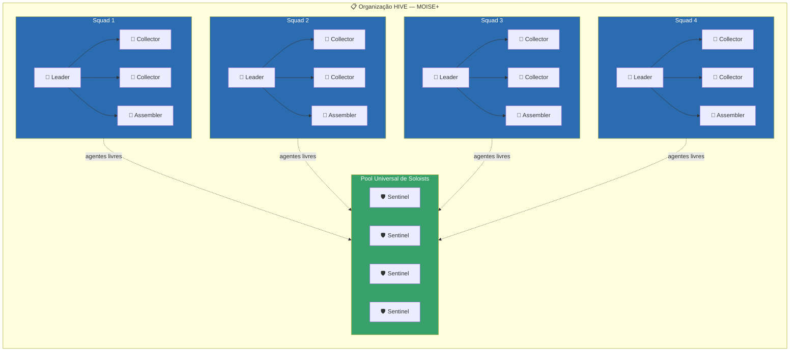
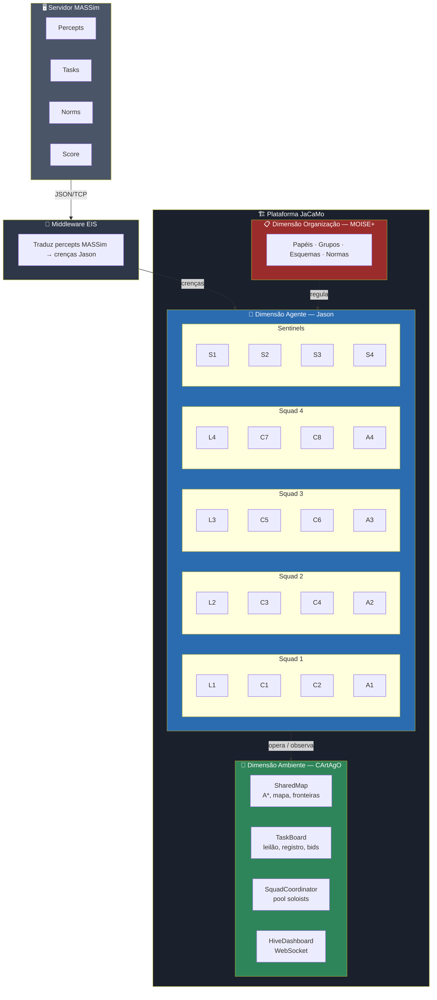
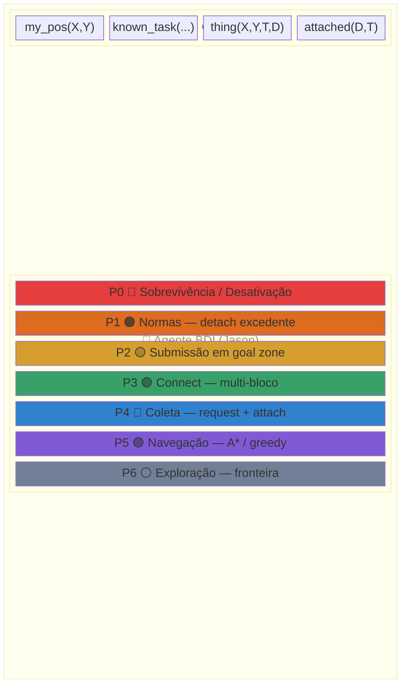
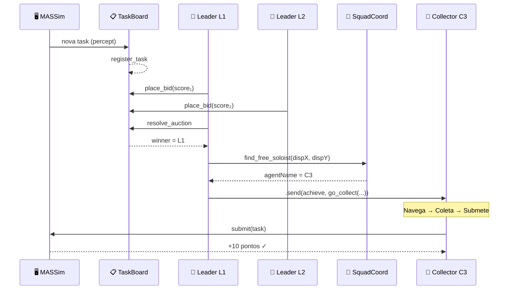
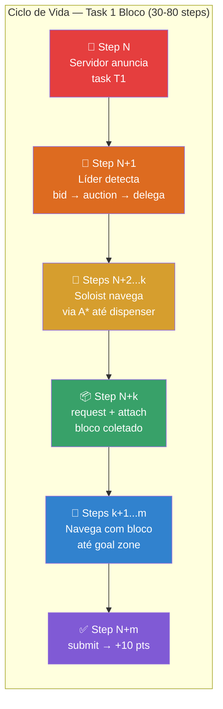

# HIVE: Um Sistema Multi-Agente baseado em JaCaMo para o Multi-Agent Programming Contest 2022

**Disciplina:** PCS 5703 — Sistemas Multi-Agentes | Escola Politécnica da USP | 1º Quadrimestre 2026

---

## Resumo

Sistemas Multi-Agentes (SMA) baseados na arquitetura BDI (*Belief-Desire-Intention*) [3, 4] representam uma abordagem promissora para problemas de coordenação distribuída, mas enfrentam desafios práticos significativos quando aplicados a cenários competitivos com restrições temporais rígidas. Este trabalho apresenta o **HIVE** (*Hierarchical Intelligent Virtual Ensemble*), um SMA desenvolvido na plataforma JaCaMo [6] para o cenário *Agents Assemble* do *Multi-Agent Programming Contest* (MAPC) 2022 [14]. O sistema emprega **20 agentes BDI** programados em AgentSpeak(L)/Jason [8] — conforme mandatado pelo cenário oficial da competição —, organizados em 4 esquadrões autônomos via MOISE+ [9], com artefatos CArtAgO [11] para mapa compartilhado, quadro de tarefas e coordenação de squads. A alocação de tarefas utiliza um leilão distribuído inspirado no *Contract Net Protocol* [22], complementado por um pool universal de soloists que maximiza a utilização dos agentes. O HIVE adapta-se ao cenário oficial via **adoção reativa de papéis** (o papel `default` não pode coletar nem submeter até `adopt(worker)` em uma *role zone*) e **posicionamento relativo** por *dead-reckoning* (`absolutePosition: false`). Um estudo de escalabilidade em cenário de desenvolvimento (6, 10, 15 e 20 agentes) demonstra scores de 60–100 pontos (média 77,1) na configuração de 15 agentes do grid reduzido, posicionando o HIVE na faixa de times medianos a competitivos do MAPC 2022.

**Palavras-chave:** Sistemas Multi-Agentes, BDI, JaCaMo, Jason, MOISE+, CArtAgO, MAPC, Contract Net Protocol.

---

## 1. Introdução

### 1.1 O Problema

O **Multi-Agent Programming Contest** (MAPC) é uma competição anual organizada desde 2005 pela Clausthal University of Technology, cujo objetivo é estimular a pesquisa em desenvolvimento e programação de sistemas multi-agentes, identificando problemas-chave, coletando benchmarks adequados e reunindo casos de teste que exigem ação coordenada [16, 24]. Na sua edição de 2022, o cenário **Agents Assemble III** [14, 23] desafia dois times de **20 agentes** a operar simultaneamente em um grid toroidal **70×70**, parcialmente observável, com as seguintes tarefas:

- **Explorar** o mapa com visão limitada (raio 5 células);
- **Coletar blocos** em dispensers espalhados pelo ambiente (ações `request` + `attach`);
- **Montar estruturas** conectando blocos entre agentes adjacentes (ação `connect`);
- **Submeter tarefas** em goal zones de acordo com padrões definidos pelo servidor (ação `submit`);
- **Respeitar normas** dinâmicas que limitam o transporte de blocos.

A complexidade reside na combinação de observabilidade parcial, dinamicidade (tarefas aparecem e expiram, goal zones se movem, normas mudam), restrições temporais (timeout de 4–10 segundos por step), **posicionamento relativo** (no cenário oficial, `absolutePosition: false` — o agente percebe apenas coordenadas relativas), a necessidade de **adoção de papéis** em *role zones* para habilitar ações de coleta/submissão, e a coordenação entre múltiplos agentes para estruturas multi-bloco.

### 1.2 Software Utilizado

O HIVE é implementado na plataforma **JaCaMo** [6, 25], que integra:

- **Jason** [8]: interpretador de AgentSpeak(L) para agentes BDI;
- **MOISE+** [9, 10]: modelo organizacional normativo;
- **CArtAgO** [11]: infraestrutura de artefatos para o ambiente computacional.

O servidor de simulação é o **MASSim 2022-1.1** [23], com comunicação via middleware **EIS** (*Environment Interface Standard*). O sistema de build utiliza **Gradle** com **Java 21**.

### 1.3 Hardware Utilizado

| Componente | Especificação |
|---|---|
| Processador | Apple Silicon (ARM64) |
| Memória RAM | 16 GB |
| JVM heap (agentes) | 3 GB (`-Xmx3g`, `-Xms512m`) |
| Sistema operacional | macOS (Darwin) |
| Agent timeout | 8.000 ms (servidor e EIS) |

### 1.4 Contribuições

As principais contribuições deste trabalho são: (i) uma arquitetura MAOP completa para o MAPC 2022 com 20 agentes, demonstrando a viabilidade de JaCaMo em cenários competitivos [7]; (ii) uma organização em MOISE+ com pool universal de soloists [10]; (iii) mecanismos de adaptação ao cenário oficial — adoção reativa de papéis e posicionamento relativo por *dead-reckoning*; (iv) uma análise experimental de escalabilidade que revela um gargalo de serialização no CArtAgO [12]; e (v) scores de 60–100 pontos (média 77), comparáveis a implementações declarativas como o time LI(A)RA [19].

---

## 2. Análise e Especificação do SMA

### 2.1 Método de Desenvolvimento

O desenvolvimento seguiu o paradigma de **Programação Orientada a Multi-Agentes** (MAOP) [6, 7], que estrutura a construção de SMA em três dimensões ortogonais: (i) **agentes** — lógica deliberativa individual; (ii) **ambiente** — recursos e ferramentas compartilhadas; e (iii) **organização** — restrições sociais sobre o comportamento coletivo. A escolha do JaCaMo se justifica pela aderência ao enunciado da disciplina PCS 5703 e pela maturidade da plataforma em competições do MAPC [20, 21].

A abordagem de desenvolvimento foi **iterativa e experimental**: cada otimização foi implementada, testada em 3+ simulações independentes, e avaliada comparativamente antes de ser mantida ou revertida.

### 2.2 Requisitos do SMA

Os requisitos funcionais foram derivados diretamente do cenário Agents Assemble [23]:

| Requisito | Descrição |
|---|---|
| RF01 | Explorar o mapa toroidal com visão parcial (raio 5) |
| RF02 | Localizar dispensers e goal zones |
| RF03 | Coletar blocos do tipo correto nos dispensers |
| RF04 | Navegar com blocos acoplados até goal zones |
| RF05 | Submeter tarefas de 1 bloco em goal zones |
| RF06 | Coordenar montagem de estruturas multi-bloco (connect) |
| RF07 | Respeitar normas dinâmicas (e.g., limite de blocos transportados) |
| RF08 | Alocar tarefas entre agentes de forma eficiente |
| RF09 | Recuperar de situações de bloqueio (stuck detection) |
| RF10 | Adotar o papel `worker` em *role zones* (cenário oficial, papel `default` sem ações de coleta/submissão) |
| RF11 | Operar com posicionamento relativo (`absolutePosition: false`) via *dead-reckoning* |

Requisitos não-funcionais:

| Requisito | Descrição |
|---|---|
| RNF01 | Responder dentro do timeout de 8 segundos por step |
| RNF02 | Escalar para 20 agentes simultâneos |
| RNF03 | Manter consistência do mapa compartilhado |

### 2.3 Especificação dos Agentes

Os 20 agentes do HIVE seguem a arquitetura **BDI** (*Belief-Desire-Intention*) [3, 4], fundamentada na teoria do raciocínio prático de Bratman [3]: intenções são compromissos que persistem como filtros de admissibilidade, reduzindo o espaço de deliberação — propriedade essencial dado o timeout de 8 segundos por step. A formalização computacional de Rao e Georgeff [4, 5] traduz esse modelo em três atitudes mentais:

- **Crenças**: `my_pos(X,Y)`, `known_task(Name, Deadline, Reward, Size)`, `thing(X, Y, Type, Details)`;
- **Desejos**: eventos gatilho `+!explore`, `+!collect_block`, `+!go_to(X,Y)`, `+!submit_task`;
- **Intenções**: planos selecionados em execução — pilhas de ações comprometidas.

Os agentes são instanciados em 4 papéis especializados (totalizando 20 agentes):

| Papel | Qtd | Responsabilidade |
|---|:---:|---|
| **Squad Leader** | 4 | Scan de tarefas, leilão, delegação a soloists |
| **Collector** | 8 | Coleta de blocos, navegação até meeting points |
| **Assembler** | 4 | Protocolo *connect* para multi-bloco, submissão |
| **Sentinel** | 4 | Soloist autônomo — coleta independente |

Todos compartilham os módulos comuns — `perception.asl`, `role_adoption.asl`, `connect_protocol.asl`, `collection.asl`, `navigation.asl`, `communication.asl`, `map_merge.asl`, entre outros — diferindo apenas nos planos específicos de cada papel. Essa **herança composicional** garante que qualquer agente livre pode atuar como soloist.

### 2.4 Especificação da Organização (MOISE+)

A organização é especificada em MOISE+ [9, 10] nas três dimensões do modelo:

**Especificação Estrutural** — define papéis, grupos e relações:
- 4 papéis: `squad_leader`, `collector`, `assembler`, `sentinel` (todos estendendo `soc`);
- 1 grupo `hive_team` com **estrutura achatada** (cardinalidades: 3–4 líderes, 6–8 coletores, 3–4 assemblers, 1–4 sentinelas);
- Relações de autoridade (`squad_leader` → `collector`/`assembler`) e comunicação (`collector` → `assembler`) intra-grupo;
- O conceito de **esquadrão** não é codificado na hierarquia MOISE+, mas realizado em tempo de execução pelo artefato `SquadCoordinator` (decisão de projeto U1, que simplifica a instanciação e a torna robusta).

**Especificação Funcional** — define 3 esquemas e suas missões:
- `exploration_scheme` (missão `m_scout`): localizar dispensers, goal zones e *role zones*;
- `task_execution_scheme` (missões `m_collect`, `m_assemble`, `m_submit`): coleta → montagem → submissão;
- `defense_scheme` (missão `m_guard`): guarda de goal zones e remoção de ameaças.

**Especificação Deôntica** — 5 normas de obrigação vinculam papéis a missões:
- `n_scout` (squad_leader → m_scout), `n_collect` (collector → m_collect), `n_assemble` e `n_submit` (assembler), `n_guard` (sentinel → m_guard).

A organização divide os 20 agentes em **4 esquadrões autônomos** (1L + 2C + 1A cada) mais um **pool de 4 sentinelas**, inspirada em organizações militares descentralizadas onde cada esquadrão possui autonomia tática local [9].

### 2.5 Especificação das Interações

A coordenação entre agentes utiliza dois mecanismos complementares:

**Leilão distribuído** (adaptação do Contract Net Protocol [22]): quando o servidor anuncia uma tarefa, cada um dos 4 líderes calcula um bid baseado em reward e distância Manhattan toroidal ao dispenser mais próximo. O primeiro líder a invocar `resolve_auction` no artefato `TaskBoard` obtém o resultado — o squad com maior score vence. O líder vencedor consulta o `SquadCoordinator` para encontrar o soloist livre mais próximo e delega via mensagem ACL.

**Self-assignment**: agentes ociosos (sem tarefa delegada) auto-atribuem uma task disponível na base de crenças a cada 5 steps, maximizando a utilização sem overhead de coordenação.

**Estigmergia computacional** [13]: o artefato `SharedMap` funciona como meio de coordenação indireta — quando um agente marca um obstáculo ou célula visitada, todos os demais agentes que focam o artefato percebem a mudança via propriedades observáveis, sem comunicação direta ponto-a-ponto.

---

## 3. Arquitetura e Design do SMA

### 3.1 Visão Geral da Arquitetura

O HIVE opera como cliente do servidor MASSim, comunicando-se via middleware EIS. A arquitetura segue o modelo tripartite do JaCaMo [6]:

### 3.2 Arquitetura Interna do Agente

Cada agente implementa uma **arquitetura híbrida em camadas** que combina deliberação BDI com hierarquia reativa inspirada na arquitetura de subsunção [1]:

| Prioridade | Camada | Comportamento | Módulo |
|:---:|---|---|---|
| 0 | Sobrevivência | Desativação, energia crítica | `connect_protocol.asl` |
| 1 | Normas | Detach de blocos excedentes | `connect_protocol.asl` |
| 2 | Submissão | Submit em goal zone | `connect_protocol.asl` |
| 3 | Conexão | Protocolo *connect* | `connect_protocol.asl` |
| 4 | Coleta | Request + attach em dispenser | `collection.asl` |
| 5 | Navegação | A* ou greedy até destino | `navigation.asl` |
| 6 | Exploração | Fronteira não visitada | `navigation.asl` |

A hierarquia é implementada pela **ordem dos planos** nos arquivos `.asl`: o Jason [8] seleciona o primeiro plano aplicável cuja guarda de contexto é satisfeita, garantindo que comportamentos de alta prioridade prevaleçam.

### 3.3 Design dos Artefatos

| Artefato | Responsabilidade | Operações Principais |
|---|---|---|
| **SharedMap** | Mapa toroidal parametrizável (40×40 dev / 70×70 oficial), A*, fronteiras, obstáculos. No modo relativo (`absolutePosition: false`), torna-se uma instância por agente (`map_<nome>`) integrada por *dead-reckoning* | `mark_visited`, `compute_next_move`, `get_nearest_frontier`, `get_nearest_dispenser`, `get_nearest_goal_zone`, `get_nearest_role_zone`, `mark_obstacle` |
| **TaskBoard** | Registro de tarefas e leilão distribuído | `register_task`, `place_bid`, `resolve_auction`, `is_task_assigned`, `remove_expired` |
| **SquadCoordinator** | Pool de soloists e composição de squads | `find_free_soloist`, `claim_task_soloist`, `mark_busy`, `mark_free`, `release_agent` |
| **HiveDashboard** | Métricas e broadcast WebSocket | `set_step`, `set_score`, `broadcast` |

Os artefatos seguem o meta-modelo **A&A** [13]: são entidades passivas que encapsulam funcionalidade e mediam a coordenação indireta entre agentes. Todas as operações sobre um mesmo artefato são **serializadas** pelo runtime CArtAgO [12], garantindo consistência sequencial.

### 3.4 Mapeamento Código-Fonte ↔ Arquitetura

| Componente | Arquivo(s) | Dimensão |
|---|---|---|
| Percepção e crenças | `src/agt/common/perception.asl` | Agente |
| Adoção de papel (cenário oficial) | `src/agt/common/role_adoption.asl` | Agente |
| Submissão, normas e connect | `src/agt/common/connect_protocol.asl` | Agente |
| Coleta de blocos | `src/agt/common/collection.asl` | Agente |
| Navegação e exploração | `src/agt/common/navigation.asl` | Agente |
| Comunicação e fusão de mapas | `src/agt/common/communication.asl`, `map_merge.asl` | Agente |
| Papéis especializados | `src/agt/{squad_leader,collector,assembler,sentinel}.asl` | Agente |
| Mapa compartilhado | `src/env/env/SharedMap.java` | Ambiente |
| Quadro de tarefas | `src/env/env/TaskBoard.java` | Ambiente |
| Coordenador de squads | `src/env/env/SquadCoordinator.java` | Ambiente |
| Dashboard (WebSocket) | `src/env/env/HiveDashboard.java` | Ambiente |
| Ponte EIS / tradução | `src/env/connection/{EISAccess,Translator}.java` | Ambiente |
| Organização | `src/org/hive_org.xml` | Organização |
| Configuração JaCaMo | `hive.jcm` | JaCaMo |

### 3.5 Dashboard de Monitoramento — HIVE Command Center

Para facilitar a depuração, análise de desempenho e demonstração visual do SMA em execução, foi desenvolvido o **HIVE Command Center**, um dashboard web em tempo real construído com React, TypeScript, Zustand e React Three Fiber. O dashboard recebe dados via WebSocket (porta 8765) diretamente do artefato `HiveDashboard` (CArtAgO), exibindo o estado completo da simulação sem impactar o desempenho dos agentes.

**Visão 2D** (Figura 1): A interface bidimensional é organizada em painéis especializados:

- **Agents (20)** — Grid com todos os 20 agentes mostrando identificador (A1–A20), posição atual `(x,y)`, destino `(destX,destY)`, barra de energia, última ação executada e resultado (✓ sucesso, ✗ falha, `xpath` falha de caminho, `xtarget` falha de alvo);
- **Squads** — Visualização dos 4 esquadrões com membros, papéis (👑 leader, 🤖 collector, 🔨 assembler, 🛡️ sentinel), blocos carregados e meeting point;
- **Task Pipeline** — Pipeline visual de cada tarefa em andamento com as fases LEI → COL → MEE → CON → SUB → DON, indicando squad atribuído, reward e deadline;
- **Event Feed** — Log de eventos em tempo real (score updates, submissões, leilões, falhas de conexão, coleta de blocos);
- **Auction Hall** — Visualização dos leilões com bids de cada squad e indicação do vencedor;
- **Battle Stats** — Contadores de submissões, conexões, blocos coletados, leilões vencidos, falhas e alertas;
- **Score Timeline** — Gráfico de evolução do score ao longo dos steps da simulação.

O header exibe status de conexão (LIVE/OFFLINE/SIM), step atual, score acumulado, alternância 2D/3D e um botão de simulação fake integrado que permite demonstrar o dashboard sem necessidade do servidor MASSim.

**Visão 3D** (Figura 2): A visualização tridimensional renderiza o ambiente MASSim em perspectiva interativa (orbitar, pan, zoom) utilizando React Three Fiber e Three.js:

- **Agentes** são representados como cubos coloridos por papel (amarelo = leader, ciano = collector, roxo = assembler, verde = sentinel), com tamanho diferenciado para líderes. Os agentes se movem suavemente entre posições via interpolação linear, e agentes desativados tombam e ficam translúcidos;
- **Dispensers** aparecem como caixas verticais rotativas, coloridas por tipo de bloco (vermelho = b0, azul = b1, âmbar = b2, roxo = b3);
- **Goal zones** são renderizadas como planos verdes semitransparentes no chão do grid;
- O **HUD** no canto superior esquerdo mostra contagens de agentes, dispensers e goal zones;
- Uma **legenda** no rodapé identifica todos os elementos visuais.

O painel lateral na visão 3D mantém o Event Feed, Battle Stats e Score Timeline visíveis para acompanhamento simultâneo.

O dashboard inclui também um **modo de simulação fake** embutido: ao clicar no botão SIM (quando offline), o frontend gera internamente agentes simulados com movimentação, tarefas, leilões e score crescente, permitindo demonstrar todas as funcionalidades visuais sem executar o servidor MASSim ou os agentes JaCaMo. Quando uma simulação real está em andamento (via WebSocket), o botão é desabilitado automaticamente.

---

## 4. Linguagens de Programação e Plataforma de Execução

### 4.1 JaCaMo e o Paradigma MAOP

A plataforma **JaCaMo** [6, 7] implementa o paradigma de Programação Orientada a Multi-Agentes (MAOP), que decompõe um SMA em três dimensões ortogonais:

| Dimensão | Tecnologia | Linguagem | Abstração central |
|---|---|---|---|
| Agente | Jason [8] | AgentSpeak(L) | Crenças, Planos, Intenções |
| Ambiente | CArtAgO [11] | Java | Artefatos, Operações, Propriedades observáveis |
| Organização | MOISE+ [9] | XML | Papéis, Grupos, Normas deônticas |

### 4.2 AgentSpeak(L) / Jason

Os agentes são programados em **AgentSpeak(L)** [4, 8], uma linguagem declarativa baseada em programação lógica que traduz conceitos BDI em construtos concretos:

| Conceito BDI | Construto AgentSpeak | Exemplo |
|---|---|---|
| Crença | Literal na base de crenças | `my_pos(10, 20)` |
| Desejo / Evento | Evento gatilho | `+!go_to(X,Y)` |
| Intenção | Instância de plano em execução | `+!collect(B) : ... <- ...` |
| Plano | `evento : contexto <- corpo` | `+!go_to(X,Y) : my_pos(X,Y) <- true.` |

O **ciclo de raciocínio do Jason** implementa o loop BDI em 10 passos [8]: percepção → BRF → geração de eventos → seleção de evento → planos relevantes → planos aplicáveis → seleção de plano → atualização de intenções → seleção de intenção → execução. Esse ciclo é **interpretado**, conferindo expressividade mas introduzindo overhead em relação a implementações compiladas.

### 4.3 CArtAgO

Os artefatos são implementados como **classes Java** que estendem `cartago.Artifact` [11]. Cada operação é anotada com `@OPERATION` e pode definir parâmetros de saída com `OpFeedbackParam`. As propriedades observáveis são declaradas via `defineObsProperty` e atualizadas com `updateObsProperty`, gerando eventos de crença nos agentes que focam o artefato.

A **serialização por artefato** [12] garante que todas as invocações a um mesmo artefato são processadas sequencialmente, eliminando a necessidade de locks explícitos mas limitando o throughput sob alta concorrência.

### 4.4 MOISE+

A especificação organizacional é declarada em **XML** seguindo o modelo MOISE+ [9, 10], com três documentos: estrutural (papéis, grupos, relações), funcional (esquemas, missões, metas) e deôntico (obrigações e permissões vinculando papéis a missões). O runtime MOISE+ dentro do JaCaMo fiscaliza automaticamente o cumprimento das normas pelos agentes.

### 4.5 Características da Implementação

| Característica | Valor |
|---|---|
| Linhas de AgentSpeak(L) | ~3.500 (módulos .asl) |
| Linhas de Java (artefatos + conexão) | ~2.500 |
| Arquivos .asl | ~14 (10 comuns + 4 papéis) |
| Artefatos CArtAgO | 4 (SharedMap, TaskBoard, SquadCoordinator, HiveDashboard) |
| Configuração MOISE+ | 1 arquivo XML (`hive_org.xml`) |
| Build system | Gradle + Java 21 |

---

## 5. Estratégia para o Time de Agentes

### 5.1 Algoritmo de Deslocamento

A navegação no grid toroidal 40×40 utiliza dois algoritmos complementares:

**A\* com wrapping toroidal**: Utilizado quando a distância Manhattan toroidal ao destino é ≤ 60. A heurística é `min(|Δx|, W-|Δx|) + min(|Δy|, H-|Δy|)`, que é admissível e garante otimalidade. O limite de expansões é 2.000 nós, com fallback para greedy se excedido. Obstáculos registrados expiram após 30 steps para acomodar mudanças ambientais.

**Navegação greedy**: Utilizada para distâncias > 60 ou como fallback do A*. Calcula a direção cardinal que minimiza a distância Manhattan toroidal ao destino.

**Exploração por fronteira**: O `SharedMap` mantém um cache de **fronteiras** (células livres adjacentes a células não visitadas). Os agentes consultam `get_nearest_frontier` para selecionar o próximo destino de exploração, cobrindo o mapa progressivamente.

### 5.2 Estratégia de Coordenação

A coordenação é realizada em três níveis:

**Nível 1 — Organizacional (MOISE+)**: A estrutura de 4 esquadrões com autonomia local garante que a falha de um líder não impacta os demais esquadrões. Cada líder toma decisões de alocação independentemente.

**Nível 2 — Leilão distribuído (Contract Net adaptado)** [22]: O fluxo de alocação de tarefas é:

Duas adaptações em relação ao CNP clássico: (i) **manager distribuído** — qualquer líder resolve o leilão, sem ponto central de falha; (ii) **contractor universal** — qualquer agente livre pode ser soloist, independentemente do papel.

**Nível 3 — Self-assignment**: Agentes ociosos auto-atribuem uma task disponível a cada 5 steps, sem overhead de comunicação.

### 5.3 Adaptação ao Cenário Oficial

A configuração oficial do MAPC 2022 impõe três diferenças com forte impacto na estratégia do time, ausentes na configuração de desenvolvimento:

**Adoção reativa de papéis**: no oficial, o papel inicial `default` **não inclui** as ações `request`, `attach`, `connect` e `submit` — o agente precisa estar sobre uma *role zone* e executar `adopt(worker)` para habilitá-las. O HIVE detecta esse modo de forma **reativa e auto-detectável**: ao receber o código de falha `failed_role` (que nunca ocorre no dev, onde `default` possui todas as ações), o agente passa a priorizar a navegação até a *role zone* mais próxima e adota `worker`. Dos cinco papéis oficiais (`default`, `worker`, `constructor`, `explorer`, `digger`), o HIVE adota universalmente `worker`, pois é o único que combina todas as ações do ciclo coleta-montagem-submissão e é o mais rápido sem carga (`speed [2,1,1,0]`).

**Posicionamento relativo (dead-reckoning)**: com `absolutePosition: false`, o agente percebe apenas coordenadas relativas. Cada agente mantém um quadro local privado, integrando cada movimento bem-sucedido, e o mapa compartilhado torna-se uma instância por agente (`map_<nome>`). Coordenadas trocadas por mensagem são *cross-frame*; a fusão de mapas exige um *handshake* de avistamento mútuo (trabalho futuro).

**Inferência de dimensões do grid**: o grid oficial (70×70) é maior que o de desenvolvimento (40×40); o A* opera com degradação graciosa quando as dimensões toroidais reais não são inferidas em runtime.

### 5.4 Otimização de Tarefas

O processo de otimização iterativo resultou nas seguintes melhorias críticas:

| Otimização | Impacto |
|---|---|
| Reduzir delegação de 3→1 soloist/task | Score 20→80 (+300%) — eliminou desperdício de agentes |
| Scan do líder: 1 task por scan (a cada 10 steps) | Score 40→100 — eliminou timeouts por loops pesados |
| Remoção de `.wait()` do quick_delegate | Redução de latência (~10ms por delegação) |
| Distância toroidal no `find_free_soloist` | Seleção correta do soloist mais próximo |
| Timeout de task 200→300 steps | Agentes completam tasks em mapas difíceis |
| Decay de obstáculos a cada 10 steps | Redução de 93% nas chamadas de decay |
| JVM heap 256MB→2GB | Eliminação de GC pauses |

### 5.5 Ciclo de Vida de uma Task (1 bloco)

---

## 6. Características Técnicas

### 6.1 Configuração Experimental

O HIVE é projetado para o **cenário oficial** do MAPC 2022, mas o estudo experimental sistemático foi conduzido em um **cenário de desenvolvimento** reduzido, que permite iterações rápidas e isola variáveis. A tabela contrasta as duas configurações:

| Parâmetro | Desenvolvimento | Oficial (competição) |
|---|---|---|
| Grid | 40 × 40, toroidal | 70 × 70, toroidal |
| Mapa | Cave, densidade 0.45 | Cave, densidade 0.6 |
| Steps | 800 | 750 |
| Agentes (por time) | 6–20 (estudo de escala) | 20 |
| Times simultâneos | 1 | 2 |
| Tamanho das tarefas | 1–2 blocos | 1–4 blocos |
| Posição absoluta | Habilitada | **Desabilitada** (relativa) |
| Papel inicial | `default` com todas as ações | `default` sem coleta/submissão (exige `adopt`) |

O estudo de desempenho a seguir refere-se ao **cenário de desenvolvimento**, no qual a configuração de 15 agentes foi identificada como o melhor equilíbrio do grid 40×40; o sistema entregue para a competição opera com 20 agentes no cenário oficial.

### 6.2 Desempenho (cenário de desenvolvimento)

Foram realizadas 13 simulações com 15 agentes (3L + 6C + 3A + 3S), das quais 7 completaram:

| Run | Score | Submissões | Status |
|:---:|:---:|:---:|---|
| 1 | **100** | 10 | Completou |
| 2 | **90** | 9 | Completou |
| 3 | **80** | 8 | Completou |
| 4 | **80** | 8 | Completou |
| 5 | **70** | 7 | Completou |
| 6 | **60** | 6 | Completou |
| 7 | **60** | 6 | Completou |
| 8–13 | — | — | Crash (steps 76–230) |

**Estatísticas**: Média 77,1 | Mediana 80 | Máximo 100 | Mínimo 60 | σ = 14,6 | Taxa de conclusão 53,8%.

### 6.3 Escalabilidade

| Agentes | Composição | Score médio | Taxa crash |
|:---:|---|:---:|:---:|
| 6 | 1L + 3C + 1A + 1S | 23,3 | 25% |
| 10 | 2L + 4C + 2A + 2S | 46,7 | 40% |
| **15** | **3L + 6C + 3A + 3S** | **77,1** | **46%** |
| 20 (config. oficial) | 4L + 8C + 4A + 4S | 70,0 | 50% |

No grid reduzido 40×40, o score cresce com o número de agentes até 15, estabilizando depois. Com 20 agentes, a média cai ligeiramente neste cenário de desenvolvimento (70 vs 77), sugerindo saturação com 4 tarefas simultâneas no máximo. Vale ressaltar que o cenário oficial (grid 70×70, maior, com mais dispensers e goal zones) mandata 20 agentes — configuração na qual a saturação observada no grid pequeno não se aplica da mesma forma.

### 6.4 Estabilidade e Diagnóstico de Falhas

Aproximadamente **46% dos runs** não completam os 800 steps. A análise dos logs revelou um padrão consistente:

1. **Trigger** (steps 76–230): 15 agentes processam percepts simultaneamente, gerando ~600–900 chamadas `mark_obstacle` por step — todas serializadas no artefato `SharedMap` [12];
2. **Escalada**: O tempo serializado excede o timeout de 8 segundos;
3. **Colapso**: A biblioteca EIS interpreta o timeout como falha de conexão e inicia um flood de reconexões;
4. **Loop terminal**: O ciclo disconnect/reconnect se auto-sustenta indefinidamente.

**Evidência**: Ao reduzir a densidade cave de 0.45 para 0.25, a taxa de crash caiu para **0%**, confirmando que o volume de percepts de obstáculos é o fator determinante. Essa limitação é inerente ao modelo de serialização do CArtAgO [12] — não é um defeito na lógica dos agentes.

### 6.5 Recuperação de Falhas

O HIVE implementa mecanismos de recuperação nos seguintes cenários:

- **Agente preso** (*stuck detection*): Se um agente permanece na mesma posição por 50 steps, o mecanismo `need_detach` é ativado — o agente desacopla blocos e busca uma rota alternativa;
- **Bloqueio em goal zone**: Se um agente com `pending_submit` é bloqueado por 6+ tentativas de movimento, ele busca uma goal zone alternativa via `get_alternative_goal_zone`;
- **Expiração de tarefas**: Tasks com mais de 300 steps sem conclusão são abandonadas e o agente volta ao pool de soloists;
- **Expiração de obstáculos**: Obstáculos no `SharedMap` expiram após 30 steps, evitando rotas permanentemente inválidas;
- **Timeout de EIS**: O cliente EIS foi configurado com timeout de 8.000ms, alinhado ao servidor, para evitar desconexões prematuras.

### 6.6 Comparação com o MAPC 2022

| Posição | Time | Framework | Score típico |
|:---:|---|---|:---:|
| 1º | FIT-BUT [17] | Java puro | 200–400 |
| 2º | MMD [18] | Java (otimização) | 150–300 |
| — | LI(A)RA [19] | JaCaMo | 80–150 |
| — | **HIVE** | **JaCaMo** | **60–100** |

A diferença para os times de topo é atribuída à **baixa taxa de conclusão de tasks multi-bloco**: o pipeline de 1 bloco funciona de forma confiável, mas o protocolo *connect* raramente completa com sucesso em mapas cave densos. Times como FIT-BUT [17] utilizam Java puro com controle direto de threads, evitando o gargalo de serialização do CArtAgO.

---

## 7. Discussão e Conclusão

### 7.1 Facilidade/Dificuldade do Método MAOP

A abordagem MAOP via JaCaMo [6] demonstrou **alta expressividade conceitual**: a separação em agentes/ambiente/organização mapeou diretamente os conceitos teóricos de SMA estudados na disciplina PCS 5703 [1]. A programação em AgentSpeak(L) [8] permitiu expressar comportamentos complexos de forma declarativa e modular.

Contudo, a natureza **interpretada** do Jason — que unifica planos contra a base de crenças a cada step — introduz um overhead significativo sob alta carga: com 15–20 agentes executando centenas de crenças cada, o tempo de deliberação torna-se um fator limitante. Essa observação é coerente com a experiência do LTI-USP [20] em edições anteriores do MAPC.

O trade-off entre **expressividade declarativa** e **eficiência computacional** é a principal tensão encontrada: frameworks BDI interpretados oferecem rastreabilidade e fidelidade conceitual, mas perdem em desempenho para implementações Java compiladas [17].

### 7.2 Facilidade/Dificuldade do Modelo Organizacional

O MOISE+ [9, 10] forneceu uma estrutura organizacional clara e verificável que facilitou o design top-down do sistema. A divisão em 4 esquadrões com autonomia local demonstrou o conceito de **organização descentralizada**.

Contudo, MOISE+ é primariamente **declarativo e estático**: define *quem pode fazer o quê*, mas não *quando* ou *como* a coordenação ocorre em tempo de execução. A coordenação dinâmica — decidir qual agente pega qual task, quando abandonar uma tarefa — foi implementada inteiramente nos planos AgentSpeak e artefatos CArtAgO, não no modelo organizacional. Para cenários altamente dinâmicos como o MAPC, o MOISE+ funciona melhor como **arcabouço estrutural** do que como **mecanismo de coordenação operacional**.

### 7.3 CArtAgO: Poder e Limitações

Os artefatos CArtAgO [11, 13] validaram a premissa central do meta-modelo A&A [13] — artefatos como ferramentas que mediam a atividade coletiva. O `SharedMap` encapsulou A*, exploração e obstáculos em uma interface limpa; o `TaskBoard` implementou leilão sem que os agentes conhecessem o protocolo.

Porém, a **serialização por artefato** [12] revelou-se o principal gargalo. Uma solução seria a **partição funcional** (sharding): separar o `SharedMap` em artefatos menores por função (obstáculos, dispensers, goal zones), distribuindo a carga de serialização.

### 7.4 Adaptação ao Cenário Oficial

A migração da configuração de desenvolvimento para o cenário oficial expôs lições valiosas. O papel inicial `default` não habilita coleta nem submissão: o agente precisa adotar `worker` em uma *role zone*. A implementação **reativa** desse mecanismo — disparada pelo código de falha `failed_role`, sem *flags* de modo estáticas — mostrou-se coerente com o princípio BDI de adaptação guiada por percepção [3, 8] e evitou suposições rígidas sobre o ambiente. Já o **posicionamento relativo** (`absolutePosition: false`), tratado por *dead-reckoning* com um quadro local por agente, revelou o custo de abrir mão de um referencial global: a fusão de mapas entre agentes (pré-requisito para *rendezvous* multi-bloco confiável) passa a exigir um *handshake* de avistamento mútuo, deixado como trabalho futuro. Essas adaptações confirmam que decisões aparentemente pequenas do cenário (ações por papel, referencial de coordenadas) têm impacto arquitetural profundo.

### 7.5 Possíveis Extensões

1. **Sharding de artefatos**: Particionar o `SharedMap` para reduzir contenção de serialização;
2. **Pipeline multi-bloco robusto**: Redesenhar o protocolo *connect* com meeting points dinâmicos e tolerância a falhas;
3. **Fusão de mapas no modo relativo**: *Handshake* de avistamento mútuo para traduzir quadros *dead-reckoned* a um referencial comum;
4. **Auto-atribuição com afinidade espacial**: Dispersão leve baseada em hash de posição, sem `findall`;
5. **Operações CArtAgO assíncronas**: Operações não-bloqueantes para atualizações de mapa;
6. **Aprendizado por reforço para parâmetros**: Otimização automática de thresholds e frequências.

### 7.6 Conclusão

Este trabalho apresentou o HIVE, um SMA baseado em JaCaMo [6] para o cenário Agents Assemble do MAPC 2022 [14]. O sistema demonstra a aplicação integrada dos três pilares da MAOP: agentes BDI em Jason [8], organização normativa em MOISE+ [9] e ambiente compartilhado em CArtAgO [11].

Os resultados experimentais — scores de 60–100 pontos com média de 77 no cenário de desenvolvimento — validam a viabilidade do paradigma MAOP [7] para cenários complexos de coordenação multi-agente, enquanto a análise de escalabilidade (15 agentes como melhor equilíbrio no grid reduzido; 20 agentes na configuração oficial) e o diagnóstico de instabilidade (gargalo de serialização do CArtAgO) contribuem com insights práticos para a comunidade.

A contribuição principal vai além dos resultados numéricos: a experiência expôs concretamente os trade-offs teorizados na literatura — entre autonomia e coordenação [1], entre expressividade e eficiência [8], entre consistência e concorrência [12]. Conforme argumentado por Bratman [3], agentes racionais precisam de intenções como compromissos que reduzem o espaço de deliberação. O HIVE demonstra que essa necessidade se aplica ao **sistema como um todo**: a escolha de framework, a granularidade dos artefatos e a frequência de coordenação são, elas mesmas, compromissos de projeto que determinam o sucesso do SMA em ambientes competitivos e dinâmicos.

---

## Referências

[1] M. Wooldridge, *An Introduction to MultiAgent Systems*, 2nd ed. Chichester, UK: John Wiley & Sons, 2009.

[2] M. Wooldridge and N. R. Jennings, "Intelligent agents: Theory and practice," *The Knowledge Engineering Review*, vol. 10, no. 2, pp. 115–152, 1995.

[3] M. E. Bratman, *Intention, Plans, and Practical Reason*. Cambridge, MA: Harvard University Press, 1987.

[4] A. S. Rao and M. P. Georgeff, "BDI Agents: From Theory to Practice," in *Proc. 1st Int. Conf. on Multiagent Systems (ICMAS-95)*, 1995, pp. 312–319.

[5] A. S. Rao and M. P. Georgeff, "Modeling Rational Agents within a BDI-Architecture," in *Proc. 2nd Int. Conf. on Principles of Knowledge Representation and Reasoning (KR'91)*, 1991, pp. 473–484.

[6] O. Boissier, R. H. Bordini, J. F. Hübner, and A. Ricci, *Multi-Agent Oriented Programming: Programming Multi-Agent Systems Using JaCaMo*. Cambridge, MA: MIT Press, 2020.

[7] O. Boissier, R. H. Bordini, J. F. Hübner, A. Ricci, and A. Santi, "Multi-agent oriented programming with JaCaMo," *Science of Computer Programming*, vol. 78, no. 6, pp. 747–761, 2013.

[8] R. H. Bordini, J. F. Hübner, and M. Wooldridge, *Programming Multi-Agent Systems in AgentSpeak using Jason*. Chichester, UK: John Wiley & Sons, 2007.

[9] J. F. Hübner, J. S. Sichman, and O. Boissier, "Developing organised multiagent systems using the MOISE+ model," *Int. J. of Agent-Oriented Software Engineering*, vol. 1, no. 3/4, pp. 370–395, 2007.

[10] J. F. Hübner, J. S. Sichman, and O. Boissier, "A Model for the Structural, Functional and Deontic Specification of Organizations in Multiagent Systems," in *SBIA 2002*, LNAI, vol. 2507. Springer, 2002, pp. 118–128.

[11] A. Ricci, M. Piunti, M. Viroli, and A. Omicini, "Environment Programming in CArtAgO," in *Multi-Agent Programming*, Springer, 2009, pp. 259–288.

[12] A. Ricci, M. Piunti, and M. Viroli, "Environment programming in multi-agent systems: An artifact-based perspective," *Autonomous Agents and Multi-Agent Systems*, vol. 23, pp. 158–192, 2011.

[13] A. Omicini, A. Ricci, and M. Viroli, "Artifacts in the A&A meta-model for multi-agent systems," *Autonomous Agents and Multi-Agent Systems*, vol. 17, no. 3, pp. 432–456, 2008.

[14] T. Ahlbrecht, J. Dix, N. Fiekas, and T. Krausburg, Eds., *The Multi-Agent Programming Contest 2022*, LNCS, vol. 13997. Springer, 2023.

[15] T. Ahlbrecht, J. Dix, N. Fiekas, and T. Krausburg, Eds., *The Multi-Agent Programming Contest 2021*, LNCS, vol. 12947. Springer, 2021.

[16] T. Ahlbrecht, J. Dix, N. Fiekas, and T. Krausburg, "The Multi-Agent Programming Contest: A Résumé," *Annals of Mathematics and Artificial Intelligence*, 2020.

[17] F. Zboril Jr., F. Vidensky, L. Dokoupil, and J. Beran, "FIT-BUT at MAPC 2022," in *LNCS*, vol. 13997. Springer, 2023, pp. 120–150.

[18] P. Böhm, "Optimization-Based Agents in the 16th Multi-agent Programming Contest," in *LNCS*, vol. 13997. Springer, 2023, pp. 19–53.

[19] M. Custódio, M. Rocha, R. Battaglin, G. P. Farias, and A. R. Panisson, "LI(A)RA Team — MAPC 2022," in *LNCS*, vol. 13997. Springer, 2023, pp. 165–194.

[20] M. F. Stabile Jr. and J. S. Sichman, "The LTI-USP Strategy to the 2020/2021 Multi-Agent Programming Contest," in *LNCS*, vol. 12947. Springer, 2021, pp. 108–133.

[21] M. R. Franco, L. M. Rosset, and J. S. Sichman, "Improving the LTI-USP Team: A New JaCaMo Based MAS for the MAPC 2013," in *EMAS 2013*, LNAI, vol. 8245. Springer, 2013, pp. 339–348.

[22] R. G. Smith, "The Contract Net Protocol: High-Level Communication and Control in a Distributed Problem Solver," *IEEE Trans. on Computers*, vol. C-29, no. 12, pp. 1104–1113, 1980.

[23] Multi-Agent Programming Contest, "Scenario Description: Agents Assemble 2022." [Online]. https://github.com/agentcontest/massim_2022/blob/main/docs/scenario.md

[24] Multi-Agent Programming Contest. [Online]. https://multiagentcontest.org/

[25] JaCaMo Project. [Online]. https://jacamo-lang.github.io/
