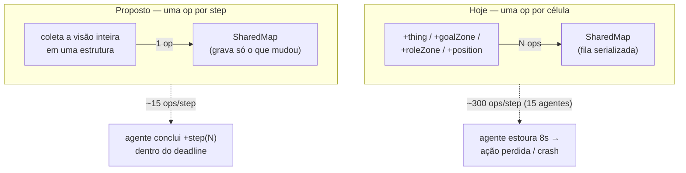

# Mapa Compartilhado em Lote — Requisitos

## Summary

Substituir a enxurrada de escritas célula-a-célula no artefato `SharedMap` por **uma atualização em lote por agente por step**, eliminando o gargalo de operações serializadas que faz os agentes perderem ações e dispara a cascata de crash. A arquitetura BDI/JaCaMo e todo o conhecimento que o mapa guarda hoje permanecem intactos — muda só o *mecanismo de ingestão* da percepção, não a estratégia.

---

## Problem Frame

Há uma única instância de `SharedMap` ([src/env/env/SharedMap.java](../../src/env/env/SharedMap.java)) compartilhada pelos 15 agentes (todos fazem `lookupArtifact("shared_map")` + `focus`). O CArtAgO serializa todas as `@OPERATION` por instância de artefato, então as operações de mapa dos 15 agentes formam uma fila única.

A cada step, o MASSim reenvia a visão local inteira e [src/agt/common/perception.asl](../../src/agt/common/perception.asl) reage a **cada célula visível** com uma operação no mapa: `+thing → update_cell`, `+goalZone → update_cell`, `+roleZone → update_cell`, `+position → mark_visited`, `+lastActionResult(failed_path) → mark_obstacle`. Com visão 5 em mapa *cave* a 45% de densidade, são dezenas de operações por agente por step × 15 agentes = centenas de operações serializadas por step.

Consequência medida num run real (seed 17, 800 steps): **940 timeouts** "No valid action available in time" (~7,8% das ações perdidas), run de **67 minutos** (o README promete ~6) e **score 70** (7 submits). Como não existe handler `-step(N)`, atraso ou falha vira ação perdida silenciosa (zero `WARNING`/`SEVERE` no log).

O ponto-chave: a lentidão/ações-perdidas e o crash de ~50% dos runs têm a **mesma raiz** — agentes lentos demais por step. Quando muitos estouram o `agentTimeout` (8s) juntos, o servidor os derruba e dispara a tempestade de reconexão. Cortar a contenção por step ataca os dois ao mesmo tempo.

---

## Key Decisions

- **Escrita em lote, não sharding nem mapa-por-agente.** Cada agente envia no máximo uma operação de mapa por step com a visão inteira. Colapsa ~300 operações/step para ~15. É o maior ganho com o menor risco, e mantém um código que o autor (pouca familiaridade com Java/JaCaMo) consegue acompanhar. Mapa local por agente (Abordagem 2) e sharding (Abordagem 3) ficam como evolução futura — ver Scope Boundaries.
- **Pular escrita de célula inalterada.** Célula já conhecida com o mesmo conteúdo não gera trabalho nem sinal novo. Depois do mapa explorado, a maioria das células já é conhecida → o volume despenca além do ganho do lote.
- **Ajuste de memória da JVM.** Tratar a pressão de memória (`-Xmx2g` com ~1,6 GB livres) que causa as ~10 pausas de GC em que os 15 agentes caem juntos.
- **Não tocar na estratégia.** A lógica de submit/alinhamento e de escolha de tarefas fica como está. O score deve subir por consequência (mais ações entregues), mas isso é ganho secundário, não objeto desta mudança.

---

## Requirements

**Redução de contenção**

- R1. Cada agente emite no máximo uma operação de atualização de mapa por step, carregando a visão inteira daquele step, em vez de uma operação por célula percebida.
- R2. A operação em lote preserva todo o conhecimento atual do mapa: tipo de célula, dispensers, goal zones, role zones e células visitadas.
- R3. Os sinais de nova descoberta (`new_dispenser`, `new_goal_zone`, `new_role_zone`) continuam sendo emitidos exatamente uma vez por descoberta, para os agentes/artefatos que dependem deles.
- R4. Célula já conhecida com conteúdo inalterado não gera escrita nem sinal redundante.

**Estabilidade de runtime**

- R5. A JVM dos agentes roda sem pausas de GC que derrubem todos os agentes simultaneamente (via ajuste de heap e/ou memória disponível).
- R6. O run completa os 800 steps sem entrar na cascata de desconexão/reconexão.

**Compatibilidade comportamental**

- R7. O comportamento observável dos agentes (exploração por fronteira, pathfinding A*/greedy, leilões, coleta, connect, submit) permanece equivalente ao atual — a mudança é de mecanismo de ingestão da percepção, não de estratégia.

---

## Visualização — antes/depois (por step, por agente)

---

## Acceptance Examples

- AE1. **Covers R1, R4.** **Given** um agente percebe 30 células num step, 28 já conhecidas e inalteradas. **When** ele processa a percepção. **Then** emite no máximo uma operação de mapa, e essa operação grava apenas as 2 células que mudaram.
- AE2. **Covers R3.** **Given** um agente percebe um dispenser pela primeira vez. **When** processa a visão. **Then** `new_dispenser` dispara uma vez; nos steps seguintes percebendo o mesmo dispenser, nenhum sinal duplicado é emitido.
- AE3. **Covers R7.** **Given** o mesmo seed 17. **When** o run roda com a mudança. **Then** os agentes ainda exploram, coletam, fazem leilão e submit como antes — só que mais ações chegam ao servidor.

---

## Success Criteria

Medição determinística no seed 17, comparando contra o baseline (940 timeouts / 67 min / score 70):

- Timeouts "No valid action" caem em ordem de magnitude (alvo: de ~940 para dezenas).
- Wall-clock do run de 800 steps cai de ~67 min para a casa de minutos (alvo ~6–15 min).
- O run completa sem nenhuma cascata de reconexão (0 crashes).
- Score ≥ 70 (esperado subir; requisito é não regredir).

---

## Scope Boundaries

- **Adiado para depois:** Abordagem 2 (mapa local por agente + merge periódico) e Abordagem 3 (sharding do mapa em vários artefatos). Só fazem sentido se, após o lote, ainda restar contenção relevante.
- **Fora do escopo:** lógica de submit/alinhamento e de escolha de tarefas; contenção em `TaskBoard`/`SquadCoordinator`; dashboard; mudanças no servidor MASSim além do ajuste de memória.

---

## Dependencies / Assumptions

- O CArtAgO serializa `@OPERATION` por instância de artefato (verificado no comportamento do run).
- Existe uma única instância de `SharedMap` compartilhada pelos 15 agentes (verificado: `lookupArtifact("shared_map")` em [src/agt/sentinel.asl](../../src/agt/sentinel.asl) e demais roles).
- O seed do mapa é fixo em 17 ([conf/TestConfig.json](../../conf/TestConfig.json)), permitindo comparação antes/depois determinística.
- `agentTimeout` permanece em 8s — aumentá-lo não é a correção (já diagnosticado: o problema é a fila de ops, não falta de tempo de CPU).
- Pressão de memória observada no ambiente (WSL2, ~1,6 GB livres com `-Xmx2g`).

---

## Outstanding Questions

**Deferred to Planning**

- Formato exato da operação em lote (uma op recebendo uma lista de células vs. uma estrutura de visão) — decisão de planejamento.
- Se `mark_visited` (posição) e `mark_obstacle` (move falho) entram no mesmo lote ou permanecem operações separadas.
- Valor exato de heap / se a melhor alavanca é liberar RAM do sistema ou reduzir `-Xmx` — definir empiricamente.
- Se vale aplicar a mesma técnica de lote/cache aos outros artefatos, caso a medição pós-mudança ainda mostre contenção.

---

## Sources / Research

- Diagnóstico de causa-raiz (sessão ce-debug): 940 timeouts em 800 steps, run de 67 min, score 70, 7 submits.
- [src/agt/common/perception.asl](../../src/agt/common/perception.asl) — handlers `+thing`/`+goalZone`/`+roleZone`/`+position`/`+lastActionResult` que disparam as ops por célula.
- [src/env/env/SharedMap.java](../../src/env/env/SharedMap.java) — `update_cell` (sem early-return), `mark_visited`, `mark_obstacle`.
- [src/agt/sentinel.asl](../../src/agt/sentinel.asl) — setup do mapa compartilhado via `lookupArtifact`/`makeArtifact`.
- [conf/TestConfig.json](../../conf/TestConfig.json) — seed 17, `agentTimeout` 8000, 800 steps, grid cave 40×40 a 45%.
