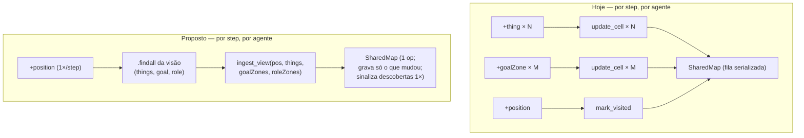

# refactor: ingestão do mapa compartilhado em lote

## Summary

Substituir o disparo de uma operação CArtAgO por célula visível por **uma operação de ingestão em lote por agente por step** no artefato `SharedMap`, com pular-célula-inalterada embutido e um ajuste de memória da JVM. Objetivo: cortar a contenção serializada que perde ~7,8% das ações e dispara a cascata de crash, sem alterar a estratégia dos agentes. Validação determinística no seed 17 contra o baseline medido (940 timeouts / 67 min / score 70).

---

## Problem Frame

Há uma única instância de `SharedMap` ([src/env/env/SharedMap.java](src/env/env/SharedMap.java)) compartilhada pelos 15 agentes, e o CArtAgO serializa toda `@OPERATION` por instância. A cada step, [src/agt/common/perception.asl](src/agt/common/perception.asl) reage a cada célula visível com uma op (`+thing → update_cell`, `+goalZone → update_cell`, `+roleZone → update_cell`, `+position → mark_visited`). Visão 5 em mapa cave a 45% = dezenas de ops/agente/step × 15 = centenas de ops serializadas/step. Os agentes não concluem `+step(N)` dentro do `agentTimeout` (8s); o servidor espera o deadline inteiro. Sem handler `-step(N)`, o atraso vira ação perdida silenciosa. Medido (seed 17): 940 timeouts, run de 67 min, score 70.

A lentidão/ações-perdidas e o crash de ~50% dos runs têm a mesma raiz — agentes lentos demais por step. Reduzir o volume de ops por step ataca os dois.

---

## Key Technical Decisions

- **Uma operação de ingestão em lote por step.** Os ~N writes por célula viram um único op por agente por step que aplica todas as atualizações internamente. É o que colapsa a fila serializada (~300 → ~15 ops/step) (see origin: docs/brainstorms/2026-06-16-mapa-compartilhado-lote-requirements.md).
- **Dobrar a marcação de posição/visitado no lote; manter obstáculo e decay separados.** `mark_visited` da posição entra no op de lote. `mark_obstacle` (só em move falho, ≤2/step) e `decay_obstacles` (já limitado a cada 5–10 steps) ficam como estão — baixa frequência, não valem a complexidade.
- **Reporte ao dashboard via sinais de descoberta.** Hoje `dash_map_dispenser`/`dash_map_goal_zone` disparam por célula a cada step. Passam a disparar uma vez na descoberta, acionados pelos sinais `new_dispenser`/`new_goal_zone` do artefato. Equivalente (ou menos mensagens) para um overlay de mapa.
- **Preservar a semântica atual exatamente.** Toda célula percebida continua marcada como visitada (comportamento atual que alimenta a fronteira); os conjuntos `known*`, as obs-properties e os sinais `new_*` disparam uma vez por descoberta, como hoje. A mudança é de mecanismo de ingestão, não de estratégia (R7).
- **Pular-inalterado é ganho secundário.** O grande ganho é o nº de operações (dispatch + lock do CArtAgO), resolvido pelo lote. Pular o `cells.put` de célula inalterada é um bônus barato dentro do op, não a alavanca principal.

---

## High-Level Technical Design

Operações leitoras do mapa (`get_nearest_dispenser`, `get_nearest_goal_zone`, `get_nearest_frontier`, `compute_next_move`) leem os mesmos campos (`cells`, `visitedCells`, `obstacles`, `knownDispensers/GoalZones/RoleZones`) — o lote deve deixar esses campos idênticos ao caminho atual.

---

## Implementation Units

### U1. Operação `ingest_view` em lote no SharedMap

- **Goal:** adicionar uma `@OPERATION` que ingere a visão inteira de um step numa única chamada, reproduzindo os efeitos de `update_cell` + `mark_visited`, pulando célula inalterada, e preservando `known*`, obs-properties e sinais `new_*` exatamente uma vez por descoberta.
- **Requirements:** R1, R2, R3, R4
- **Dependencies:** nenhuma
- **Files:** [src/env/env/SharedMap.java](src/env/env/SharedMap.java)
- **Approach:** novo op recebendo a posição do agente e listas da visão (things, goal zones, role zones). Marca a célula do agente como visitada (e `obstacles.remove`, como `mark_visited` hoje). Para cada entrada: normaliza a chave, compara `cells.get(k)` ao novo `"type:details"`; se mudou, `cells.put`; `visitedCells.add` (preservar: toda célula percebida vira visitada); para dispenser/goal/role usa o guard `known*.add()` para `defineObsProperty` + `signal` uma única vez — idêntico ao `update_cell` atual. Parsing defensivo dos termos de lista do CArtAgO (reusar `toInt`). Não introduzir limpeza de obstáculo nova (manter o comportamento atual de `update_cell`, que não remove de `obstacles` em células percebidas).
- **Patterns to follow:** espelhar `update_cell` ([src/env/env/SharedMap.java:62-90](src/env/env/SharedMap.java#L62-L90)) e `mark_visited` ([src/env/env/SharedMap.java:92-96](src/env/env/SharedMap.java#L92-L96)); reusar `normX`/`normY`/`key`/`toInt`.
- **Test scenarios:**
  - Happy: `ingest_view` com 1 dispenser + 1 obstáculo + 1 goal zone → `cells` contém os 3 com `"type:details"` corretos; `knownDispensers`/`knownGoalZones` atualizados; exatamente um sinal `new_dispenser` e um `new_goal_zone`.
  - Covers AE2. Chamar `ingest_view` duas vezes com o mesmo dispenser → `new_dispenser` dispara só na primeira; segunda não re-sinaliza.
  - Covers AE1. Visão com 30 células, 28 já conhecidas inalteradas → apenas as 2 alteradas geram `cells.put`.
  - Edge: listas vazias → só a célula do agente é marcada visitada; nenhum sinal.
  - Edge: célula antes ausente percebida como obstáculo → `cells` recebe `"obstacle:..."` (afeta `get_nearest_frontier`, que ignora obstáculos).
- **Verification:** compila; o estado resultante (`cells`, `visitedCells`, `known*`) é idêntico ao produzido pelo caminho `update_cell`/`mark_visited` para a mesma visão.
- **Execution note:** caracterização primeiro — fixar o estado que a visão atual produz via `update_cell` antes de adicionar o lote, para checar equivalência.

### U2. Reescrever a percepção para ingerir em um op por step

- **Goal:** substituir os handlers por-percepto que chamam `update_cell` por uma ingestão em lote por step; preservar o reporte ao dashboard via sinais de descoberta.
- **Requirements:** R1, R3, R7
- **Dependencies:** U1
- **Files:** [src/agt/common/perception.asl](src/agt/common/perception.asl), [src/agt/common/dashboard_hooks.asl](src/agt/common/dashboard_hooks.asl)
- **Approach:** remover os handlers `+thing`/`+goalZone`/`+roleZone` que chamam `update_cell`. Em `+position` (que já dispara uma vez por step com `absolutePosition`), após as tarefas atuais, fazer `.findall` das crenças `thing`/`goalZone`/`roleZone` e chamar `ingest_view` uma vez. Manter as demais obrigações de `+position` (`try_update_pos`, `dash_step`, `check_stuck`, `periodic_cleanup`). Religar o reporte de mapa ao dashboard: adicionar handlers `+new_dispenser`/`+new_goal_zone` que chamam `dash_map_dispenser`/`dash_map_goal_zone` uma vez por descoberta. Manter `mark_obstacle` em `+lastActionResult(failed_path)` como está.
- **Patterns to follow:** estrutura atual de `+position` ([src/agt/common/perception.asl:12-18](src/agt/common/perception.asl#L12-L18)); handler de sinal `+new_dispenser` ([src/agt/collector.asl:71](src/agt/collector.asl#L71)); `+!dash_map_*` ([src/agt/common/dashboard_hooks.asl:93-99](src/agt/common/dashboard_hooks.asl#L93-L99)).
- **Test scenarios:**
  - Happy: num step em que o agente vê ~20 células, exatamente uma `ingest_view` é invocada (não ~20 `update_cell`) — verificável pela queda de ops no log.
  - Descoberta de dispenser novo → dashboard recebe um `dash_map_dispenser`; re-ver nos steps seguintes não gera mensagem duplicada.
  - Covers AE3. Num run com seed 17, agentes seguem explorando, coletando e submetendo (equivalência comportamental).
  - Edge: step sem nenhum `thing`/zona visível → `ingest_view` ainda roda com listas vazias, sem erro.
- **Verification:** o log do servidor mostra ordem de magnitude menos ops/step; agentes ainda exploram/coletam/submetem; dashboard ainda mostra dispensers/goal zones.
- **Execution note:** manter equivalência — comparar os logs de descoberta de um run curto antes/depois.

### U3. Ajustar memória da JVM para eliminar pausas de GC

- **Goal:** remover os ~10 steps em que os 15 agentes caem juntos por pausa de GC.
- **Requirements:** R5; contribui para R6
- **Dependencies:** nenhuma (medir após U1/U2)
- **Files:** [build.gradle](build.gradle)
- **Approach:** hoje `-Xmx2g -Xms512m` ([build.gradle:44](build.gradle#L44)) numa máquina de ~7,5 GB com ~1,6 GB livres. Medir as pausas de GC num run (ex.: `-verbose:gc` temporário) e escolher empiricamente entre reduzir `-Xmx` (se o heap está superdimensionado vs. o conjunto vivo), liberar RAM do sistema, ou ajustar metas do G1 (`-XX:MaxGCPauseMillis`). Não sobre-otimizar — o critério é sumir com os estóis dos 15 juntos.
- **Patterns to follow:** `jvmArgs` da task `run` em [build.gradle:44](build.gradle#L44).
- **Test scenarios:** Test expectation: none — ajuste de configuração; validado empiricamente em U4 (sem steps com 15 timeouts simultâneos atribuíveis a GC).
- **Verification:** o run mostra ~0 steps com os 15 agentes caindo juntos; o log de GC não mostra pausas de vários segundos.

### U4. Validação antes/depois no seed 17

- **Goal:** comprovar o ganho com métricas determinísticas vs. o baseline (940 timeouts / 67 min / score 70).
- **Requirements:** todos os Success Criteria
- **Dependencies:** U1, U2, U3
- **Files:** nenhum (procedimento de medição)
- **Approach:** rodar servidor (seed 17) + agentes pelo procedimento estabelecido; capturar nº de "No valid action available in time" do log do servidor, tempo de parede do primeiro→último step, e score do `results/*.json`. Comparar ao baseline. Se útil, medir após U1/U2 e após U3 separadamente para atribuir os ganhos.
- **Patterns to follow:** procedimento de execução já documentado (build do JAR via Maven, agentes via gradle, score em `results/*.json`).
- **Test scenarios:** Test expectation: none — esta unidade é a própria validação; registra as métricas.
- **Verification:** métricas atingem os Success Criteria abaixo; nenhuma cascata de reconexão.
- **Execution note:** medição primeiro — baseline já capturado; re-medir após as mudanças.

---

## Success Criteria

Medição determinística no seed 17, vs. baseline (940 timeouts / 67 min / score 70):

- Timeouts "No valid action" caem em ordem de magnitude (alvo: ~940 → dezenas).
- Tempo de parede do run de 800 steps cai de ~67 min para a casa de minutos (alvo ~6–15 min).
- Run completa sem cascata de reconexão (0 crashes).
- Score ≥ 70 (esperado subir; requisito é não regredir).

---

## Acceptance Examples

- AE1. **Covers R1, R4.** Dado um agente percebendo 30 células (28 já conhecidas inalteradas), quando processa a percepção, então emite no máximo uma operação de mapa e grava só as 2 células que mudaram.
- AE2. **Covers R3.** Dado um dispenser percebido pela primeira vez, então `new_dispenser` dispara uma vez; nos steps seguintes percebendo o mesmo, nenhum sinal duplicado.
- AE3. **Covers R7.** Dado o seed 17, quando o run roda com a mudança, então os agentes ainda exploram, coletam, fazem leilão e submetem como antes — só que mais ações chegam ao servidor.

---

## Scope Boundaries

### Deferred to Follow-Up Work

- Aplicar lote/cache aos artefatos `TaskBoard`/`SquadCoordinator`, caso a medição pós-mudança ainda mostre contenção.
- Abordagem 2 (mapa local por agente + merge) e Abordagem 3 (sharding do mapa).

### Fora do escopo

- Lógica de submit/alinhamento e de escolha de tarefas (causa separada do score).
- Dashboard além do religamento dos hooks de mapa.
- Mudanças no servidor MASSim além do ajuste de memória.

---

## Risks & Dependencies

- **Timing de percepção.** Se `ingest_view` rodar antes das crenças de percepção entrarem na BB, a visão fica incompleta. Mitigação: disparar em `+position`, que é reasserido a cada step junto com a visão completa.
- **Deriva comportamental.** Se a semântica de "toda célula percebida vira visitada" mudar, a fronteira/exploração muda. Mitigação: preservar exatamente em U1; validar em U4 (AE3).
- **Pular-inalterado suprimindo re-sinal.** Mitigação: os sinais já são guardados por `known*.add()`; pular afeta só o `cells.put`, nunca o disparo de descoberta.
- **Parsing de termos de lista do CArtAgO em Java.** Mitigação: parsing defensivo espelhando `toInt`; cobrir com os cenários de U1.
- **Dependências:** JaCaMo 1.3.0 (manuseio de termos de lista do CArtAgO); procedimento de run com seed 17 para validação.

---

## Open Questions (Deferred to Implementation)

- Formato exato dos parâmetros de lista (lista de estruturas vs. arrays paralelos) — definir ao tocar Java/asl.
- Se `update_cell` permanece para compatibilidade ou é removido depois de ficar sem uso (após U2).
- Se vale dobrar `mark_obstacle` no lote — só se a medição mostrar que importa.
- Valor exato do ajuste de JVM — empírico (U3).

---

## Sources & Research

- Documento de origem: [docs/brainstorms/2026-06-16-mapa-compartilhado-lote-requirements.md](docs/brainstorms/2026-06-16-mapa-compartilhado-lote-requirements.md).
- Diagnóstico (sessão ce-debug): 940 timeouts em 800 steps, run de 67 min, score 70, 7 submits; baseline para U4.
- [src/env/env/SharedMap.java](src/env/env/SharedMap.java) — `update_cell`, `mark_visited`, `mark_obstacle`, `decay_obstacles` (escritoras) e `get_nearest_*`/`compute_next_move`/`get_nearest_frontier` (leitoras que o lote deve preservar).
- [src/agt/common/perception.asl](src/agt/common/perception.asl) — handlers por-percepto a substituir.
- [src/agt/collector.asl:71](src/agt/collector.asl#L71) — consumidor de `new_dispenser`.
- [build.gradle:44](build.gradle#L44) — `jvmArgs` da task `run`.
