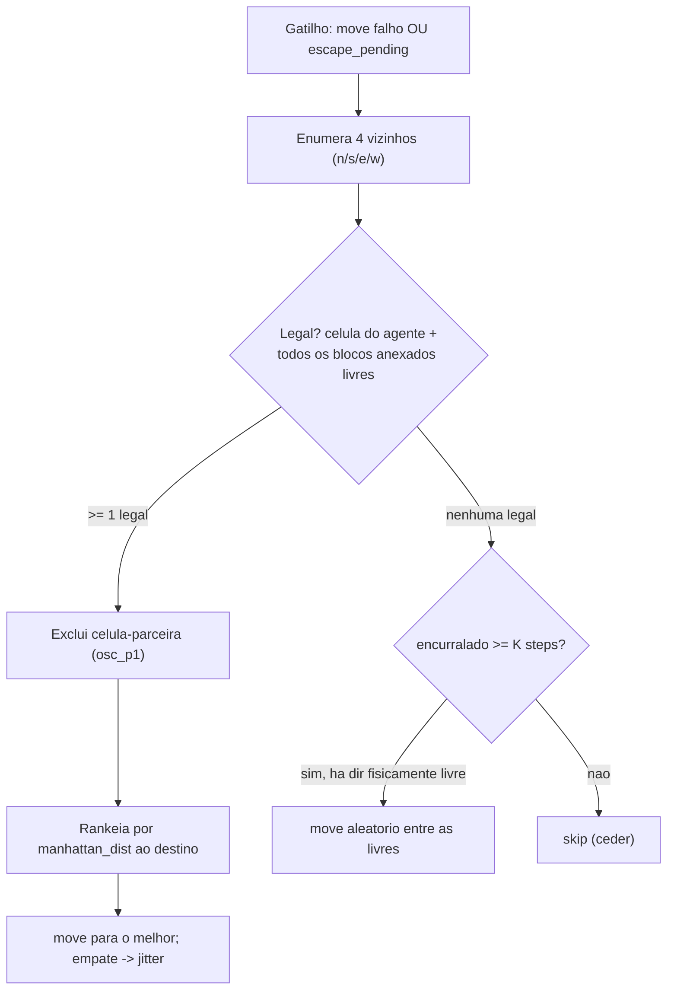

# feat: Camada reativa de escape para o livelock de movimento

## Summary

Adicionar uma camada reativa de escape em `.asl`: quando um `move` falha ou a oscilação é detectada, o agente passa para um vizinho local livre que mais o aproxima do destino, ou cede (`skip`) se estiver encurralado. O ranking usa a distância toroidal que o `SharedMap` já expõe, então o escape concorda com a métrica do A* sem nenhum Java novo. O núcleo do A* e o `SharedMap` ficam intactos.

## Problem Frame

Os agentes agem a cada step mas não progridem ao se aglomerar/perto de paredes. A medição (seed 17, 200 steps) mostrou que o modo dominante é a oscilação A↔B — **157 oscilações vs 8 stuck (~20×)**. Hoje, ao bloquear, o agente tenta uma única perpendicular fixa ([navigation.asl:81-95](src/agt/common/navigation.asl#L81-L95)) sem checar se a célula está livre; e o detector de oscilação só registra log ([perception.asl:52](src/agt/common/perception.asl#L52)) — nada reage a ele. O agente continua a quicar até o detach forçado de 50 steps, perdendo o bloco.

---

## Requirements

Rastreiam o requirements doc de origem (ver origin: `docs/brainstorms/2026-06-17-livelock-escape-reativo-requirements.md`).

**Comportamento do escape**

- R1. O escape é acionado por dois gatilhos: `move` falho (`last_move_blocked`) e detecção de oscilação. (origin R1)
- R2. Uma direção é legal só quando, na percepção local, a célula-alvo do agente **e** as células futuras de **todos** os blocos anexados estão livres (sem `thing` de obstáculo/entidade/bloco). (origin R2)
- R3. Entre as direções legais, mover para a mais próxima do destino por distância toroidal, excluindo a célula-parceira da oscilação; empate resolvido por jitter. (origin R3)
- R4. Sem direção legal útil → emitir `skip` (ceder). (origin R4)
- R5. Após K steps consecutivos encurralado → um movimento aleatório entre as direções legais; se nenhuma for legal, manter `skip`. (origin R5)

**Cobertura e integração**

- R6. O escape substitui a reação a bloqueio nos três handlers com destino ativo — navegação genérica, coleta e transporte para submit; o fallback de troca-de-goal-zone do submit é mantido como ortogonal. (origin R6)
- R7. Em `+position`, o detector de oscilação registra um pedido pendente e não emite ação; o escape sai no próximo `+step` navegante, que consome o pedido (descartado se o destino é alcançado ou o agente sai de navegação). (origin R7)
- R8. Uma ação por step: o escape pré-empta o `move` normal; nunca uma segunda ação. (origin R8)
- R9. O A* (`compute_next_move`) é stateless por step; o núcleo do A* e o `SharedMap` não mudam; o detach de 50 steps permanece como rede. (origin R9)
- R10. A camada só age na navegação com destino ativo (`has_destination`); a exploração pura mantém o comportamento atual. (origin R10)

**Validação**

- R11. Medir A/B (camada off vs on) em N=5 runs no seed 17, 200 steps, por mediana; aprovar se a mediana de `[OSC]` cai ≥50% (157→≤~78) e `[STUCK]` não sobe; gate do `#2` ancorado na mediana de detaches forçados de carregador, não em submits. (origin Success Criteria)

---

## Key Technical Decisions

- KTD1. **Legalidade da percepção local; ranking pela op de distância toroidal já existente.** A legalidade (R2) vem das crenças `thing` do agente (ground-truth dos adjacentes na visão 5). O ranking por proximidade (R3) usa `manhattan_dist` do `SharedMap` ([SharedMap.java:272](src/env/env/SharedMap.java#L272)), que chama o mesmo `wrappedManhattan` ([SharedMap.java:53](src/env/env/SharedMap.java#L53)) usado pela heurística do A*. Resultado: a camada fica 100% em `.asl`, consistente com a rota do A*, sem Java novo — resolvendo a questão load-bearing da distância toroidal.
- KTD2. **Escape como crença `escape_pending`, consumida no próximo `+step` navegante.** O detector roda em `+position` e não pode emitir ação ali (colidiria com o `move` do `+step`). Ele assere `escape_pending`; o handler de navegação consome o pedido e pré-empta o `compute_next_move` daquele step (R7, R8).
- KTD3. **Ponte de referencial para o anti-volta.** `osc_p1` é absoluto (X,Y); a percepção `thing` é relativa (DX,DY). A exclusão da célula-parceira compara o candidato absoluto `(MX+DX, MY+DY)` com `osc_p1`. (origin: ponte de referencial deferida)
- KTD4. **No submit, escape e fallback de destino são ortogonais.** O escape escolhe o **movimento**; o `nav_block_count` continua incrementando e a troca-de-goal-zone dispara no seu limiar (nível de **destino**). Os dois compõem em vez de competir. (origin: sequenciamento deferido)
- KTD5. **Jitter no empate de distância.** Quando duas direções legais empatam em distância, escolher aleatoriamente — evita que dois agentes frente-a-frente espelhem a escolha e formem nova oscilação. (origin: desempate deferido)
- KTD6. **Gate ancorado em movimento.** A decisão de construir o `#2` se ancora na mediana de detaches forçados de carregador, não em submits (submits estáveis após queda de `[OSC]` são inconclusivos — podem ser limite de estratégia). (origin Success Criteria)

---

## High-Level Technical Design

Fluxo de decisão do escape (gatilho → escolha de ação no step):

A pré-empção (R8): em cada `+step` navegante, se `last_move_blocked` ou `escape_pending` valem, o handler de escape emite a ação **no lugar** do `compute_next_move` normal. Como o A* é stateless por step (KTD2/R9), nada é cacheado ou descartado.

---

## Implementation Units

### U1. Núcleo de decisão do escape (asl)

- **Goal:** um objetivo reutilizável `!escape_move(MX, MY, DX, DY)` que decide a ação de escape conforme o fluxo do HTD.
- **Requirements:** R2, R3, R4, R5; KTD1, KTD3, KTD5.
- **Dependencies:** nenhuma (usa `manhattan_dist`, já existente).
- **Files:** `src/agt/common/navigation.asl` (definição do objetivo, perto da lógica de navegação).
- **Approach:** enumerar as 4 direções com seus offsets; para cada uma, testar legalidade pela percepção (`not thing(DX,DY,obstacle,_)` etc. para a célula do agente, e via `.findall` sobre `attached(AX,AY)` para cada bloco, testando `(AX+DX, AY+DY)`); descartar a direção cujo destino absoluto `(MX+DX,MY+DY)` é igual a `osc_p1`; rankear as legais por `manhattan_dist((MX+DX),(MY+DY),DX_dest,DY_dest,-D)` e escolher o menor D com desempate aleatório. Se não há legal: incrementar/consultar um contador de "encurralado"; se ≥ K e há direção fisicamente livre, mover aleatório entre as livres; senão `skip`. K é uma crença parametrizável (`escape_shake_k(3)` como padrão).
- **Patterns to follow:** o cálculo de offset de direção em [perception.asl:171-174](src/agt/common/perception.asl#L171-L174); o uso de `manhattan_dist`/`compute_next_move` como ops do `SharedMap` em [navigation.asl:101](src/agt/common/navigation.asl#L101).
- **Test scenarios** (verificadas por parse `as2j` + runs instrumentados no seed 17, já que não há harness de teste para `.asl`):
  - Covers AE2. Vizinho-alvo ocupado por colega, outra direção legal existe → move para a legal mais próxima do destino.
  - Covers AE3. Carregando 1 bloco; direção livre para o agente mas bloqueada para o bloco → direção não-legal.
  - Covers AE7. Carregando 2 blocos; direção libera a célula de um bloco mas não do outro → direção não-legal.
  - Covers AE4. Nenhuma direção legal → `skip`.
  - Covers AE5. Encurralado por K steps com ≥1 direção livre → move aleatório entre livres; nenhuma livre → mantém `skip`.
  - Covers AE6. Única direção livre é a parceira da oscilação → cede (não volta a quicar).
  - Empate de distância entre duas legais → escolha varia entre execuções (jitter).
- **Verification:** parse OK; em run instrumentado, ao bloquear, o agente escolhe um vizinho livre lateral e não repete a célula-parceira.

### U2. Detector de oscilação registra pedido de escape

- **Goal:** `check_osc` deixa de ser só-log e passa a registrar `escape_pending`.
- **Requirements:** R1, R7; KTD2.
- **Dependencies:** U1.
- **Files:** `src/agt/common/perception.asl` (handler `+!check_osc`, [perception.asl:52-59](src/agt/common/perception.asl#L52-L59)).
- **Approach:** ao detectar o ping-pong, manter o log e a atualização de `osc_p1`/`osc_p2` (via `osc_shift`), e assere `escape_pending(X,Y)`. Não emitir ação em `+position`. O pedido é consumido/abolido em U3.
- **Patterns to follow:** o handler atual de `check_osc`/`osc_shift` ([perception.asl:52-64](src/agt/common/perception.asl#L52-L64)).
- **Test scenarios:**
  - Covers AE1. Oscilando A↔B com destino ativo → após o disparo, existe `escape_pending` e nenhuma ação saiu em `+position`.
  - Não-oscilação (movimento de contorno legítimo, sem voltar à célula de 2 steps atrás) → `escape_pending` não é criado.
- **Verification:** parse OK; o log `[OSC]` continua aparecendo e passa a ser seguido de uma ação de escape no step seguinte (não mais só-log).

### U3. Cabeamento do escape nos handlers de navegação

- **Goal:** rotear os três handlers com destino ativo para o `!escape_move`, consumindo `last_move_blocked`/`escape_pending`, com uma ação por step.
- **Requirements:** R6, R7, R8, R9, R10; KTD2, KTD4.
- **Dependencies:** U1, U2.
- **Files:** `src/agt/common/navigation.asl` (substituir a perpendicular em [navigation.asl:81-95](src/agt/common/navigation.asl#L81-L95) e consumir `escape_pending` antes do `compute_next_move` normal); `src/agt/common/collection.asl` (reação a bloqueio em [collection.asl:71-85](src/agt/common/collection.asl#L71-L85)); `src/agt/common/connect_protocol.asl` (reação a bloqueio do `pending_submit` em [connect_protocol.asl:276+](src/agt/common/connect_protocol.asl#L276)).
- **Approach:** em cada handler navegante, antes de chamar `compute_next_move`, se `last_move_blocked` ou `escape_pending` valem, delegar ao `!escape_move(MX,MY,DX,DY)` e abolir o pedido consumido (uma ação por step). No `connect_protocol`, preservar o incremento de `nav_block_count` e o disparo de troca-de-goal-zone no limiar — o escape decide o movimento, o fallback decide o destino (KTD4). Garantir que `escape_pending` é descartado quando o destino é alcançado ou o agente entra em estado sem navegação (R7).
- **Patterns to follow:** os três handlers de bloqueio existentes; a precedência de planos por `+step` em cada arquivo.
- **Test scenarios:**
  - Covers AE2. `failed_path` durante navegação genérica → escape escolhe vizinho legal (não a perpendicular fixa antiga).
  - `failed_path` durante `collecting` → escape em vez do desvio perpendicular de [collection.asl:74-81](src/agt/common/collection.asl#L74-L81).
  - `failed_path` carregando bloco rumo a goal zone → escape escolhe o movimento E o `nav_block_count` continua incrementando; ao atingir o limiar, a troca-de-goal-zone ainda dispara.
  - Pedido de escape pendente consumido no `+step` seguinte → exatamente uma ação emitida nesse step.
- **Verification:** parse OK; nos três contextos (explorar/coletar/submeter) o agente usa o escape; nenhum step emite duas ações; a troca-de-goal-zone do submit ainda ocorre no limiar.

### U4. Instrumentação e protocolo de medição A/B

- **Goal:** tornar o gate mensurável e documentar o protocolo de 5 runs.
- **Requirements:** R11; KTD6.
- **Dependencies:** U3.
- **Files:** `src/agt/common/navigation.asl` e `src/agt/common/connect_protocol.asl` (marcador de log contável nos pontos de detach forçado).
- **Approach:** garantir um marcador único e contável (ex.: `[DETACH]`) em cada ponto de detach forçado de carregador (em [navigation.asl:65-77](src/agt/common/navigation.asl#L65-L77) e no caminho de detach do submit), além dos já existentes `[OSC]`, `[STUCK]` e `SUCESSO`. Documentar o protocolo A/B: rodar 5× com a camada desligada (estado atual: perpendicular + `#4` só-log) e 5× ligada, mesmo seed 17/200 steps, comparar medianas de `[OSC]`, `[STUCK]`, `[DETACH]`, submits.
- **Test scenarios:** `Test expectation: none` — unidade de instrumentação/medição; sem mudança comportamental. Verificação é a contabilidade dos marcadores num run.
- **Verification:** um run produz contagens não-ambíguas de `[OSC]`, `[STUCK]`, `[DETACH]` e submits, suficientes para preencher a tabela A/B.

---

## Scope Boundaries

**Adiado (atrás da medição desta camada)**

- `#2` (A* enxergar colegas vivos) e o enabler (expor posições ao `SharedMap`).

**Fora desta correção**

- Reframe de duas camadas no `SharedMap` (`staticObstacles`/`liveOccupancy`); dimensão adversária (ADV-*).

**Intocado**

- Estratégia de tarefas/submit; o fix do EIS (`awaitTime`).

---

## Risks & Dependencies

- **Precedência de planos entre arquivos.** O escape precisa ser o handler escolhido nos três contextos de bloqueio; ordem de carga dos `.asl` pode afetar qual `+step` dispara. Mitigar tornando as condições dos handlers mutuamente exclusivas (cada um guarda seu contexto: genérico/`collecting`/`pending_submit`).
- **Interação com o `nav_block_count` do submit.** Risco de o escape "resetar" ou competir com a cadência de troca-de-goal-zone; KTD4 define a composição ortogonal — validar no cenário de carregador bloqueado.
- **Gate sobre topologia única.** O seed 17 é uma só geometria; N=5 trata o RNG, não o mapa. Limitação conhecida, registrada na origem.
- **Sem harness de teste `.asl`.** A verificação depende de parse `as2j` + runs instrumentados no seed 17; não há asserts unitários.

---

## Sources / Research

- Origem: [docs/brainstorms/2026-06-17-livelock-escape-reativo-requirements.md](docs/brainstorms/2026-06-17-livelock-escape-reativo-requirements.md) (AE1–AE7 e Success Criteria detalhados lá).
- `manhattan_dist` (op exposta) e `wrappedManhattan` (métrica toroidal do A*): [SharedMap.java:272](src/env/env/SharedMap.java#L272), [SharedMap.java:53](src/env/env/SharedMap.java#L53).
- Handlers de bloqueio atuais: [navigation.asl:81-95](src/agt/common/navigation.asl#L81-L95), [collection.asl:71-85](src/agt/common/collection.asl#L71-L85), [connect_protocol.asl:276](src/agt/common/connect_protocol.asl#L276).
- Detector de oscilação e offsets de direção: [perception.asl:52-64](src/agt/common/perception.asl#L52-L64), [perception.asl:171-174](src/agt/common/perception.asl#L171-L174).
- Medido (seed 17): 157 osc / 200 steps ≈ 20× stuck (8); `#1` cortou 570 marcações-fantasma (36%).
