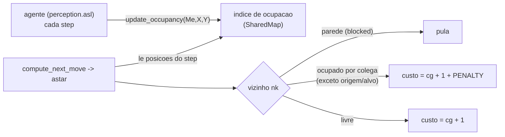

# feat: A* ciente de colega vivo (overlay de penalização)

## Summary

Fazer o A* (`astar` em `src/env/env/SharedMap.java`) somar uma **penalidade de custo alto finito** às células ocupadas por colegas vivos, roteando ao redor da congestão em vez de para dentro dela. As posições vivas chegam ao A* por um índice de ocupação interno ao SharedMap, alimentado por cada agente a cada step. O escape reativo (`.asl`, já existente) permanece como fallback de corredor.

## Problem Frame

A camada reativa de escape foi medida e **piorou** a oscilação (157→339): o escape é um reflexo de 1 passo sem autoridade sobre a rota — empurra o agente pro lado, e no step seguinte o A* re-puxa direto pro gargalo bloqueado por colega (o passo-1 fez não marcar colega). O fix tem de mudar a **rota** (o que o A* sabe), não o reflexo. Ver origin: `docs/brainstorms/2026-06-17-astar-ciente-colega-requirements.md`.

---

## Requirements

Rastreiam o requirements doc de origem.

- R1. O `astar` atribui custo alto finito às células ocupadas por colega vivo (não as remove do grafo), roteando ao redor quando há alternativa e atravessando só quando for o único caminho. (origin R1)
- R2. A célula de origem (agente que chama) e a célula-alvo nunca são penalizadas. (origin R2)
- R3. O overlay é efêmero: usa as posições do step corrente, sem persistência nem decay. (origin R3)
- R4. As posições vivas ficam num índice de ocupação interno ao SharedMap, atualizado por cada agente a cada step; coordenadas absolutas. (origin R4)
- R5. O escape reativo (`.asl`) permanece como fallback de corredor frente-a-frente; o #2 cuida do roteamento no espaço aberto. (origin R5)
- R6. Validar A/B no seed 17 (mediana de 5 runs, 200 steps), base vs #2+escape; aprovar se a mediana de `[OSC]` cai ≥50% E submits não regridem. (origin R6)
- R7. O overlay entra só no `astar` (escolha do passo), não no `astarCost` (seleção de goal zone).

---

## Key Technical Decisions

- KTD1. **Penalizar via custo aditivo na expansão de vizinhos do `astar`** — a célula ocupada recebe `+PENALTY` no custo (`ng`), e **não** entra no conjunto `blocked` (que continua só paredes/skip). Mantém a célula transponível (corredor não dá deadlock).
- KTD2. **Índice de ocupação dentro do SharedMap** — um op novo, chamado por cada agente a cada step (ao lado do `update_agent_pos`). Sem link entre artefatos nem posições passadas por chamada. Coordenadas absolutas (`absolutePosition: true`), sem ponte de referencial.
- KTD3. **Overlay só no `astar`**, não no `astarCost` — a consciência-de-colega afeta o passo do agente, não qual goal zone ele escolhe.
- KTD4. **Origem e alvo fora do conjunto penalizado** — espelha como o `astar` já remove origem+alvo do `blocked`.
- KTD5. **Escape (`.asl`) mantido como fallback** — o #2 resolve o aberto (acaba a órbita); o escape cobre o corredor residual onde nenhum agente tem rota alternativa.
- KTD6. **`PENALTY` é parâmetro de calibração** — começa num valor e é afinado pela medição A/B (baixo demais = não desvia; alto demais = vira bloqueio).

---

## High-Level Technical Design

Fluxo de dados (alimentação do índice por step) e a decisão de custo no A*:

O `blocked` (paredes) continua causando `skip`; a ocupação viva é um conjunto **separado** que só soma custo — é isso que diferencia penalizar de bloquear.

---

## Implementation Units

### U1. Enabler — índice de ocupação no SharedMap

- **Goal:** o SharedMap mantém um índice de posições vivas, alimentado por cada agente a cada step.
- **Requirements:** R4.
- **Dependencies:** nenhuma.
- **Files:** `src/env/env/SharedMap.java` (campo + op novos); `src/agt/common/perception.asl` (chamada de push).
- **Approach:** adicionar um `ConcurrentHashMap<String,int[]>` de ocupação e um `@OPERATION update_occupancy(nome, x, y)` que sobrescreve a entrada (coords normalizadas). Chamá-lo em `+!try_update_pos` ([perception.asl:69-70](src/agt/common/perception.asl#L69-L70)), ao lado do `update_agent_pos`. Coordenadas absolutas.
- **Patterns to follow:** `SquadCoordinator.agentPositions` + `update_agent_pos` ([SquadCoordinator.java:216](src/env/env/SquadCoordinator.java#L216)); o jeito que `obstacles`/`cells` já vivem no SharedMap.
- **Test scenarios:**
  - Após um agente reportar, sua célula está no índice; um segundo reporte sobrescreve o primeiro (sem entrada-própria obsoleta).
  - Verificação comportamental via run instrumentado (o índice alimenta U2).
- **Verification:** compila/parseia; num run, o índice de ocupação fica populado a cada step (contagem de debug > 0).

### U2. Overlay de penalização no astar

- **Goal:** o `astar` penaliza células ocupadas por colega (exceto origem/alvo), roteando ao redor quando possível.
- **Requirements:** R1, R2, R3, R7; KTD1, KTD3, KTD4.
- **Dependencies:** U1.
- **Files:** `src/env/env/SharedMap.java` (custo de vizinho no `astar`).
- **Approach:** no `astar`, montar um conjunto `occupied` a partir do índice de ocupação (posições do step corrente), removendo origem e alvo. No laço de expansão de vizinhos, manter o `skip` do `blocked` (paredes); para vizinho não-bloqueado, `ng = cg + 1 + (occupied.contains(nk) ? PENALTY : 0)`. **Não** adicionar `occupied` ao `blocked`. Aplicar só no `astar`, não no `astarCost`.
- **Technical design (direcional):** o laço de vizinhos espelha o do `astarCost` ([SharedMap.java:305-315](src/env/env/SharedMap.java#L305-L315)), com a penalidade somada ao `ng`.
- **Patterns to follow:** o laço de custo do `astar`/`astarCost` existente.
- **Test scenarios** (comportamentais, run instrumentado seed 17):
  - Covers AE1. Espaço aberto, colega no caminho direto, há rota lateral → o A* retorna direção que contorna (não entra na célula do colega).
  - Covers AE2. Corredor 1-wide, colega é o único caminho → A* retorna a direção do corredor (penalidade aceita) → move falha → escape cede.
  - Covers AE3. Colega na célula-alvo → alvo não penalizado; A* roteia até lá.
  - Covers AE4. Própria célula do agente no índice → não penalizada (origem removida).
  - Covers AE5. Colega moveu no step anterior → A* usa as posições correntes; célula vaga deixa de ser penalizada quando o colega reporta.
- **Verification:** compila; run instrumentado mostra a órbita de espaço-aberto sumir (`[OSC]` cai vs só-escape).

### U3. Calibração da penalidade e medição A/B

- **Goal:** escolher o valor de `PENALTY` e medir o gate.
- **Requirements:** R5, R6; KTD5, KTD6.
- **Dependencies:** U2.
- **Files:** `src/env/env/SharedMap.java` (valor de `PENALTY`); medição usa a instrumentação existente (`[OSC]`/`[STUCK]`/`[DETACH]`/`SUCESSO`).
- **Approach:** rodar o A/B — base = estado commitado (#1 + #4 só-log, sem escape, sem #2) vs candidato = #2 + escape — 5 runs cada, seed 17, 200 steps, mediana. Varrer alguns valores de `PENALTY` (baixo/médio/alto relativo ao custo de passo) e escolher um onde o A* contorna colega no aberto mas ainda atravessa corredor. Confirmar que o escape só dispara no corredor residual (R5).
- **Test scenarios:** `Test expectation: none` — unidade de calibração/medição; sem código comportamental além da constante `PENALTY`. A verificação é a tabela A/B.
- **Verification:** mediana de `[OSC]` ≥50% abaixo da base, submits não regridem, e o escape-fallback ainda dispara em corredores.

---

## Scope Boundaries

**Deferred to Follow-Up Work**

- Limpeza de ocupação obsoleta de agente desativado (aceita-se a obsolescência breve por ora).

**Fora desta correção**

- Reserva de células / pathfinding cooperativo; reframe de duas camadas no SharedMap; dimensão adversária.

**Intocado**

- Estratégia de tarefas/submit; fix do EIS (`awaitTime`); passo-1 (overlay é efêmero, não marcação); o código do escape (`.asl`, mantido como fallback, sem mudanças).

---

## Risks & Dependencies

- **Mudança em Java (`SharedMap.java`) exige recompilar** — diferente do escape (só `.asl`, lido em runtime). Garantir que o run reconstrói as classes (`gradle` compila antes do `run`).
- **Calibração da penalidade** — baixo demais não desvia; alto demais vira bloqueio (deadlock de corredor). Mitigado pela varredura em U3.
- **Ocupação obsoleta** de agente desativado fica no índice até reativar (raro/breve); penalizar célula obsoleta é mayormente inócuo (penalize, não bloqueio).
- **Depende do escape** (`.asl`, U1-U4, não-commitado) presente como fallback; o #2 vai por cima.
- **Sem harness de teste unitário** para `.asl`/Java aqui; verificação via parse/compile + runs instrumentados no seed 17.

---

## Sources / Research

- Origem: [docs/brainstorms/2026-06-17-astar-ciente-colega-requirements.md](docs/brainstorms/2026-06-17-astar-ciente-colega-requirements.md) (AE1–AE5 e Success Criteria detalhados lá).
- Ponto de injeção: corpo do `astar` ([SharedMap.java:320](src/env/env/SharedMap.java#L320)) e o laço de custo análogo no `astarCost` ([SharedMap.java:305-315](src/env/env/SharedMap.java#L305-L315)); `blocked = obstacles.keySet()` remove origem+alvo ([SharedMap.java:326-328](src/env/env/SharedMap.java#L326-L328)).
- Enabler: `update_agent_pos`/`agentPositions` ([SquadCoordinator.java:216](src/env/env/SquadCoordinator.java#L216)); push por step em [perception.asl:69-70](src/agt/common/perception.asl#L69-L70).
- Evidência do ce-debug: o escape reativo orbita o gargalo (OSC 157→339) porque o A* re-puxa sem conhecer o colega.
