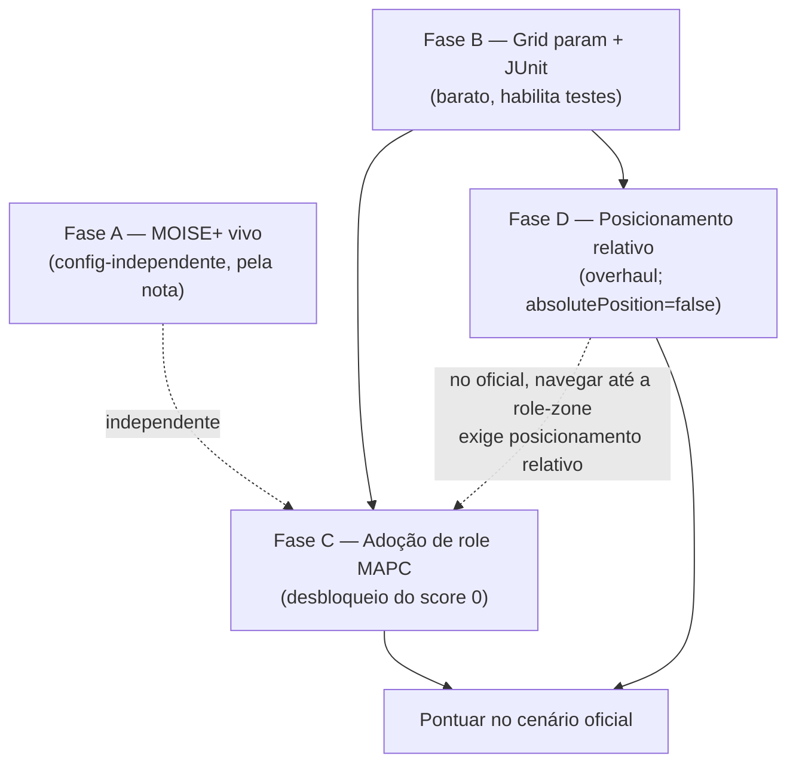

# feat: Cenário oficial MAPC 2022 & organização MOISE+ (Track 3)

## Summary

Tornar o HIVE realmente competitivo na config **oficial** do MAPC 2022 (70×70, 750 steps, 20
agentes, `absolutePosition: false`) e satisfazer o requisito de **MOISE+** do enunciado. Quatro
frentes, em fases: (A) ligar a organização MOISE+ que já existe mas está morta; (B) parametrizar o
grid e montar o harness de teste JUnit; (C) adoção de role do cenário MAPC (o desbloqueio do
`score 0`); (D) **overhaul de posicionamento relativo** — porque o oficial desliga
`absolutePosition` e toda a navegação do HIVE assume posição absoluta. A Fase D é a maior, mas
**tratável**: o time **LI(A)RA** (Jason, MAPC 2022, cenário oficial) resolve a fusão de mapas com um
handshake de avistamento mútuo — **portar-e-validar**, não pesquisa do zero (ver Sources).

---

## Problem Frame

O HIVE pontua hoje (~70/50) apenas porque a config de **dev** ([conf/FastTestConfig.json](conf/FastTestConfig.json),
40×40) é permissiva em dois eixos que o cenário **oficial** não é:

1. **Role inicial.** No oficial o role `default` não tem `request/attach/connect/submit`
   ([massim_2022/server/conf/sim/roles/standard.json](massim_2022/server/conf/sim/roles/standard.json)).
   Sem `adopt(worker|constructor)` numa role-zone, o time só anda → **score 0**. Na dev, o
   `default` já tem todas as ações.
2. **Posição absoluta.** O oficial roda `absolutePosition: false`; o
   [scenario.md:36](massim_2022/docs/scenario.md#L36) confirma que *"agents do not know their
   absolute positioning"*. Toda a navegação do HIVE — `SharedMap`, A*, wrap toroidal,
   `AdjacentDirection` — é keyed em **coordenadas absolutas**. A dev liga `absolutePosition: true`
   para mascarar isso.

Além disso, o enunciado PCS5703 **exige o modelo organizacional MOISE+**, e a spec
[src/org/hive_org.xml](src/org/hive_org.xml) existe mas **nunca é carregada** ([hive.jcm](hive.jcm)
não tem bloco `organisation`; zero ações ora4mas nas `.asl`) — risco de nota. O grid está hardcoded
em 40 em 4 lugares, e o oficial usa 20 agentes (dev usa 15).

---

## Requirements

- **R1 — MOISE+ vivo.** A organização `hive_org` é carregada; agentes adotam roles
  organizacionais e se comprometem com as missions obrigadas. (Pela nota; config-independente.)
- **R2 — Grid parametrizável.** Dimensões do grid vêm de fonte única (40 ou 70), sem literal
  hardcoded; a matemática de wrap fica correta em ambos.
- **R3 — Adoção de role MAPC.** Agentes navegam a uma role-zone e `adopt`am um role capaz,
  habilitando `request/attach/connect/submit` no cenário oficial.
- **R4 — Posicionamento relativo.** O time mapeia e navega com `absolutePosition: false` (frame
  local por agente + fusão de mapas de time).
- **R5 — Escala.** O time sobe para 20 agentes com composição de squad coerente com a organização.
- **R6 — Iteração barata.** A config de dev 40×40 segue rodável (adoção de role atrás de flag) e a
  lógica não-trivial mora em Java testável, gerando evidência para o relatório (§5/§6).

---

## High-Level Technical Design

**Dois conceitos de "role" que o plano nunca deve confundir:**

| Conceito | O que é | Valores | Como muda | Por que importa |
|---|---|---|---|---|
| Role **organizacional** (MOISE+) | estrutura de time da org | squad_leader, collector, assembler, sentinel | `adoptRole` na org (Ora4MAS) | exigido pela nota; não afeta ações do jogo |
| Role **do cenário** (MAPC) | gateia ações do simulador | default, worker, constructor, explorer | ação `adopt` numa role-zone | habilita `request/submit` → desbloqueia score |

**Dependência entre fases (no cenário oficial):**

Na **dev** (absolutePosition=true), a Fase C funciona sem a Fase D. No **oficial**, a navegação
até a role-zone (C) depende do posicionamento relativo (D) — por isso D é pré-requisito real de
pontuar lá.

---

## Key Technical Decisions

- **KTD1 — MOISE+ mínimo-mas-real.** Agentes adotam o role org e se comprometem com as missions
  obrigadas; as missions são satisfeitas por *goal achievement* dos comportamentos que já existem.
  A coordenação real continua sendo o líder + leilão (`TaskBoard`). MOISE+ **não** vira o fluxo de
  controle. _Rationale:_ a abordagem do STRATEGY.md (manter `.asl` fina, não arrancar lógica que
  funciona sem evidência); a nota pede a org **usada**, não **dirigindo tudo**.
- **KTD2 — Dimensões do grid de fonte única injetada.** Como `absolutePosition: false` implica que
  o tamanho não é percebido diretamente, as dimensões vêm de um parâmetro de config no launch,
  threaded para toda a matemática de wrap; `AdjacentDirection` passa a receber dims por argumento
  (hoje são `static final 40`). _Rationale:_ remove os 4 hardcodes; a descoberta dinâmica de
  tamanho é tratada na Fase D.
- **KTD3 — Adoção de role MAPC atrás de flag.** Um flag de config (`needs_role_adoption`) liga a
  adoção só no oficial; na dev o `default` já tem as ações, então fica desligado. _Rationale:_
  preserva a iteração rápida no 40×40 (R6).
- **KTD4 — Posicionamento relativo via frame local integrado + fusão de mapas.** Cada agente mantém
  um frame local (origem = início, deslocamento integrado dos `move` bem-sucedidos); os mapas se
  fundem quando agentes se identificam mutuamente. _Rationale:_ é a forma padrão de lidar com
  `absolutePosition: false`. **O protocolo de fusão tem padrão *proven* do LI(A)RA** (handshake de
  avistamento mútuo); o ponto em aberto é a *arquitetura* — adaptar ao `SharedMap` vs. crenças
  por-agente (ver U9 / Open Questions).
- **KTD5 — Política de role como Java puro testável.** O mapeamento role-org → role-MAPC (e o
  respeito ao teto da norma `adopt`) é uma função pura testável, não lógica em `.asl`. _Rationale:_
  testabilidade do STRATEGY.md; gera evidência de §5.

---

## Scope Boundaries

**Neste plano:** Fases A–D conforme abaixo (R1–R6).

**Fora do escopo (outros tracks):**
- Track 2 — estratégia de tarefas (viés single-block, submit-loop, normas): plano separado.
- Track 1 — harness de medição/métricas além do source-set JUnit que a Fase B introduz.
- Navegação (resíduos do livelock) e jogo adversário: gated no STRATEGY.md.

**Deferred to Follow-Up Work:**
- **Arquitetura da fusão de mapas (U9).** A *técnica* está resolvida (handshake de avistamento mútuo
  do LI(A)RA — identifica o par e alinha frames); o que falta decidir é adaptá-la ao `SharedMap`
  (Java) vs. migrar para o modelo de crenças por-agente. Um `/ce-brainstorm` curto só sobre isso.
- Afinação da composição de squad para 20 (quantos worker/constructor/explorer) depois de medir.

---

## Implementation Units

### Phase A — Organização MOISE+ viva (config-independente; pela nota)

#### U1. Carregar a organização `hive_org` no projeto JaCaMo

- **Goal:** a org sai do papel — `hive_org.xml` é instanciada (grupo `hive_team` + subgrupos,
  schemes), com os artefatos Ora4MAS criados num workspace.
- **Requirements:** R1.
- **Dependencies:** nenhuma.
- **Files:** [hive.jcm](hive.jcm) (adicionar bloco `organisation`/`workspace`),
  [src/org/hive_org.xml](src/org/hive_org.xml) (revisar cardinalidades vs. 20 agentes).
- **Approach:** declarar a organização a partir de `hive_org.xml` no `.jcm`, instanciar o grupo
  `hive_team` (e subgrupos `squad_group`/`sentinel_group`) e os schemes; garantir que o workspace
  da org exista para os agentes focarem. Sem mudar comportamento de agente ainda.
- **Patterns to follow:** sintaxe JaCaMo de `organisation ... { group ...: ... scheme ... }`.
- **Test scenarios:** `Test expectation: none -- wiring declarativo; validado por boot da sim sem
  erro de carregamento da org e presença dos artefatos de grupo/scheme.`
- **Verification:** a aplicação sobe e os artefatos da org aparecem (introspecção Ora4MAS); nenhum
  agente quebra no `!start`.

#### U2. Agentes adotam role organizacional e comprometem a mission obrigada

- **Goal:** cada agente entra no workspace da org, adota seu role organizacional e se compromete
  com a mission que a norma obriga, sem alterar a coordenação real (líder + leilão).
- **Requirements:** R1.
- **Dependencies:** U1.
- **Files:** novo [src/agt/common/organization.asl](src/agt/common/organization.asl);
  [src/agt/squad_leader.asl](src/agt/squad_leader.asl),
  [src/agt/collector.asl](src/agt/collector.asl),
  [src/agt/assembler.asl](src/agt/assembler.asl),
  [src/agt/sentinel.asl](src/agt/sentinel.asl) (hook no `+!start`).
- **Approach:** no `!start`, `joinWorkspace` da org → `adoptRole(<role org>)` no grupo →
  ao receber a obrigação, `commitMission`. Os goals das missions (`blocks_collected`,
  `blocks_assembled`, `pattern_submitted`, etc.) são marcados como atingidos pelos comportamentos
  que já existem (`collection.asl`, `assembler.asl`) — ponto de integração fino, não reescrita
  (KTD1).
- **Patterns to follow:** o hook `+!start <- !try_set_grid_dims; ...` já presente em cada agente.
- **Test scenarios:** `Test expectation: integração` — (a) no boot, cada tipo de agente adota o
  role org correto; (b) a obrigação dispara `commitMission`; (c) ao completar o fluxo de coleta
  existente, o goal da mission correspondente é sinalizado e o scheme avança. Lógica em `.asl` →
  validação por integração, não unit.
- **Verification:** introspecção da org mostra roles adotados e missions comprometidas; o fluxo de
  coleta/submit segue funcionando como antes na dev config.

---

### Phase B — Grid parametrizável + harness de teste (barato; habilita testes)

#### U3. Adicionar source-set de teste + JUnit ao build

- **Goal:** existir um lugar para testar a lógica Java pura em ms, sem rodar a sim.
- **Requirements:** R6.
- **Dependencies:** nenhuma.
- **Files:** [build.gradle](build.gradle) (sourceSet `test` com `src/test/java`, dependência
  JUnit 5, task `test`); novo `src/test/java/` (raiz).
- **Approach:** adicionar `testImplementation`/`testRuntimeOnly` do JUnit 5 e o source-set; um
  teste trivial que compila e passa para provar o encanamento.
- **Test scenarios:** `Test expectation: none -- config de build; validada por um teste trivial
  verde.`
- **Verification:** `gradle test` roda e passa.

#### U4. Parametrizar as dimensões do grid (fonte única)

- **Goal:** eliminar os 4 hardcodes de `40` e fazer o wrap funcionar em 40 e 70.
- **Requirements:** R2.
- **Dependencies:** U3.
- **Files:** [src/java/hive/AdjacentDirection.java](src/java/hive/AdjacentDirection.java) (remover
  `static final 40`; receber dims por argumento),
  [src/env/env/SquadCoordinator.java](src/env/env/SquadCoordinator.java) (`wrapDist(...,40)` →
  param), [src/agt/common/perception.asl](src/agt/common/perception.asl) (linha 7:
  `set_grid_dimensions` a partir da config, não literal),
  [src/agt/common/navigation.asl](src/agt/common/navigation.asl) (linha 114: `mod 40` → dims),
  novo [src/test/java/hive/AdjacentDirectionTest.java](src/test/java/hive/AdjacentDirectionTest.java).
  `SharedMap.set_grid_dimensions` já é parametrizável — reusar.
- **Approach:** uma fonte única de dims (parâmetro injetado no launch, KTD2) threaded para toda a
  matemática de wrap. `AdjacentDirection` passa a receber `(w,h)`.
- **Patterns to follow:** `wrappedManhattan`/`wrapDist` já existentes em
  [src/env/env/SharedMap.java](src/env/env/SharedMap.java).
- **Test scenarios:** wrapDelta/Manhattan corretos em 40 e 70; wrap-around `39→0` (40) e `69→0`
  (70); origem==alvo → 0; adjacência n/s/e/w resolvida com wrap; não-adjacente → `none`. (Regressão
  do grid sem nenhuma run.)
- **Verification:** suíte de `AdjacentDirectionTest` verde nos dois tamanhos.

---

### Phase C — Adoção de role do cenário MAPC (desbloqueio do score 0)

> ✅ **Desarmada pelo estudo do `~/repos/MAPC` (2026-06-17).** O `worker_role.asl` + `explore.asl`
> dão um padrão validável: perceber `roleZone(RX,RY)` (relativo à visão) → `move_relative` até a
> célula → `adopt(...)`, com hook de obrigação MOISE+ (`+!adopt_..._role[scheme] <- ...;
> goalAchieved`). **Funciona em coords relativas — independe de `absolutePosition`**, logo a Fase C
> está **desacoplada da Fase D** e pode ser portada-e-validada já. Não copiar às cegas: a política de
> role e os gates são nossos.

#### U5. Política role-org → role-MAPC (Java testável)

- **Goal:** decidir qual role MAPC cada agente deve adotar, respeitando o teto da norma `adopt`.
- **Requirements:** R3.
- **Dependencies:** U3.
- **Files:** novo [src/java/hive/RolePolicy.java](src/java/hive/RolePolicy.java), novo
  [src/test/java/hive/RolePolicyTest.java](src/test/java/hive/RolePolicyTest.java).
- **Approach:** função pura `(roleOrg, contexto) → roleMAPC` (collector→worker,
  assembler→constructor, sentinel→explorer; squad_leader→worker/explorer a definir), com fallback
  quando o teto da norma `adopt` (quantity) já foi atingido.
- **Test scenarios:** cada role-org mapeia para o role-MAPC esperado; respeita o teto de quantity
  (não excede o permitido por time); fallback para role alternativo quando o desejado está cheio;
  entrada desconhecida → default seguro.
- **Verification:** `RolePolicyTest` verde.

#### U6. Comportamento de adoção + gate das ações de pontuação

- **Goal:** no oficial, o agente navega até uma role-zone, `adopt`a o role capaz e só então libera
  os planos de `request/attach/connect/submit`.
- **Requirements:** R3, R6.
- **Dependencies:** U5.
- **Files:** novo [src/agt/common/role_adoption.asl](src/agt/common/role_adoption.asl);
  [src/agt/common/perception.asl](src/agt/common/perception.asl) (handler do percept `role(R)`
  atual; flag `needs_role_adoption`); [src/agt/common/collection.asl](src/agt/common/collection.asl)
  e [src/agt/assembler.asl](src/agt/assembler.asl) (guarda dos planos por `has_capable_role`).
- **Approach:** padrão do MAPC (relativo, **sem depender de posição absoluta**): se `roleZone(RX,RY)`
  é percebida → `move_relative(RX,RY)` até `roleZone(0,0)` → `adopt(RoleDesejado)` (de U5) → tratar
  `failed_location`; se nenhuma role-zone na visão → `explore` (random-walk anti-backtrack). Fallback
  para a role-zone *lembrada* (`known_role_zone` no `SharedMap`) só quando houver frame confiável
  (Fase D). Com `needs_role_adoption=false` (dev), `has_capable_role` é sempre verdadeiro (KTD3).
- **Patterns to follow:** `~/repos/MAPC/src/agt/worker_role.asl` + `explore.asl` (relativo); o
  `signal new_role_zone` do `SharedMap` para a memória de role-zones.
- **Test scenarios:** `Test expectation: integração` — agente `default` navega até a role-zone e
  adota; `failed_location` → reposiciona e tenta de novo; gate: nenhum `request/submit` antes de
  ter role capaz; com flag desligado, comportamento dev inalterado. (A parte Java pura é U5.)
- **Verification:** no oficial, agentes terminam com role worker/constructor/explorer e começam a
  pedir/anexar; na dev nada muda.

---

### Phase D — Posicionamento relativo (overhaul; `absolutePosition: false`)

> ⚠️ **Reavaliado vs `~/repos/MAPC` (2026-06-17): o MAPC NÃO resolve isto.** A config dele usa
> `absolutePosition: true`, o mapa é por-agente write-once sem wrap nem merge, e a inferência por
> move-count foi só *planejada* (nunca implementada). **Não há port** — a Fase D segue em aberto.
> Dois reframes do estudo: (1) **muita navegação não precisa de mapa global** — ir a alvo *percebido*
> (dispenser/role-zone/bloco/goal-zone) funciona em coords relativas (`move_relative`); o mapa global
> só serve p/ *lembrar* onde vi algo. (2) Logo o escopo encolhe: **dead-reckoning por-agente (U7) +
> navegação relativa**, e **evitar o merge cross-agente (U9)** — coordenar por mensagens/claims (como
> o MAPC) em vez de um mapa de coordenadas compartilhado.
>
> **Mas o LI(A)RA (time Jason de 2022, que jogou o cenário OFICIAL) RESOLVE a pilha toda** (ver
> U7/U8/U9 + Sources). O "problema de pesquisa" — identificar qual colega se vê e alinhar frames —
> tem solução concreta e portável: **handshake de avistamento mútuo no mesmo step**. Logo a Fase D é
> **tratável por port-e-validação** (adaptando à arquitetura do HIVE), não um projeto de pesquisa.
>
> **Resolvido (dono, 2026-06-17):** a competição usa a **config padrão do MAPC 2022 →
> `absolutePosition: false`**. Logo a **Fase D é OBRIGATÓRIA** (não condicional). O `true` do
> `~/repos/MAPC`/smoke era só conveniência de dev — não vale para a competição.

#### U7. Frame local por agente (deslocamento integrado)

- **Goal:** cada agente sabe sua posição num **frame local** (origem no início) integrando os
  `move` bem-sucedidos, substituindo a dependência de `my_pos` absoluto.
- **Requirements:** R4.
- **Dependencies:** U3.
- **Files:** novo [src/java/hive/LocalFrame.java](src/java/hive/LocalFrame.java), novo
  [src/test/java/hive/LocalFrameTest.java](src/test/java/hive/LocalFrameTest.java);
  [src/agt/common/perception.asl](src/agt/common/perception.asl) (alimentar resultado dos `move`).
- **Approach:** acumular deslocamento por `move` com `lastActionResult(success)`; mapear percepções
  de visão (relativas) para o frame local. Sem tamanho de grid conhecido ainda (wrap só após U8).
- **Test scenarios:** sequência n/e/s/w com sucesso atualiza o offset corretamente; `move` falho →
  offset inalterado; mapeamento de um "thing" percebido em (dx,dy) para coordenada de frame local;
  offset monotônico sem wrap.
- **Verification:** `LocalFrameTest` verde; offsets batem com trajetória conhecida.

#### U8. Mapa em frame relativo de time + inferência de dimensões

- **Goal:** o `SharedMap` opera num frame **relativo de time** (pré-fusão, privado por agente) e
  infere as dimensões toroidais por observação (alimentando o param da Fase B).
- **Requirements:** R2, R4.
- **Dependencies:** U7.
- **Files:** [src/env/env/SharedMap.java](src/env/env/SharedMap.java), novo teste
  [src/test/java/env/SharedMapRelativeTest.java](src/test/java/env/SharedMapRelativeTest.java).
- **Approach:** mapa **por-agente** no frame dead-reckoned (U7), usado p/ *lembrar* alvos já vistos;
  a navegação curta usa percepção relativa direta (não o mapa). Inferir largura/altura observando
  reaparecimento de landmark / o wrap, preenchendo as dims de KTD2 quando descobertas. **Sem merge
  cross-agente** aqui (ver U9).
- **Test scenarios:** inserção/consulta de célula em frame relativo; inferência de dimensão a
  partir de um landmark reobservado; wrap aplicado só após dims conhecidas. (Marcar o que depender
  de U9 como bloqueado.)
- **Verification:** consultas de mapa coerentes num frame relativo de agente único, sem
  `absolutePosition`.

#### U9. Fusão de mapas cross-agente — handshake de avistamento mútuo (port do LI(A)RA, validar)

- **Goal:** quando dois agentes do time se enxergam, identificar o par, alinhar os frames (transform
  `mate_filter`) e traduzir posições compartilhadas entre frames.
- **Requirements:** R4.
- **Dependencies:** U7, U8.
- **Files:** novo `src/agt/common/map_merge.asl` (+ teste em Java da álgebra do transform, se extraída).
- **Approach (padrão *proven* do LI(A)RA):** ao perceber `thing(XMate,YMate,entity,Team)` na visão,
  registrar `found_mate(XMate,YMate,XMy,YMy,Step)` e **broadcast**. Quem também viu o par no **mesmo
  step** com offsets **consistentes** (`(XF+XO,YF+YO)==(0,0)` → eles se viram) computa
  `mate_filter(Colega,dX,dY)`; daí toda posição informada é traduzida por `+dX,+dY`. **Validar e
  melhorar** — a impl do LI(A)RA é imperfeita: drift corrigido por brute-force (`fix_*Zones`), gossip
  multi-hop é TODO (sync 1-hop), sem wrap toroidal, e risco de ambiguidade quando vários pares se
  veem no mesmo step.
- **Decisão de arquitetura (Open Question):** o LI(A)RA usa **crenças `.asl` por-agente**; o HIVE usa
  **`SharedMap` (Java, compartilhado)**. Portar a *técnica* exige escolher: adaptá-la ao `SharedMap`
  ou migrar para o modelo por-agente.
- **Test scenarios:** offset mútuo consistente → transform correto; offsets inconsistentes → não
  funde; tradução idempotente; ambiguidade (2 pares com mesmo offset no mesmo step) → não funde errado.
- **Verification:** dois agentes com trajetórias distintas convergem para posições consistentes num
  mini-cenário, sem `absolutePosition`.

#### U10. Escala para 20 agentes + composição de squad

- **Goal:** o time conecta 20 agentes com composição coerente com a organização e a política de
  role.
- **Requirements:** R5.
- **Dependencies:** U2, U6.
- **Files:** [hive.jcm](hive.jcm) (15→20 agentes), [eismassimconfig.json](eismassimconfig.json)
  (`count` 15→20), revisar cardinalidades em [src/org/hive_org.xml](src/org/hive_org.xml).
- **Approach:** subir o número de conexões e distribuir roles org/MAPC; afinação fina da
  composição fica deferida (pós-medição).
- **Test scenarios:** `Test expectation: integração` — 20 agentes conectam; nº de cada role
  respeita as cardinalidades min/max da org; nenhuma adoção viola o teto da norma.
- **Verification:** boot oficial com 20 agentes conectados e roles adotados sem violação.

---

## Risks & Dependencies

- **`absolutePosition: false` confirmado** (dono: é a config padrão da competição 2022). A **Fase D
  é necessária**, não uma aposta — o overhaul de posicionamento relativo está no **caminho crítico**
  de pontuar no oficial. (O flag de KTD3 e o param de KTD2 mantêm a dev 40×40 rodável em paralelo.)
- **Fusão de mapas (U9) — evitada por default.** Era o maior risco; reframed para **não construir**
  (coordenar por claims/mensagens, à la MAPC). Só vira risco se um mapa global se provar necessário.
  Fases A–C seguem entregáveis independentemente (valem na dev e pela nota).
- **Runs caras e ruidosas.** Validar por unit test (Fases B–D têm lógica Java testável) e só
  checkpoints na sim; reportar score com dispersão (STRATEGY.md).
- **Norma `adopt` (quantity).** Adotar role demais do mesmo tipo gera punição; `RolePolicy` (U5)
  precisa respeitar o teto.
- **Suficiência do MOISE+ mínimo para a nota.** Se o professor esperar MOISE+ *dirigindo* a
  coordenação, a Fase A precisa crescer (ver Open Questions).

---

## Open Questions

- **~~`absolutePosition` true ou false?~~ RESOLVIDO (dono, 2026-06-17): `false`** — é a config
  padrão da competição 2022. A **Fase D é obrigatória** (posicionamento relativo, padrão do LI(A)RA).
- **Identificação de colega percebido (U9) — RESPONDIDA pelo LI(A)RA:** handshake de avistamento
  mútuo no mesmo step + checagem de offset consistente. Resta a **decisão de arquitetura**: adaptar
  a técnica ao `SharedMap` (Java) vs. migrar para o modelo de crenças por-agente do LI(A)RA.
- **Viabilidade da inferência de dimensões do grid (U8)** sem posição absoluta.
- **Profundidade de MOISE+ exigida pela nota** — "mínimo-mas-real" (KTD1) basta, ou o professor
  quer a org governando o comportamento?

---

## System-Wide Impact

- **Navegação (Fase D)** reescreve a fundação de posicionamento: toca `SharedMap`, A*,
  `AdjacentDirection`, percepção e todos os agentes. É a mudança mais invasiva — daí o phasing e o
  spike.
- **Organização (Fase A)** adiciona um hook de `!start` em todos os agentes e o bloco `organisation`
  no `.jcm`.
- **Escala (U10)** toca a config de conexão (EIS) e as cardinalidades da org.
- **Fases A–C entregam valor independentemente** (nota + dev config + base do oficial); a Fase D é
  o que destrava pontuar no oficial real.

---

## Sources & Research

> **Princípio de reúso (do dono):** prior art **externa** é **citada** (relatório §1/§4/§7 +
> comentários de código) e portamos a *técnica* **adaptada e melhorada** — nunca cópia literal. O
> `~/repos/MAPC` é **trabalho do próprio dono → NÃO é citado** (reúso livre). As fraquezas conhecidas
> do LI(A)RA (sem wrap toroidal, drift por brute-force, gossip 1-hop, ambiguidade) são exatamente
> onde "fazer melhorado".

- [STRATEGY.md](STRATEGY.md) — Track 3 (origin).
- [src/org/hive_org.xml](src/org/hive_org.xml) — spec MOISE+ existente (não carregada).
- [hive.jcm](hive.jcm) — sem bloco `organisation` (org morta confirmada).
- [massim_2022/server/conf/sim/roles/standard.json](massim_2022/server/conf/sim/roles/standard.json)
  — roles oficiais (`default` sem ações de pontuação).
- [massim_2022/server/conf/sim/sim1.json](massim_2022/server/conf/sim/sim1.json) —
  `absolutePosition: false`, 70×70, 750 steps, `entities: 20`.
- [massim_2022/docs/scenario.md](massim_2022/docs/scenario.md) — adoção de role (§adopt, role
  zones), percepção relativa (l.36), step percepts.
- [build.gradle](build.gradle) — sem source-set de teste / JUnit (a adicionar em U3).
- Grid hardcoded: [src/agt/common/perception.asl:7](src/agt/common/perception.asl#L7),
  [src/agt/common/navigation.asl:114](src/agt/common/navigation.asl#L114),
  [src/env/env/SquadCoordinator.java:230](src/env/env/SquadCoordinator.java#L230),
  [src/java/hive/AdjacentDirection.java:8](src/java/hive/AdjacentDirection.java#L8).

_(**Nota interna — NÃO é citação.** O `~/repos/MAPC` é prior work do **próprio dono**; reúso livre,
não vai às referências do relatório.)_ Dele aprendemos: o padrão de adoção de role relativo
(`worker_role.asl`/`explore.asl`, Fase C) e a sintaxe de org (Fase A). **Confirmado:** o MAPC punta o
`absolutePosition` (config `true`, mapa write-once sem merge, inferência só planejada) → **não
resolve a Fase D**. Os `*Test.java` dele serviram de molde mental para o JUnit (U3).

**LI(A)RA** ([github.com/Liga-IA/liara-agents](https://github.com/Liga-IA/liara-agents)) — **time
Jason** do MAPC 2022, jogou o **cenário oficial** (`absolutePosition: false`). **Resolve a Fase D**
(estudado 2026-06-17):

- `src/asl/memory_updates.asl` — auto-localização por `position(X,Y)` (dead-reckoning) + memória de
  mapa por frame (`+thing(XMy+XThing,...)[source(memory)]`). **Serve à U7/U8.**
- `src/asl/synchronism.asl` — **fusão de mapas via handshake de avistamento mútuo** (`found_mate` →
  `mate_filter` → tradução de posições). **A solução da U9.** Imperfeito (drift por brute-force em
  `fix_*Zones`; `transmit_to_others` é TODO; sem wrap).
- `src/asl/adoptrole.asl` — `adopt(Role)` simples; nota de inferir role pelas ações (Fase C / U5).
- Demais times de 2022 (referência da *técnica*, não JaCaMo): MMD (Python), deSouches/FIT BUT (Java,
  `github.com/zborilf/deSouches`), GOALdigger & GOAL-DTU (GOAL). Fonte: `multiagentcontest.org/2022`.
