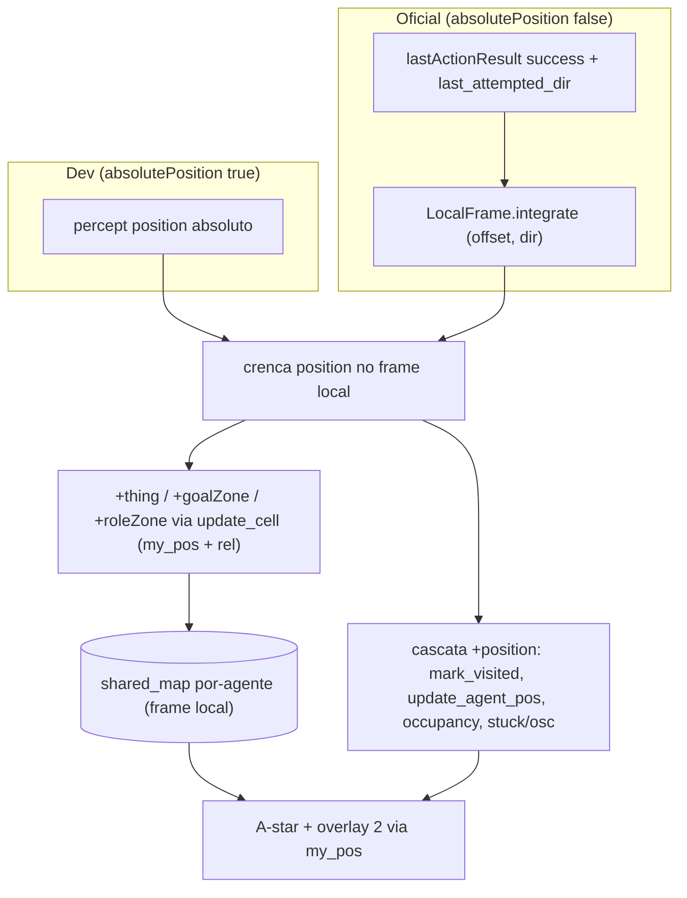

# feat: Fase D — posicionamento relativo (incremento 1)

> **Status pós-review (2026-06-17, code review Fase D):** entrega **parcial** — o
> núcleo está de pé, mas nem toda unidade foi entregue. Use isto ao citar o plano
> no relatório.
> - **Entregue:** U2 (keystone dead-reckoning), U3 (mapa por-agente), U5 (overlay de
>   entidade percebida — agora com filtro de time inimigo, #4), R7 (`translateCells`).
> - **U1 (`LocalFrame.java` + `LocalFrameTest`):** construído **no review** — a álgebra
>   de dead-reckoning (R1/AE1) passou a ter cobertura JUnit; o `.asl` a espelha.
> - **U4 (inferência de dimensão toroidal):** **deferida** — agentes usam
>   `hive.GridConfig` (default/`-PgridW`), não inferem o 70×70 em runtime. R6/AE2/AE3
>   ainda não implementados.
> - **Limitação conhecida (#2):** coordenação por coordenadas (connect/meeting-point)
>   é **cross-frame** e não converge no oficial pré-fusão; depende da U9.

## Summary

Reviver o HIVE sob a config oficial (`absolutePosition: false`) fazendo cada agente
**se localizar por dead-reckoning no próprio frame** e navegar relativo ao que percebe/lembra.
O keystone é re-sintetizar a crença `position(X,Y)` num frame local — assim todo o pipeline
existente que depende de `my_pos` revive sem reescrita. O `shared_map` passa a ser **uma
instância por agente** (cada frame é privado). A fusão cross-agente fica **deferida e gated
por medição**.

---

## Problem Frame

A competição usa a config padrão do MAPC 2022, com `absolutePosition: false`: o ambiente
**não fornece o percept `position(X,Y)`**. Em `src/agt/common/perception.asl`, `my_pos(X,Y) :-
position(X,Y)`, e `my_pos` é consultado em quase todo o código de comportamento
(`navigation.asl`, `collection.asl`, `communication.asl`, `squad_leader.asl`,
`dashboard_hooks.asl`). Sem `position`, a cascata `+position` nunca dispara e os handlers
`+thing`/`+goalZone`/`+roleZone` — todos guardados por `my_pos(MX,MY)` — não mapeiam nada.
O HIVE pontua hoje só porque a config de dev (`absolutePosition: true`) entrega `position`
absoluto.

O reframe (origin) encolhe o problema: muita navegação não precisa de mapa global — ir a um
alvo **percebido** funciona em coordenadas relativas; o mapa só serve para **lembrar** onde
algo foi visto. Logo o incremento 1 entrega localização + navegação relativa e evita o pedaço
caro (a fusão de mapas), cujo retorno real é a coordenação de montagem multi-bloco.

---

## Key Technical Decisions

- **KTD1 — Keystone: re-sintetizar `position(X,Y)` no frame local, não reescrever os
  consumidores de `my_pos`.** `my_pos` é consumido em todo o código; manter a crença
  `position` por dead-reckoning revive navegação, coleta, comunicação e mapeamento no oficial
  com mudança mínima. **Modo dual:** usar o percept do ambiente quando presente (dev,
  `absolutePosition: true`), cair para dead-reckoning quando ausente (oficial) — para não
  regredir o dev (see origin: R1, R2).

- **KTD2 — `shared_map` como instância por-agente, não namespacing num artefato único.**
  Hoje os 15 agentes compartilham uma instância (`lookupArtifact("shared_map")`); frames
  privados escrevendo nela se sobrepõem. Dar a cada agente sua própria instância preserva o
  A*/overlay do `SharedMap.java` **verbatim** e localiza a mudança nos inits de role. Cada
  instância **é** um frame (satisfaz o "frame-parametric" de R7); a fusão depois é uma
  tradução por offset. **Trade-off:** o conhecimento de mapa fica privado pré-fusão — alvos
  descobertos por um agente não chegam aos outros pelo mapa (esperam U9); a coordenação
  pré-fusão segue por mensagens (`task_board`, `squad_coordinator`, que continuam
  compartilhados). **Ressalva (ver Risks #2):** mensagens que carregam **coordenadas**
  (connect/meeting-point) são cross-frame e não convergem no oficial pré-fusão — só a
  coordenação que não troca coordenadas (tipo de tarefa, papéis) sobrevive intacta.

- **KTD3 — Dimensão toroidal por-instância e best-effort.** A inferência alimenta os campos
  `gridWidth`/`gridHeight` **da instância** (já per-instance no `SharedMap`), não o
  `hive.GridConfig` global (que continua sendo o seed do dev). Até inferir, `norm()` já trata
  `size<=0` como sem-wrap, então o A* roda sem wrap e degrada graciosamente.

- **KTD4 — Overlay #2 degradado para colegas percebidos.** Sem frame global, a ocupação
  cross-agente perde sentido; o overlay passa a penalizar só células de colega **percebido**
  (alcance de visão), que é onde as colisões ocorrem (see origin: R8).

---

## High-Level Technical Design

O keystone (KTD1) e seus efeitos. O caminho do dev (percept do ambiente) e o do oficial
(dead-reckoning) convergem na mesma crença `position`, e daí para baixo nada muda:

Pontos de design embutidos:
- O bloco "Oficial" só assume quando o percept `position` está ausente (KTD1, modo dual).
- `update_cell(MX+X, MY+Y, …)` já mapeia percepção relativa para o frame de `my_pos`; com
  `my_pos` no frame local, o mapa fica correto por-agente sem tocar nesses handlers.
- `shared_map` é per-instância (KTD2); a inferência de dimensão (U4) ajusta o wrap dessa
  instância.

---

## Requirements

Carregados do documento de origem (mesmos R-IDs para rastreabilidade).

**Localização por-agente**
- R1. Cada agente mantém posição num frame local com origem no início, integrando `move`
  bem-sucedidos; `move` falho é no-op.
- R2. Percepções de visão (relativas) são mapeadas para o frame local do agente.

**Memória e navegação em frame relativo**
- R3. O `shared_map` opera num frame privado por-agente; alvos vistos (dispenser/role-zone/
  goal-zone/bloco) são memorizados nesse frame.
- R4. Navegação a alvo **percebido** usa percepção relativa direta; o mapa serve para navegar
  a alvo **lembrado** fora da visão via A*.
- R5. A* toroidal e overlay #2 preservados no frame do agente; wrap só após dimensões
  conhecidas (R6).
- R6. Dimensões toroidais inferidas por observação, alimentando o tamanho da instância.

**Compatibilidade com a fusão futura**
- R7. Mapa e posições representados de forma parametrizada por frame, para a fusão entrar como
  tradução por offset sem reescrever o mapa.
- R8. Overlay #2 obtém posições de colega de percepção direta (colegas visíveis) no frame do
  agente.

**Validação**
- R9. A álgebra de frame, inferência e tradução é testável em JUnit, sem rodar a simulação.

---

## Implementation Units

### U1. `LocalFrame.java` — álgebra de dead-reckoning (Java puro)

- **Goal:** integrar deslocamento por direção, mapear percepção relativa para o frame local,
  e traduzir coordenadas por um offset (costura da fusão) — tudo como funções puras testáveis.
- **Requirements:** R1, R2, R7 (álgebra).
- **Dependencies:** nenhuma.
- **Files:** `src/java/hive/LocalFrame.java`, `src/test/java/hive/LocalFrameTest.java`.
- **Approach:** métodos estáticos no padrão de `src/java/hive/AdjacentDirection.java`:
  `integrate(int[] offset, String dir)` aplica deltas n/s/e/w; `toLocal(px,py,relX,relY)`
  mapeia um percept relativo; `translate(x,y,dX,dY)` re-keia uma célula por um offset. Sem
  wrap (offset não-limitado até as dimensões serem conhecidas — U4).
- **Execution note:** test-first (lógica pura).
- **Patterns to follow:** `src/java/hive/AdjacentDirection.java` (estático puro + JUnit),
  `src/test/java/hive/AdjacentDirectionTest.java`.
- **Test scenarios:**
  - Covers AE1. Sequência n/e/s/w (só sucessos) → offset esperado; integrar nada quando o
    chamador não passa sucesso → offset inalterado.
  - `toLocal` de um percept (dx,dy) com offset corrente → coordenada de frame correta.
  - `translate` idempotente e correto: aplicar offset (0,0) não muda; aplicar (dX,dY) e
    depois (-dX,-dY) volta ao original.
- **Verification:** `LocalFrameTest` verde.

### U2. Re-sintetizar `position(X,Y)` por dead-reckoning (keystone)

- **Goal:** manter a crença `position(X,Y)` no frame local integrando moves bem-sucedidos
  quando o percept do ambiente está ausente, revivendo `my_pos` em todo o código.
- **Requirements:** R1, R2.
- **Dependencies:** U1.
- **Files:** `src/agt/common/perception.asl`.
- **Approach:** semear `position(0,0)` no init. Em `+lastActionResult(success)` com
  `last_attempted_dir(Dir)`, integrar `Dir` (deltas de U1) e re-asserir `position`. Preservar
  a cascata `+position` existente (mark_visited, update_agent_pos, occupancy, check_stuck,
  check_osc). **Modo dual:** quando o percept `position` do ambiente chega (dev), usá-lo e
  **não** dead-reckonar; o guard exato (detectar ausência do percept vs. flag de config) fica
  para a implementação (Open Questions).
- **Execution note:** characterization — preservar o comportamento da cascata `+position`;
  validar por boot (U6) no dev (sem regressão) e no oficial.
- **Patterns to follow:** handlers `+position`, `+lastActionResult(success)`,
  `last_attempted_dir(Dir)` em `src/agt/common/perception.asl`.
- **Test scenarios:** `Test expectation: integração` — coberto pelo boot de U6 (a lógica .asl
  não é unit-testável; a álgebra está em U1). No oficial, `position` acumula coerente e os
  planos guardados por `my_pos` disparam (mapeamento, navegação).
- **Verification:** boot oficial mostra `my_pos` resolvendo e o pipeline de mapeamento
  populando o mapa por-agente.

### U3. `shared_map` por instância-por-agente

- **Goal:** cada agente cria e foca sua própria instância de `shared_map` (frame privado),
  eliminando a colisão de frames.
- **Requirements:** R3, R7.
- **Dependencies:** U2.
- **Files:** `src/agt/squad_leader.asl`, `src/agt/collector.asl`, `src/agt/assembler.asl`,
  `src/agt/sentinel.asl`, `src/agt/dummy.asl`; teste novo
  `src/test/java/env/SharedMapRelativeTest.java`.
- **Approach:** trocar o idioma *lookup-or-create* de `"shared_map"` por uma instância única
  por agente: `makeArtifact("map_" ++ Me, "env.SharedMap", [], MapId); focus(MapId)` (sem
  `lookupArtifact`). `SharedMap.java` **sem mudança de lógica** (já opera num único frame).
  `task_board` e `squad_coordinator` permanecem compartilhados.
- **Patterns to follow:** os blocos de init atuais (lookup-or-create de `shared_map`) nos 4
  `.asl` de role.
- **Test scenarios:**
  - Covers R3. Inserção/consulta de célula no frame local de uma instância.
  - Isolamento: duas instâncias distintas não compartilham células (sem cross-talk).
- **Verification:** `SharedMapRelativeTest` verde; boot mostra mapas por-agente independentes.

### U4. Inferência de dimensões toroidais + gating do wrap

- **Goal:** inferir largura/altura por observação e alimentar o tamanho da instância; A* sem
  wrap até as dimensões serem conhecidas.
- **Requirements:** R5, R6.
- **Dependencies:** U3.
- **Files:** `src/env/env/SharedMap.java`, `src/test/java/env/SharedMapRelativeTest.java`.
- **Approach:** detectar reaparecimento de landmark a um deslocamento D (ou o ponto de wrap) →
  dimensão = D, gravada em `gridWidth`/`gridHeight` **da instância** (não no `GridConfig`
  global). Até lá, dims = 0 e `norm()` não aplica wrap. Best-effort (robustez fica como
  risco). O caminho do dev continua sendo `apply_grid_config` (global).
- **Execution note:** characterization da correção do wrap pós-inferência.
- **Patterns to follow:** `norm()`/`wrapDist()`/`astar()` em `src/env/env/SharedMap.java`;
  `src/test/java/env/SharedMapAStarTest.java` (casos de wrap toroidal).
- **Test scenarios:**
  - Covers AE2. Landmark reobservado após dar a volta → dimensão inferida; antes disso, sem
    wrap.
  - Covers AE3. Dimensões conhecidas + alvo próximo da borda oposta → A* escolhe o caminho com
    wrap.
- **Verification:** testes de inferência e de wrap pós-inferência verdes.

### U5. Overlay #2 a partir de colegas percebidos

- **Goal:** o overlay #2 penaliza só células de colega percebido, no frame local.
- **Requirements:** R8.
- **Dependencies:** U2, U3.
- **Files:** `src/agt/common/perception.asl`.
- **Approach:** ao perceber `thing(DX,DY,entity,Team)` do próprio time, empurrar
  `update_occupancy` da própria instância com `my_pos + (DX,DY)`. A própria posição já é
  empurrada via `try_update_pos`. A expiração por step (existente) cuida do envelhecimento.
  A origem da identidade de time fica para a implementação (Open Questions).
- **Patterns to follow:** `+thing(...)` e `try_update_pos`/`update_occupancy` em
  `src/agt/common/perception.asl`; o overlay `occupied` em `SharedMap.astar`.
- **Test scenarios:** `Test expectation: integração` + caracterização do overlay em
  `SharedMapAStarTest` (uma célula de colega no frame local é penalizada; origem/alvo não).
- **Verification:** A* desvia de célula de colega percebido; sem contaminação cross-frame.

### U6. Validação: boot de convergência no oficial

- **Goal:** provar que os agentes convergem a alvos no frame relativo, sem `absolutePosition`,
  e que o dev não regrediu.
- **Requirements:** R9 + critérios de sucesso.
- **Dependencies:** U2, U3, U4, U5.
- **Files:** `eismassimconfig.json` / config de boot oficial (sem alterar o default do dev);
  evidência registrada para o relatório.
- **Approach:** um boot headless no oficial (`absolutePosition: false`, 70×70) medindo
  **convergência de navegação** (um agente alcança um alvo percebido e um alvo lembrado de
  forma confiável) — **não** score (depende da Fase C). Um boot no dev (`FastTestConfig`,
  40×40) confirma que o modo dual não regrediu. A suíte JUnit (U1/U4) roda em ~8s como rede de
  segurança.
- **Execution note:** medição barata primeiro; um run por config (custo de run é alto).
- **Test scenarios:** `Test expectation: integração` — convergência no oficial; sem regressão
  no dev; 25+ testes JUnit verdes.
- **Verification:** evidência de convergência no oficial e paridade no dev capturada.

---

## Acceptance Examples

- AE1. **Covers R1.** **Given** offset inicial (0,0); **When** sequência n/e/s/w com sucesso e
  um `move` falho no meio; **Then** o offset reflete só os moves bem-sucedidos.
- AE2. **Covers R6.** **Given** dimensão desconhecida; **When** um landmark é reobservado após
  dar a volta no grid; **Then** a dimensão é inferida e passa a alimentar o wrap; antes, sem
  wrap.
- AE3. **Covers R5.** **Given** dimensões conhecidas e alvo lembrado próximo da borda oposta;
  **When** o A* planeja; **Then** escolhe o caminho mais curto pelo wrap toroidal.

---

## Scope Boundaries

**Deferido (gated por medição)**
- Fusão de mapas cross-agente (handshake de avistamento mútuo do LI(A)RA) e a montagem
  multi-bloco coordenada por coordenadas compartilhadas.
- A métrica/limiar que dispara a construção da fusão (decisão de medição após este incremento).

**Separado (outras fases)**
- Adoção de role (Fase C) — destrava o score; é o que torna o ganho mensurável.
- Escala para 20 agentes e composição de squad.

**Não-objetivo**
- Reescrever os consumidores de `my_pos`: o keystone (KTD1) os preserva de propósito.

---

## Risks & Dependencies

- **Modo dual (dev percept vs. oficial dead-reckon) pode regredir o dev.** Mitigação: guard
  explícito + boot de paridade no dev (U6). O dev é o caminho que pontua hoje.
- **Inferência de dimensão pode não convergir cedo.** Mitigação: best-effort, A* sem wrap até
  inferir (`norm` trata size<=0). Caminhos perto da borda ficam subótimos nesse intervalo.
- **Drift do dead-reckoning** (moves parciais/não-confirmados). Mitigação: integrar só
  sucessos confirmados; o LI(A)RA tolera drift; a medição decide os próximos passos.
- **Mapas por-agente perdem descoberta compartilhada pré-fusão** → re-exploração, menos
  eficiente. Aceito (a fusão é U9, gated).
- **Coordenação por coordenadas é cross-frame e quebra no oficial pré-fusão (#2, achado do
  review).** `connect_request(Me, MX, MY, …)` (`communication.asl`) e `set_meeting_point(GX, GY)`
  (`squad_leader.asl`) trocam coordenadas no frame dead-reckoned do **remetente**; com origens
  por-agente distintas, o destinatário as interpreta no frame errado e a navegação ao rendezvous
  fica incorreta. Funcionava com `absolutePosition:true` (frame global). Corrige o texto do KTD2,
  que afirmava que a coordenação por mensagens seguiria intacta — as mensagens **carregam
  coordenadas**. Mitigação atual: rendezvous só por adjacência percebida (fallback do
  `connect_protocol`). Resolução real: U9 (frame compartilhado) — ou um rendezvous puramente por
  percepção. Não bloqueia bloco-único; bloqueia montagem multi-bloco no oficial.
- **Dependência: Fase C** para score observável no oficial — fora deste plano; a validação
  aqui é convergência, não score.
- **Dependência: harness JUnit (25 testes)** como rede de segurança contra regressão.

---

## Open Questions

Deferidas à implementação:
- Guard exato para distinguir o modo dev-percept do modo oficial-dead-reckon (detectar
  ausência do percept `position` vs. flag de config).
- Robustez da inferência de dimensão (landmark único vs. corroboração; método de detecção do
  wrap).
- De onde vem a identidade do próprio time para U5 (nome da crença).

---

## Sources / Research

- Origem: `docs/brainstorms/2026-06-17-fase-d-posicionamento-relativo-requirements.md`.
- `src/agt/common/perception.asl` — `my_pos :- position`, cascata `+position`, handlers
  `+thing`/`+goalZone`/`+roleZone` (o pipeline que o keystone revive).
- `src/env/env/SharedMap.java` — A* toroidal, `norm`/`wrapDist`, overlay #2 (`occupancy`),
  campos `gridWidth`/`gridHeight` per-instância.
- Inits de `shared_map` (lookup-or-create) em `src/agt/{squad_leader,collector,assembler,
  sentinel,dummy}.asl` — o ponto da mudança per-agente.
- `src/java/hive/AdjacentDirection.java` + `src/test/java/hive/AdjacentDirectionTest.java` —
  padrão de helper estático puro + JUnit para U1.
- Plano guarda-chuva: `docs/plans/2026-06-17-003-feat-cenario-oficial-organizacao-plan.md`
  (Fase D / U7–U10); este plano implementa o incremento 1.
- Referência externa para a fusão deferida (U9): LI(A)RA (`synchronism.asl`,
  `memory_updates.asl`) — citável no relatório; portar adaptado.
