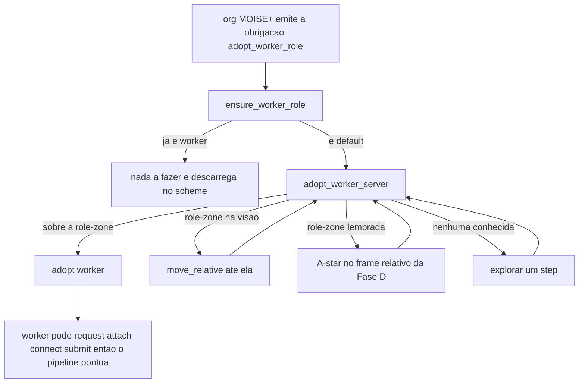

# feat: Track 3 Fase C — adoção de role (capacidade de pontuar no oficial)

> **Encerrado em 2026-06-18 (status: completed).** U1–U4 ✅: a capacidade de adoção de role
> está entregue — o agente adota `worker`, coleta, submete, e a org MOISE+ **dirige e registra**
> a adoção (loop normativo fecha, commits `4b6a2d8`/`b9aa684`/`5b3336f`). **Provado em ISOLAMENTO**
> (`conf/IsolationRolesConfig.json`, 40×40 + `absolutePosition:true`): adopt-spam corrigido (gate por
> percept `role/1`) + anti-oscilação → **score 0→10, submits 0→3**. **U5 (R7 — score>0 NO OFICIAL 70×70)
> NÃO foi atingido e foi DEFERIDO:** o bloqueio é **livelock de navegação + cross-frame (U9)**, fora do
> escopo da Fase C — vai para os tracks de **navegação (GPS/footprint/handedness)** e **fusão de mapas
> (U9)** no `docs/backlog.md`. Decisão do dono: interromper o plano 001 neste estágio.

## Summary

No cenário oficial do MAPC 2022 o agente começa no role `default`, que **não tem**
`request/attach/connect/submit` — sem adotar um role de pontuação, o time faz **score
0**. Esta fase dá ao HIVE a **adoção de role dirigida pela organização MOISE+**: a org
emite uma obrigação de adotar `worker`; o agente, ao alcançar uma **role-zone** (via a
navegação relativa que a Fase D destravou), executa `adopt(worker)` e ganha as ações de
coletar/montar/submeter — e o pipeline existente passa a pontuar. Incremento mínimo
viável: todos os executores adotam um único role de pontuação (`worker`).

---

## Problem Frame

Os roles reais do MAPC 2022 são **aditivos** sobre o `default` (livro MAPC, Table 1):
`worker = default + request,attach,connect,disconnect,submit`. O `default`
(move/rotate/adopt/clear/detach) sozinho **não pontua**. A ação `adopt` só funciona
quando o agente está **sobre uma role-zone** (que é fixa a simulação inteira;
`massim_2022/docs/scenario.md`). Hoje o HIVE só **mapeia** `role_zone` na percepção —
não tem nenhuma lógica de adoção — então no oficial anda bem mas faz score 0.

Como os roles são aditivos, o `worker` **também anda e re-adota** (herda o `default`):
a adoção é essencialmente "ir à role-zone e adotar **uma vez**", sem máquina de troca, e
o pipeline de coleta/montagem revive com as ações novas, sem reescrita.

**Distinção central (ver `CONCEPTS.md`):** "role" tem dois sentidos — o **role MOISE+**
(função no time: collector/assembler/…, já adotado via `players` no `hive.jcm`) e o
**role MAPC** (capacidade no servidor: default/worker/…, percebido como `my_role`,
adotado via `adopt` numa role-zone). A Fase C é o **elo**: a org MOISE+ dirige a adoção
do role MAPC — dando dentes ao requisito de MOISE+ do entregável (hoje a org existe mas,
por KTD1 da Fase A, **não dirige** o controle).

---

## Key Technical Decisions

- **KTD1 — Reusar o padrão `worker_role.asl` do `~/repos/MAPC`, adaptado (citar + melhorar).**
  O projeto-referência do dono já tem o ciclo completo: `!ensure_worker_role` →
  `!adopt_worker_server` (adopt quando sobre a role-zone; navegar/explorar caso
  contrário) + o hook de obrigação MOISE+ `+!adopt_worker_role[scheme(...)]`. Adaptar à
  realidade do HIVE: usar `my_pos` **dead-reckoned** (Fase D) no lugar de `position`
  absoluto, e a navegação do HIVE (`has_destination`/`compute_next_move`) no lugar de
  `navigate_step`. (see origin: KD1, Sources)
- **KTD2 — Adoção dirigida por obrigação MOISE+ real.** A org emite uma obrigação
  `adopt_worker_role` (novo goal/mission/norm no `hive_org.xml`); o agente a satisfaz
  adotando worker e descarrega via o scheme — espelha o idioma de obrigação→`commitMission`
  que `organization.asl` já usa. É o que dá dentes ao MOISE+. (see origin: R2; decisão do
  dono nesta fase)
- **KTD3 — Config de avaliação fiel, reusando os roles reais bundled.** A união aditiva
  é feita **pelo servidor no load** (`GameState.parseRoles` lê o 1º role como base;
  `Role.fromJSON` une `default.actions ∪ json.actions`), então o `worker` lista só os
  extras no JSON e mesmo assim **anda**. Logo o `massim_2022/server/conf/sim/roles/standard.json`
  bundled **é o role-set real e usável** — o boot reutiliza esses roles (copiar/referenciar),
  com `absolutePosition:false`, 70×70, roleZones. O config a **evitar** é o
  `conf/OfficialTestConfig.json` do projeto (default inline com TODAS as ações, p/ dev).
  (see origin: R4, KD4)
- **KTD4 — Adicionar `get_nearest_role_zone` ao `SharedMap`.** Não existe (só há
  dispenser/goal-zone); é preciso para navegar via A* a uma role-zone **lembrada** (fora
  da visão). Espelhar `get_nearest_goal_zone` verbatim. (see origin: R1)
- **KTD5 — Não reescrever o pipeline de coleta/montagem.** A Fase C só o **destrava** ao
  conferir as ações; request/attach/connect/submit já existem. (see origin: KD5)

---

## High-Level Technical Design

Fluxo de adoção (mínimo viável) e o elo MOISE+:

Pontos de design embutidos:
- `roleZone(0,0)` = role-zone na célula atual (percept relativo) → é quando `adopt` é
  legal. A adoção é **uma vez**; depois `my_role(worker)` faz o gate curto-circuitar.
- A navegação reusa a Fase D: `my_pos` dead-reckoned + `get_nearest_role_zone` (KTD4) +
  `compute_next_move`. Sem `absolutePosition`.
- A org dispara via obrigação (KTD2); o `.asl` de adoção (KTD1) é a capacidade que a
  satisfaz.

---

## Requirements

Carregados do documento de origem (mesmos R-IDs).

- R1. Um executor, ao lembrar/perceber uma role-zone, navega até ela e executa
  `adopt(worker)`, ganhando request/attach/connect/submit.
- R2. A adoção é **dirigida e registrada pela org MOISE+** (obrigação → satisfação →
  discharge), não decisão solta do agente.
- R3. Pós-adoção, o pipeline existente (request → attach → [connect] → submit) opera e o
  time **pontua**.
- R4. Existe um config de avaliação com os **roles reais aditivos** (default sem ações de
  pontuação; worker = default + extras).
- R5. Recuperação: o gate `!ensure_worker_role` re-checa a cada deliberação. **Nota (revisão
  2026-06-18): no engine NÃO há perda involuntária de role** — desativação só tira
  attachments, não o role (`Entity.deactivate`). R5 é baixo-risco (o pipeline re-coleta
  blocos); re-adoção só se o agente trocar de role de propósito.
- R7. Boot no oficial (roles reais, 70×70) demonstra **score > 0** (vs 0 hoje); sem
  regressão no dev.

*(R6 — normas de contagem de role — fica em Open Questions: depende do limite no config
de avaliação; a composição via org o respeita quando entrar a especialização.)*

---

## Implementation Units

### U1. `get_nearest_role_zone` no `SharedMap` (Java puro + JUnit)

- **Goal:** query A* da role-zone **lembrada** mais próxima, para navegar a ela fora da
  visão.
- **Requirements:** R1.
- **Dependencies:** nenhuma.
- **Files:** `src/env/env/SharedMap.java`, `src/test/java/env/SharedMapAStarTest.java`.
- **Approach:** espelhar `get_nearest_goal_zone` **verbatim** — iterar `knownRoleZones`,
  `astarCost`, retornar a mais próxima (ou `-1,-1` se nenhuma). `@OPERATION` com
  `OpFeedbackParam`. Sem mudança de lógica do A* (já é por-instância, frame relativo).
- **Patterns to follow:** `get_nearest_goal_zone` em `src/env/env/SharedMap.java`;
  `SharedMapAStarTest` (casos de wrap/obstáculo).
- **Test scenarios:**
  - Mais próxima entre múltiplas role-zones conhecidas (custo A*).
  - Nenhuma role-zone conhecida → retorna `-1,-1`.
  - Covers wrap toroidal: role-zone na borda oposta → caminho com wrap (quando dims>0).
  - Obstáculo entre agente e role-zone → custo reflete o desvio.
- **Verification:** novos testes verdes em `SharedMapAStarTest`.

### U2. Config oficial fiel com roles aditivos reais

- **Goal:** um config de avaliação/boot que reproduz a restrição real de roles.
- **Requirements:** R4.
- **Dependencies:** nenhuma.
- **Files:** `conf/OfficialRolesConfig.json` (novo); opcionalmente um arquivo de roles
  irmão se preferir separar (`conf/roles/*.json`).
- **Approach:** `absolutePosition:false`, 70×70, `roleZones` presentes, **time único A**.
  O array `roles` é o **real bundled** (`sim/roles/standard.json`, copiado verbatim): role[0]
  = `default` `[skip,move,rotate,adopt,clear,detach]`; `worker` lista só `[request,attach,
  connect,disconnect,submit]` (o engine une com o default no load → worker anda). Não
  "corrigir" o standard.json — ele já está certo. Manter `conf/FastTestConfig.json` (dev) e
  `conf/OfficialTestConfig.json` (degenerado, dev) intactos.
- **Execution note:** sem código testável; validado pelo boot (U5).
- **Patterns to follow:** `massim_2022/server/conf/sim/sim1.json` + `sim/roles/standard.json`
  (o config oficial real — copiar os roles); estrutura de `conf/OfficialTestConfig.json` só
  como esqueleto (servidor/match/teams).
- **Test scenarios:** `Test expectation: none` — config; comportamento coberto por U5.
- **Verification:** o servidor sobe com o config; um agente `default` recebe `FAILED_ROLE`
  ao tentar `request`, e após `adopt(worker)` numa role-zone passa a poder (e continua
  andando — o worker herda o move do default).

### U3. Adoção de `worker` no agente (reuso adaptado do MAPC `worker_role.asl`)

- **Goal:** lógica `.asl` que adota `worker`: gate, navegação à role-zone (percebida →
  `move_relative`; lembrada → `get_nearest_role_zone` + A*; nenhuma → explorar), e `adopt`
  quando sobre a role-zone. Inclui a re-adoção (R5).
- **Requirements:** R1, R3, R5.
- **Dependencies:** U1.
- **Files:** `src/agt/common/role_adoption.asl` (novo módulo comum);
  `{ include("common/role_adoption.asl") }` **só nos executores de pipeline:
  `collector` e `assembler`** — quem faz `request/attach/connect/submit`. `sentinel` usa
  `clear` (já no `default`) e `squad_leader` coordena/leiloa → **não precisam de worker**
  (adotar à toa gasta agente/steps indo à role-zone).
  > **Ajuste da revisão (2026-06-18):** resolve a incoerência com a Open Question "quais
  > executores" — escopo mínimo = collector+assembler. (Nota estratégica de medição, fora
  > da Fase C: times campeões do MAPC fizeram quase todos worker.)
- **Approach:** adaptar `~/repos/MAPC/src/agt/worker_role.asl`:
  - `+!ensure_worker_role : my_role(worker) <- true.` / `: true <- !adopt_worker_server.`
  - `+!adopt_worker_server : my_role(worker) <- true.`
  - `+!adopt_worker_server : roleZone(0,0) <- adopt(worker).` (sobre a role-zone)
  - `: roleZone(RX,RY) <- !move_relative(RX,RY).` (role-zone na visão)
  - `: my_pos(MX,MY) & <role-zone lembrada via get_nearest_role_zone> <- !navegar (compute_next_move).`
  - `: true <- !explore_step.` (nenhuma conhecida — reusar a exploração existente)
  - Usar `my_role` (do percept `+role(R)`, já rastreado em `perception.asl`) como gate.
  - **Integração no ciclo (gotcha nº 1 do boot):** o HIVE delibera por `+step(N)` com
    **prioridade por ordem de include** (`collection.asl`: "incluir ANTES de navigation").
    A adoção deve ser um plano **`+step(N)` incluído ANTES de `collection.asl`** (gateia a
    coleta) que dispara `!ensure_worker_role` — **não** um handler reativo `+role(default)`.
    Garantir **uma única ação MASSim por step** (adopt OU move OU explore). O próprio
    `worker_role.asl` de referência avisa: um `+role(default)` reativo pode submeter **duas
    ações no mesmo step**.
- **Execution note:** lógica `.asl` não é unit-testável; validar por boot (U6).
- **Patterns to follow:** `~/repos/MAPC/src/agt/worker_role.asl` (ciclo de adoção — citar
  e melhorar); `src/agt/common/navigation.asl` (`has_destination`/`compute_next_move`);
  `src/agt/common/perception.asl` (`+roleZone`, `+role(R)→my_role`, `my_pos`).
- **Test scenarios:** `Test expectation: integração` — coberto pelo boot (U6): o agente
  acha a role-zone, navega, adota worker uma vez, e o gate curto-circuita depois.
- **Verification:** no boot oficial, agentes passam de `my_role(default)` a `my_role(worker)`
  e o pipeline de coleta dispara.

### U4. Elo MOISE+: obrigação `adopt_worker_role` na organização

- **Goal:** a org MOISE+ **dirige** a adoção — emite a obrigação, o agente satisfaz (via
  U3) e descarrega no scheme.
- **Requirements:** R2.
- **Dependencies:** U3.
- **Files:** `src/org/hive_org.xml` (novo goal + mission + norma de obrigação para
  executores); `src/agt/common/organization.asl` (handler da obrigação).
- **Approach:** adicionar ao `hive_org.xml` um goal (ex.: `worker_role_adopted`) numa
  mission (ex.: `m_adopt`) **separada** (não dentro do `task_execution_scheme` — desacopla,
  respeita KTD5) com a norma de obrigação para collector/assembler; em `organization.asl`,
  tratar a **obrigação-de-REALIZAÇÃO**:
  `+obligation(Ag,_,achieved(S,adopt_worker_role,Ag),_) <- !ensure_worker_role; goalAchieved(...)`.
  > **Ajuste da revisão (2026-06-18):** isto é comportamento **NOVO**, não "espelhar o idioma
  > já presente". Hoje `organization.asl` só faz `commitMission` e **deliberadamente NÃO
  > atinge goals** (KTD1); `adopt_worker_role` é o **1º goal que a org realmente dirige** — o
  > cerne de "dar dentes ao MOISE+" (e o que o relatório avalia). Cuidado com o
  > **endereçamento do artefato**: o ref usa `goalAchieved(...)[artifact_id(OrgArtId)]`, a
  > `organization.asl` usa `[artifact_name(Scheme), wid(W)]` — alinhar p/ não falhar em silêncio.
- **Execution note:** validar por boot (U6); confirmar que a obrigação dispara e descarrega
  sem travar o scheme existente (`task_execution_scheme`).
- **Patterns to follow:** `src/agt/common/organization.asl` (handler de `obligation` +
  `commitMission`); `~/repos/MAPC/src/agt/worker_role.asl` (override de obrigação);
  `src/org/hive_org.xml` (schemes/missions/goals atuais).
- **Test scenarios:** `Test expectation: integração` — coberto por U6: a org emite a
  obrigação, o agente adota worker e a obrigação é descarregada (sem violação de norma).
- **Verification:** log mostra `[ORG]` obrigando a adoção e o agente virando worker em
  resposta.

### U5. Validação: boot de score no oficial + paridade no dev

- **Goal:** provar **score > 0** no oficial com roles reais; confirmar que o dev não
  regrediu; confirmar a interação com desativação (R5).
- **Requirements:** R7 + critérios de sucesso.
- **Dependencies:** U1, U2, U3, U4.
- **Files:** evidência registrada para o relatório (sem alterar defaults do dev).
- **Approach:** boot headless no oficial (config de U2, roles reais, 70×70) medindo
  **score** (results/*.json) — agentes acham role-zone, adotam worker, completam ≥1 task.
  **Asserção concreta:** `FAILED_ROLE` em `request` (default) **some** após o `adopt`
  (engine: `Simulation.java:118-119` retorna `FAILED_ROLE` p/ ação fora do role). Boot no
  dev (`FastTestConfig`) confirma sem regressão.
  > **Ajustes da revisão (2026-06-18):** (i) **desativação PRESERVA o role** — `Entity.deactivate()`
  > só faz `detachAll()`+timer, nunca `setRole`; R5 não precisa re-adoção ativa, só re-coleta
  > de blocos (resolvido sem boot). (ii) **Pré-boot: `hive_org.xml` soma `max=19`** — bootar
  > com **≤19 agentes** OU subir as cardinalidades antes, senão o 20º agente fica sem role org
  > → sem obrigação → ocioso, poluindo o boot.
- **Execution note:** medição barata; um run por config (custo de run alto).
  > **Sequenciamento (de-risk):** boot **intermediário após U3** com trigger simples
  > (executores chamam `!ensure_worker_role` no `+step(N)`, sem org) → confirma `my_role→worker`
  > + `score>0`. **Só então** entra U4 (a org dirige) e re-boota. Isola bug de adoção (U3) de
  > bug de org (U4) — divide o ciclo de depuração intrincado em dois menores.
- **Test scenarios:** `Test expectation: integração` — score > 0 no oficial; sem regressão
  no dev; suíte JUnit verde (inclui U1).
- **Verification:** evidência de `Submit ... SUCESSO` / score > 0 no oficial capturada; dev
  com pipeline intacto.

---

## Acceptance Examples

- AE1. **Cobre R1/R3.** **Given** agente `default` sem ações de coleta; **When** acha e
  alcança uma role-zone e adota `worker`; **Then** ganha request/attach/submit e completa
  ≥1 task. *(Test: U5 boot.)*
- AE2. **Cobre R4.** **Given** o config de avaliação (U2); **Then** o `default` recebe
  `FAILED_ROLE` em `request`, mas o `worker` (= default + extras) **anda E pontua**.
- AE3. **Cobre R2.** **Given** a org MOISE+ ativa; **When** emite a obrigação de adoção;
  **Then** o agente adota `worker` em resposta e a obrigação é descarregada.

---

## Scope Boundaries

**Deferido (gated por medição)**
- Especialização de role: `constructor` (speed 1 sempre — multi-bloco), `explorer`
  (vision 7, `survey` p/ achar role-zone/dispenser rápido), `digger` (clear ranged).
- Troca dinâmica de role por fase de tarefa.
- Mapeamento fino role MOISE+ → role MAPC por função (quando entrar a especialização).
- Fusão de mapas cross-agente (U9) — gated nesta fase.

**Deferido a follow-up (sequenciamento)**
- Escala para 20 agentes e composição de squad.

**Não-objetivo**
- Reescrever os consumidores do pipeline de coleta/montagem (KTD5).

---

## Risks & Dependencies

- **Dependência: Fase D (navegação relativa)** — pré-requisito para chegar à role-zone
  sem `absolutePosition`. Entregue.
- **Dependência: org MOISE+ viva (Fase A)** — base do elo de obrigação; já tem
  `commitMission` e o goal `role_zones_found`.
- **Risco: config fiel.** Se o config de avaliação real diferir do de U2 (ex.: o professor
  usa outro), revalidar. Mitigação: U2 segue a Table 1 do livro; o boot (U5) confirma a
  mecânica (default falha `request`, worker pontua).
- **Risco: a obrigação MOISE+ trava/duplica o scheme existente.** Mitigação: espelhar o
  idioma já testado de `organization.asl`; descarregar via scheme (não crença); boot.
- **Risco: drift do dead-reckoning** atrapalha alcançar a role-zone lembrada. Mitigação:
  role-zones são fixas (landmark estável) e perto da visão entra `move_relative` direto;
  A* só p/ lembradas. A medição decide.

---

## Open Questions

Deferidas à implementação/medição:
- ✅ **RESOLVIDA (revisão 2026-06-18) — Desativação preserva o role MAPC? SIM.**
  `Entity.deactivate()` só faz `detachAll()`+timer, nunca `setRole`. R5 é automático (sem
  re-adoção); o agente só re-coleta blocos.
- **Norma de contagem de role (R6):** qual o limite no config de avaliação? No mínimo
  viável collector+assembler viram worker; se houver teto, a org precisa distribuir (entra
  com a especialização). *(Backlog/spec: os times de topo ignoraram normas de role e comeram
  a multa — provável não-problema.)*
- ✅ **RESOLVIDA (revisão 2026-06-18) — Quais executores adotam:** **collector + assembler**
  (os que usam o pipeline). Sentinel (`clear` já no `default`) e squad_leader (coordena) **não**.

---

## Sources / Research

- Origem: `docs/brainstorms/2026-06-18-fase-c-adocao-role-requirements.md`.
- `~/repos/MAPC/src/agt/worker_role.asl` — ciclo de adoção (`ensure_worker_role` /
  `adopt_worker_server`) + override de obrigação MOISE+. Padrão a citar e melhorar.
- `src/agt/common/organization.asl` — idioma `obligation → commitMission` (base de U4).
- `src/org/hive_org.xml` — schemes/missions/goals atuais (goal `role_zones_found`).
- `src/env/env/SharedMap.java` — `get_nearest_goal_zone` (modelo de U1); A* por-instância.
- `src/agt/common/perception.asl` — `+roleZone`, `+role(R)→my_role`, `my_pos` (Fase D).
- `massim_2022/docs/scenario.md` — mecânica de `adopt`/role-zone; role-zones fixas;
  desativação perde attachments; normas de contagem de role.
- `local/978-3-031-38712-8.pdf` (livro MAPC 2022, Table 1) — roles **aditivos** (worker =
  default + extras).
- `massim_2022/server/.../game/GameState.java` (`parseRoles`) + `protocol/.../data/Role.java`
  (`fromJSON`) — a união aditiva é feita pelo **engine** no load; logo `sim/roles/standard.json`
  é o role-set **real e usável** (worker anda). O degenerado é `conf/OfficialTestConfig.json`.
- `massim_2022/server/conf/sim/sim1.json` — config oficial real (absolutePosition:false, 70×70,
  roleZones, roles=standard.json) — base de U2.
- `CONCEPTS.md` — distinção role MOISE+ vs role MAPC.
